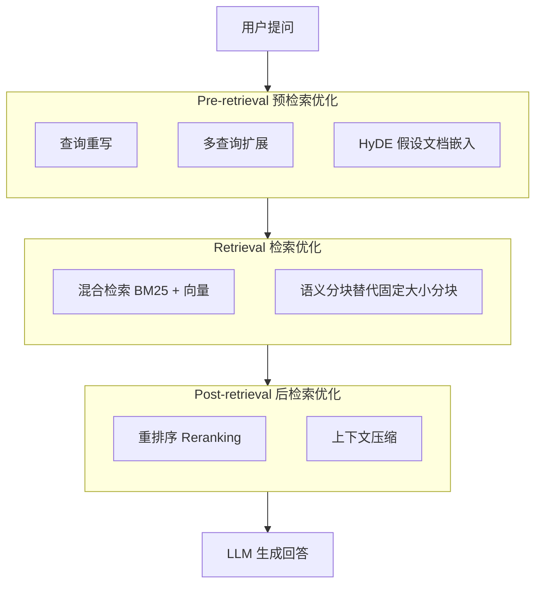
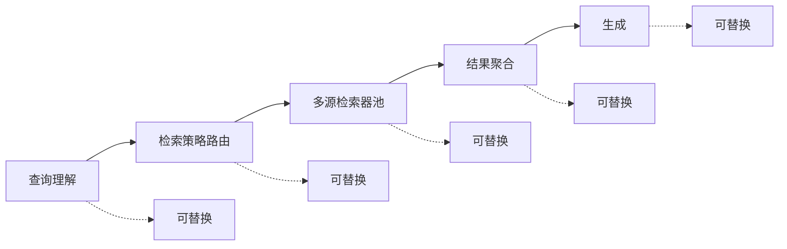
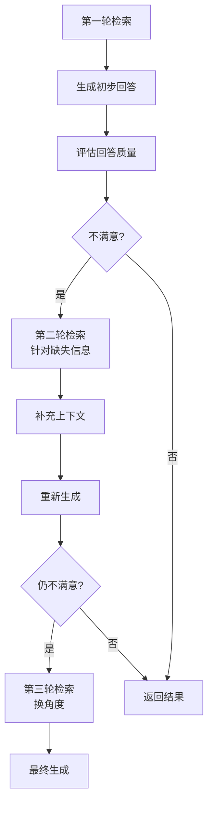
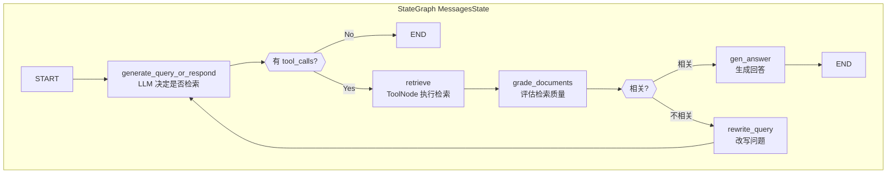

# 第2章 RAG 技术架构演进（五代范式）

第一章我们理解了"为什么需要 RAG"。本章将回答"RAG 是如何演进的"。从 2020 年 Lewis 等人首次提出 RAG 概念至今，RAG 架构经历了五代范式迭代：从最朴素的 Naive RAG，到今天以 Agentic RAG 为代表的智能体化检索生成。每一代都在解决上一代的核心痛点，理解这条演进路线，是选择合适方案的基础。

<div id="rag-timeline"></div>

---

## 2.1 Naive RAG：朴素 RAG

Naive RAG 是所有 RAG 系统的起点。它的流程简单到可以用三句话概括：

```text
用户提问 → 向量数据库中搜索 Top-K 个相关片段 → 将片段和问题一起丢给 LLM → 得到回答
```

### 2.1.1 核心流程

Naive RAG 由两条流水线组成：

**索引流水线（离线，一次性）**

原始文档 → 文档解析 → 固定大小分块 → Embedding 向量化 → 存入向量数据库

**查询流水线（在线，每次调用）**

用户问题 → 问题向量化 → 相似度搜索取 Top-K → 拼接为 Prompt → LLM 生成回答

这就是全部。没有查询优化、没有重排序、没有上下文压缩——只有最基础的"检索 + 生成"。

### 2.1.2 为什么叫"朴素"

因为它只做了 RAG 的最小可行实现。就像一个只会做加法的计算器——能用，但功能极其有限。

Naive RAG 的设计假设了三个前提条件：

- **用户的提问已经足够好**：不需要改写或扩展
- **向量相似度 = 语义相关性**：语义上最相似的片段就是最有用的
- **Top-K 就是答案**：不需要排序优化，前 K 个就是最好的

在实际场景中，这三个前提几乎都不成立。

### 2.1.3 三大核心缺陷

| 缺陷 | 具体表现 | 影响 |
|------|---------|------|
| **多跳推理失败** | "比较政策 A 和政策 B 的差异"需要同时检索两个文档，但向量相似度搜索只返回与整体查询最接近的一个 | 召回率低 |
| **过时/冲突来源** | 知识库中有同一文档的三个版本时，无法优先选择最新版；不同文档对同一事实有矛盾描述时无法判断 | 准确率下降 |
| **不必要的检索开销** | "现在几点？""写个 Python Hello World"这类问题根本不需要外部知识，但 Naive RAG 仍然执行完整检索流程 | 延迟高、成本浪费 |

（来源: [02-RAG五种架构对比分析.md](reference/10-高级RAG范式/02-RAG五种架构对比分析.md)）

此外还有几个常见但容易被忽视的问题：
- 分块粒度难以兼顾：太大引入噪声，太小丢失上下文
- 无对话记忆：每次查询独立处理，无法关联历史
- 无结果质量反馈：模型不会质疑检索到的内容是否可靠

尽管存在这些缺陷，Naive RAG 在 2023 年之前仍然是主流方案。它的价值在于验证了"检索增强生成"这个方向的有效性——即使是最简单的实现，也能将开放域问答的准确率从纯 LLM 的约 30% 提升到 50%+。（来源: [01-RAG原始论文精要.md](reference/02-RAG核心原理/01-RAG原始论文精要.md)）

---

## 2.2 Advanced RAG：高级 RAG

2023 年中至 2024 年，业界开始系统性地解决 Naive RAG 的缺陷。Advanced RAG 的核心思想是在检索的前后各加一层优化。

> **为什么需要 Advanced RAG？** Naive RAG 的三大核心缺陷——多跳推理失败、过时/冲突来源无法甄别、不必要的检索开销——本质上都源于同一个问题：**它对"检索"这件事没有任何优化**。用户的问题可能表述模糊，检索结果可能包含噪声，最相关的片段可能排在第 15 位而非第 1 位。Advanced RAG 的出发点很简单：既然检索质量直接决定生成质量，那就系统性地优化检索的每个环节。

### 2.2.1 三层优化架构

Advanced RAG 在 Naive RAG 的基础上增加了三个优化环节：



### 2.2.2 预检索优化（Pre-retrieval）

预检索优化的目标是让用户的提问变得更适合检索。

**查询重写（Query Rewriting）**

用户的提问往往是口语化的、模糊的、不完整的。查询重写将其转换为更精确的检索友好的表达：

| 原始查询 | 重写后 |
|---------|--------|
| "怎么配？" | "如何配置 LangGraph 与 ChromaDB 进行文档检索？" |
| "报错了" | "LangGraph ChromaDB 连接超时错误如何排查？" |

**多查询扩展（Multi-Query）**

同一个问题可以从多个角度去检索。LLM 将原问题改写成 3-5 个不同表述的变体，分别检索后合并去重：

```text
原问题："RAG 和微调哪个更好？"
  │
  ├── 变体1："RAG vs Fine-Tuning 对比分析"
  ├── 变体2："什么时候应该用 RAG 而不是微调？"
  ├── 变体3："RAG 和模型微调各自的优缺点"
  └── 变体4："企业 AI 项目选型：RAG 或 Fine-Tuning"
```
每个变体检索 Top-K，合并后去重，最终候选集覆盖面远大于单次检索。

**HyDE（Hypothetical Document Embedding）**

短查询（如"Python 错误处理"）在向量空间中的表示往往不够精确。HyDE 的做法是先用 LLM 生成一段"可能回答该问题的伪文档"，然后用这段伪文档去做向量检索。因为伪文档比原始查询长得多，包含更多语义信息，所以检索效果显著提升。（来源: [01-RAG五代演进全景.md](reference/10-高级RAG范式/01-RAG五代演进全景.md)）

### 2.2.3 检索增强（Retrieval Enhancement）

**混合检索（Hybrid Search）**

纯向量检索有一个致命弱点：它擅长捕捉语义相似性，但对精确匹配无能为力。"Python snake handling"在语义上可能被匹配到关于蛇类动物的文档。混合检索结合了两种互补的方法：

| 方法 | 原理 | 强项 | 弱项 |
|------|------|------|------|
| **BM25（稀疏检索）** | 关键词频率统计 | 精确术语匹配、专有名词 | 无法理解同义词 |
| **Dense Retrieval（稠密检索）** | 向量语义相似度 | 语义理解、模糊匹配 | 专有名词漂移 |

两者通过 RRF（倒数排名融合）算法合并结果，通常能将 nDCG@10 提升 8-15%。（来源: [03-RAG系统设计完整指南.md](reference/02-RAG核心原理/03-RAG系统设计完整指南.md)）

### 2.2.4 后检索优化（Post-retrieval）

**重排序（Reranking）**

向量检索是为了速度做的近似匹配，精度有限。重排序使用专门的 Cross-Encoder 模型（如 BGE-Reranker）对检索到的 Top-20-30 个片段逐一打分，重新排列后只保留 Top-5-10。这是用极低成本实现效果翻倍的关键步骤——生产级 RAG 中几乎已成为标配。

**上下文压缩**

检索到的片段可能很长且包含冗余信息。上下文压缩通过 LLM 过滤掉与问题无关的内容，只保留核心信息后送入生成模块，既节省 Token 又减少噪声干扰。

### 2.2.5 效果数据

Advanced RAG 相比 Naive RAG 的改进：

| 指标 | Naive RAG | Advanced RAG | 提升 |
|------|-----------|-------------|------|
| 召回率 | ~60% | ~85% | **+25%** |
| 准确率 | ~50% | ~72% | **+22%** |
| 幻觉率 | 较高 | 降低 20-35% | 显著改善 |

（来源: [01-RAG五代演进全景.md](reference/10-高级RAG范式/01-RAG五代演进全景.md)）

---

## 2.3 Modular RAG：模块化 RAG

Advanced RAG 解决了很多具体问题，但它仍然是一个固定的线性流水线。Modular RAG 的思路完全不同：**把 RAG 拆成一组可插拔的模块，像搭积木一样组合**。

> **为什么 Advanced RAG 的固定流水线不够用？** Advanced RAG 的三层优化架构（预检索 → 检索 → 后检索）虽然大幅提升了效果，但它有一个根本性的局限：**流水线是固定的**。无论用户问的是简单事实还是复杂多跳问题，数据走的是同一条链路；无论知识来源是 PDF、SQL 数据库还是实时 API，检索器也只有一套。当企业需要同时处理结构化和非结构化数据、需要根据问题类型动态切换策略时，固定流水线就成了天花板。Modular RAG 正是为了打破这个天花板而诞生的。

### 2.3.1 核心思想

Modular RAG 将传统 RAG 流水线中的每个环节都抽象为独立模块：


每个方括号代表一个可插拔的组件，可以有多种实现方式自由切换：

| 模块 | 可选实现 |
|------|---------|
| 查询理解 | 直接传递 / LLM 改写 / 多查询扩展 / HyDE |
| 检索策略路由 | 单路检索 / 按领域分流 / 按查询类型分流 |
| 检索器池 | 纯向量 / BM25 / 混合检索 / 图检索 / SQL 检索 |
| 结果聚合 | RRF 融合 / Cross-Encoder 重排 / MMR 去重 |
| 生成 | 单次生成 / Self-RAG 反思生成 / 多轮迭代 |

### 2.3.2 与 Advanced RAG 的区别

| 维度 | Advanced RAG | Modular RAG |
|------|-------------|-------------|
| 架构形态 | 固定线性流水线 | 可插拔模块网络 |
| 扩展方式 | 在现有链路上加新环节 | 替换或新增任意模块 |
| 定制灵活性 | 低 | 高 |
| 复杂度 | 中等 | 较高 |
| 适用场景 | 大多数标准 RAG 场景 | 需要多源异构检索的复杂场景 |

Modular RAG 的优势在于：当你的知识库既有结构化数据（SQL 数据库）又有非结构化文档（PDF），还需要实时搜索时，可以通过配置不同的检索器来统一处理，而不需要维护多个独立的 RAG 系统。

在实现层面，Modular RAG 的理念与 **LangGraph StateGraph** 天然契合——每个模块对应一个图节点，模块间的数据流通过状态（State）传递，条件路由决定执行路径。（来源: [04-LangGraph入门到实践全指南.md](reference/04-工具链与环境/04-LangGraph入门到实践全指南.md)）

---

## 2.4 Graph RAG：图谱 RAG

2024 年下半年，微软研究院提出了 Graph RAG，标志着 RAG 技术进入了一个新的分支。Graph RAG 用**知识图谱**替代（或补充）传统的纯向量检索，从根本上解决了一个长期存在的难题：全局性问题。

> **为什么向量检索在全局性问题上存在根本缺陷？** 无论是 Naive RAG、Advanced RAG 还是 Modular RAG，它们的检索核心都是向量相似度——"找与问题最相似的片段"。但向量检索有一个本质局限：**它只能做局部匹配，无法做全局归纳**。当用户问"我们公司过去一年的主要风险趋势是什么？"时，答案散落在数百份文档中，没有任何单个片段能与之"相似"。这不是优化流水线或增加模块能解决的——这是向量检索范式的结构性盲区。Graph RAG 正是从这个根本缺陷出发，引入知识图谱来建立实体间的关联关系，使系统具备全局视角。

### 2.4.1 传统 RAG 的盲区：局部 vs 全局

传统基于向量的 RAG 天然适合回答**局部性问题**（Local Queries）：

- "产品 X 的退款政策是什么？" → 检索产品手册的相关段落即可
- "上周的销售数据是多少？" → 检索对应的报表

但对于**全局性问题**（Global Queries），向量检索几乎无能为力：

- "我们公司过去一年的主要风险趋势是什么？" → 需要从数百份报告中综合提炼
- "行业竞争格局发生了哪些变化？" → 需要跨多个来源建立关联

向量检索的本质是"找最相似的"，而全局性问题需要的是"综合归纳"。这不是相似度能解决的。

### 2.4.2 Graph RAG 的解决方案

Graph RAG 的做法是将文档内容构建为一个**知识图谱（Knowledge Graph）**：

1. **图谱构建阶段**：用 LLM 从文档中抽取实体（Entity）和关系（Relation），构建实体-关系-实体的图结构
2. **社区摘要阶段**：对图谱中的紧密连接社区（Community）进行分层摘要，形成从宏观到微观的多层级摘要
3. **查询阶段**：
   - **局部查询**：从特定实体出发做多跳推理（类似传统 RAG）
   - **全局查询**：利用社区摘要进行高层级的综合回答

### 2.4.3 全局查询 vs 局部查询

| 特征 | 局部查询 | 全局查询 |
|------|---------|---------|
| 示例 | "张三负责的项目有哪些？" | "研发部门的主要瓶颈是什么？" |
| 检索方式 | 实体出发的多跳遍历 | 社区摘要的综合分析 |
| 适用方法 | 图谱遍历 + 向量补全 | 分层社区摘要 |
| 回答特点 | 精确、有明确来源 | 综合、需要归纳能力 |

### 2.4.4 效果与局限

Graph RAG 在全局性问题上的表现显著优于传统 RAG：微软报告显示，在需要综合多个文档的全局性问题上，Graph RAG 的准确率相比传统 RAG 提升约 35%。（来源: [01-RAG五代演进全景.md](reference/10-高级RAG范式/01-RAG五代演进全景.md)）

但同时 Graph RAG 也有明显的代价：
- 图谱构建成本高：需要 LLM 抽取实体关系，计算量大
- 更新困难：文档变更后需要重建受影响的图谱区域
- 不适合所有场景：对于简单的 FAQ 类问题，Graph RAG 属于杀鸡用牛刀

**最佳实践**：Graph RAG 通常与传统向量 RAG 配合使用——向量检索处理局部精确查询，图谱处理全局综合查询。

---

## 2.5 Agentic RAG：智能体 RAG

2025-2026 年，随着 Agent 技术的成熟，RAG 开始与 AI Agent 深度融合，形成了当前最前沿的范式：Agentic RAG。如果说之前的 RAG 都是"被动响应式"的——用户问什么就检索什么——那么 Agentic RAG 则是"主动规划式"的——Agent 自主决定何时检索、检索什么、是否需要再次检索。

> **为什么需要 Agentic RAG？** 前四代范式虽然不断进化，但都共享一个根本假设：**系统是被动的**——用户提问触发检索，检索结果直接送入生成，整个过程是"一锤子买卖"。然而真实场景中，复杂问题往往需要多步推理、多源信息交叉验证、以及对检索结果质量的自我审视。Advanced RAG 和 Modular RAG 优化了"怎么检索"，Graph RAG 扩展了"检索什么"，但它们都没有解决"谁来决策"的问题。Agentic RAG 将决策权从固定流水线交给具备推理能力的 Agent，让系统从"工具"进化为"协作者"。

### 2.5.1 核心特征

Agentic RAG 将 RAG 从一个线性流水线升级为具备自主决策能力的智能系统：

| 特征 | 传统 RAG | Agentic RAG |
|------|---------|------------|
| 检索触发方式 | 用户提问即触发 | Agent 判断是否需要检索 |
| 检索次数 | 固定 1 次 | 动态 0-N 次 |
| 检索策略 | 固定的单一策略 | 根据问题类型动态选择 |
| 工具使用 | 仅向量库 | 向量库 + 搜索引擎 + API + 数据库 |
| 结果评估 | 无 | 自我反思，不满意则重新检索 |
| 编排框架 | 线性 Chain / LCEL | **LangGraph StateGraph** |

### 2.5.2 四大关键能力

**① 自适应检索（Adaptive Retrieval）**

Agent 首先判断当前问题是否需要外部知识：

- "1+1等于几？" → 不需要检索，直接回答
- "最新的 Python 版本是什么？" → 需要检索最新信息
- "我们的 Q2 财报显示了什么趋势？" → 需要检索内部文档

这种判断可以节省大量不必要的检索开销。在高并发场景下，Adaptive RAG 可以降低 40% 以上的检索调用成本。（来源: [02-RAG五种架构对比分析.md](reference/10-高级RAG范式/02-RAG五种架构对比分析.md)）

**② 迭代精炼（Iterative Refinement）**

一次检索不够？那就再检一次。Agentic RAG 支持多轮检索循环：


这种循环逻辑在 **LangGraph StateGraph** 中通过 `conditional_edges`（条件边）天然支持，无需复杂的控制流管理。（来源: [03-LangGraph官方AgenticRAG教程.md](reference/04-工具链与环境/03-LangGraph官方AgenticRAG教程.md)）

**③ 多源异构检索（Multi-Source Retrieval）**

Agentic RAG 不再局限于单一的向量数据库。它可以同时访问：

- 内部文档知识库（向量库）
- 实时搜索引擎（Google/Bing API）
- 结构化数据库（SQL / API）
- 其他工具（代码解释器、计算器）

Agent 根据问题的性质自动选择最合适的数据源。在 LangGraph 中，每种数据源可以被封装为一个独立的图节点，通过 `ToolNode` 统一管理。

**④ 自我反思（Self-Reflection）**

这是 Agentic RAG 区别于前几代的最重要特征。Agent 不仅会检索，还会质疑自己的检索结果：

- "检索到的这段信息真的能回答用户的问题吗？"
- "有没有遗漏的重要角度？"
- "我的回答是否有足够的事实依据？"

Self-RAG 通过特殊的反思 Token（`[Retrieve]`、`[IsRel]`、`[IsSup]` 等）让模型在生成过程中自主决定何时检索、检索结果是否相关、是否充分支持回答。实验表明，Self-RAG 可以将幻觉率降低 20-40%。（来源: [01-RAG五代演进全景.md](reference/10-高级RAG范式/01-RAG五代演进全景.md)）

### 2.5.3 Agentic RAG 的典型架构（LangGraph 实现）

使用 LangGraph 构建 Agentic RAG 是 2026 年的主流方案。以下是基于官方教程的核心架构模式：（来源: [03-LangGraph官方AgenticRAG教程.md](reference/04-工具链与环境/03-LangGraph官方AgenticRAG教程.md)）



**核心代码骨架**：

> 以下为概念性伪代码，帮助理解 Agentic RAG 的控制流逻辑。完整的 LangGraph 实现将在第 5 章（工具链与环境）和第 12 章（企业级实战）中详细展开。

```python
# === Agentic RAG 概念伪代码 ===
# 展示核心决策循环，而非具体框架 API

class AgenticRAG:
    """Agentic RAG 的核心是一个自主决策循环"""

    def run(self, question):
        # 第一步：判断是否需要检索
        if not self.needs_retrieval(question):
            return self.direct_answer(question)

        # 第二步：检索 → 评估 → 迭代的循环
        max_rounds = 3
        for round in range(max_rounds):
            # 根据问题类型选择数据源
            sources = self.select_sources(question)  # 向量库/搜索引擎/API...

            # 执行检索
            documents = self.retrieve(question, sources)

            # 评估检索质量：相关则生成回答，不相关则改写问题重试
            if self.is_relevant(documents, question):
                answer = self.generate(question, documents)

                # 第三步：自我反思——回答是否充分？
                if self.is_satisfactory(answer, question):
                    return answer
                else:
                    # 补充检索缺失的信息
                    question = self.identify_gaps(answer, question)
            else:
                # 检索结果不相关，改写问题后重试
                question = self.rewrite_query(question)

        return self.generate(question, documents)  # 达到上限，用已有信息回答
```

这段伪代码揭示了 Agentic RAG 与前几代范式的本质区别：**控制流不再是线性的，而是一个带有判断、分支和循环的决策图**。在 LangGraph 等 Agent 编排框架中，每个判断点对应一个条件边（conditional edge），每个动作对应一个图节点（node），整个流程被组织为一个有向图。（来源: [03-LangGraph官方AgenticRAG教程.md](reference/04-工具链与环境/03-LangGraph官方AgenticRAG教程.md)）

### 2.5.4 生产注意事项

Agentic RAG 虽然强大，但在生产环境中需要特别注意：

- **延迟累积**：多轮检索意味着多次 LLM 调用，总延迟可能达到数秒甚至更长。**建议**：为 Agent 设置最大迭代轮次（通常 2-3 轮），对简单查询走快速路径跳过检索，并考虑对检索和评估步骤使用更轻量的模型（如将评估模型从 GPT-4 降级为 GPT-3.5-turbo）以控制端到端延迟。
- **成本控制**：每增加一轮检索就增加一次 Embedding + LLM 调用的费用。**建议**：实现 Token 预算机制，为每次对话设定最大 Token 消耗上限；对高频低价值查询（如问候语、简单计算）设置"不检索"规则，避免不必要的 API 调用；同时监控每轮迭代的边际收益，当额外检索带来的质量提升低于阈值时提前终止。
- **安全边界**：自主决策的 Agent 需要明确的权限约束，防止越权操作。**建议**：对 Agent 可访问的工具和数据源实施白名单机制，限制其只能调用预定义的检索 API；对涉及敏感数据的查询添加权限校验节点；在生产环境中始终保留"人工确认"（Human-in-the-Loop）选项，特别是对删除、写入等高风险操作。
- **可观测性**：多步推理过程必须可追踪、可审计，否则出问题时难以定位。**建议**：为每次 Agent 决策记录完整的推理链路（包括每轮的查询改写、检索来源、评估结果和最终选择），集成 LangSmith 或 Langfuse 等 Tracing 工具实现可视化调试；同时建立关键指标仪表盘，实时监控平均迭代轮次、检索命中率、自我反思通过率等核心指标。

根据 MarsDevs 2026 生产指南，Agentic RAG 比 vanilla RAG 贵 **3-10x tokens**，延迟增加 **2-5x**。生产目标应设定为：faithfulness ≥0.9, answer relevancy ≥0.85, context precision ≥0.8。（来源: [05-AgenticRAG2026生产指南与框架选型.md](reference/04-工具链与环境/05-AgenticRAG2026生产指南与框架选型.md)）

---

## 本章小结：五代范式横向对比

| 维度 | Naive RAG | Advanced RAG | Modular RAG | Graph RAG | Agentic RAG |
|------|-----------|-------------|-------------|----------|-------------|
| **时间** | 2023 前 | 2023 中-2024 | 2024-2025 | 2024 下 | 2025-2026 |
| **核心创新** | 最小可行性实现 | 预/后检索优化 | 模块可插拔 | 知识图谱增强 | Agent 自主决策 |
| **检索次数** | 固定 1 次 | 固定 1 次 | 固定 1-N 次 | 1-N 次 | 动态 0-N 次 |
| **检索策略** | 纯向量 | 混合检索 | 多源可选 | 向量+图谱 | 自适应多源 |
| **自我反思** | ❌ | ❌ | ❌ | ❌ | ✅ |
| **编排框架** | 手写脚本 | 线性 Pipeline | 模块组合 | GraphRAG SDK | LangGraph 等 Agent 编排框架 |
| **复杂度** | 低 | 中 | 中高 | 高 | 最高 |
| **适用规模** | Demo/PoC | 小型生产 | 中型生产 | 知识密集型 | 企业级复杂场景 |

**选型建议**：

- 快速验证概念 → **Naive RAG**
- 标准 FAQ / 知识库问答 → **Advanced RAG**
- 多源异构数据整合 → **Modular RAG**
- 需要全局综合分析 → **Graph RAG**（配合向量 RAG）
- 企业级复杂应用 → **Agentic RAG（LangGraph 实现）**

这五代范式不是替代关系，而是**递进关系**。每一代都建立在上一代的基础上，解决更深层的问题。实际项目中，你很可能同时用到多种范式的组合——例如在 Agentic RAG（LangGraph 编排）的框架内，内部使用 Advanced RAG 的混合检索和重排序，同时对特定领域启用 Graph RAG 的图谱推理。
