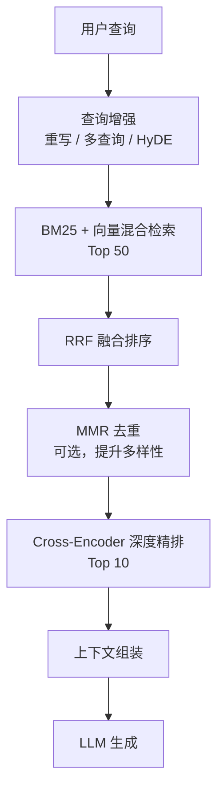

# 第5章 检索与生成管线

前两章我们完成了索引管线的搭建——原始文档已经转化为可检索的向量。本章将进入 RAG 系统的第二条流水线：检索与生成管线（Retrieval & Generation Pipeline）。这条管线负责从向量库中精准检索相关信息，并将检索结果注入 LLM 以生成高质量的回答。

检索与生成管线是 RAG 系统的"大脑"。索引管线决定了知识的存储质量，而检索生成管线决定了能否从海量知识中找到正确答案，并给出有据可依的回复。

**本章技术选型**：我们将采用 **LangGraph StateGraph** 作为编排层，替代传统的 LangChain LCEL Chain。LangGraph 提供了更灵活的图结构、内置状态管理和条件路由能力，特别适合构建生产级 RAG 系统（来源: [03-LangGraph官方AgenticRAG教程.md](reference/04-工具链与环境/03-LangGraph官方AgenticRAG教程.md)）。

---

## 5.1 检索模块

检索模块的核心任务是：给定用户问题，从向量数据库中找到最相关的文本片段。本章将使用 **Chroma 原生 API** 和 **rank_bm25 库** 实现检索，不再依赖 LangChain 的 Retriever 抽象层。

> **数据格式说明**：第4章（索引管线）输出的数据格式为 `{"text": str, "metadata": dict}`，即每个文档片段是一个字典，包含 `text`（文本内容）和 `metadata`（元数据，如文件名、页码等）两个字段。本章所有代码均基于此格式编写，使用 `chunk["text"]` 获取文本内容，使用 `chunk["metadata"]` 获取元数据。

### 5.1.1 语义检索（Dense Retrieval）

#### 概念与原理

语义检索（Semantic Search / Dense Retrieval）是信息检索领域的一次范式跃迁。传统关键词检索基于词汇层面的精确匹配，而语义检索将文本映射到高维连续向量空间，通过向量间的几何距离（通常为余弦相似度）来衡量语义相关性。

**核心原理**：语义检索依赖两个关键组件——**Embedding 模型**（编码器）和**向量数据库**（索引与检索引擎）。Embedding 模型将任意长度的文本压缩为固定维度的稠密向量（通常 384-1536 维），使得语义相近的文本在向量空间中距离更近。这一能力的理论基础来自 **Word2Vec**（2013）提出的分布式语义假设——"上下文相似的词，其语义也相似"，后续的 **Sentence-BERT**（2019）和 **BGE**（2023）等模型将这一思想扩展到了句子和段落级别。

> **🎯 交互演示**：下方 3D 可视化展示了文档在向量空间中的分布。三种颜色的点分别代表 RAG 架构、数据处理、评估体系三大主题的文档。点击 **"检索演示"** 可观察用户查询如何找到语义最相近的文档。

<script type="importmap">
{
  "imports": {
    "three": "https://cdn.jsdelivr.net/npm/three@0.170.0/build/three.module.js",
    "three/addons/": "https://cdn.jsdelivr.net/npm/three@0.170.0/examples/jsm/"
  }
}
</script>
<div id="vector-viz"></div>

**为什么需要语义检索**：关键词检索存在根本性缺陷——它无法跨越"词汇鸿沟"（Vocabulary Gap）。例如用户搜索"怎么做 RAG"，而文档中写的是"检索增强生成架构的实现方法"，关键词检索会因为缺乏共同词汇而完全匹配不到。语义检索通过将双方都映射到语义空间，即使用词完全不同，只要含义相近就能匹配成功。

**发展历程**：
- **2013年**：Word2Vec 开创词向量表示，证明语义可以用几何关系编码
- **2017年**：Transformer 架构提出，为上下文感知的语义编码奠定基础
- **2019年**：Sentence-BERT 引入对比学习，大幅提升句子级语义表示质量
- **2021年**：E5、BGE 等专用 Embedding 模型涌现，检索效果持续刷新
- **2024-2026年**：Matryoshka Representation Learning（MRL）等技术使 Embedding 模型支持灵活维度裁剪，BGE-M3 等多语言模型支持稠密、稀疏、多向量混合检索

**优点**：理解语义含义，不受词汇表面形式限制；对同义词、近义表达、跨语言查询天然友好。

**缺点**：对精确实体名称（如 "API-2024-001"）的匹配不如关键词检索精准；Embedding 模型的计算开销较大；对领域外长尾术语的编码质量可能下降。

**注意事项与常见陷阱**：
1. **查询短文本问题**：用户查询通常很短（5-10个词），而文档片段较长，这种不对称性会导致 Embedding 质量下降。解决方案是使用 ColBERT 等晚期交互模型，或采用 HyDE（5.2.4节）生成假设性文档来弥补
2. **Embedding 模型选型**：生产环境应选择经过 MTEB 排行榜验证的模型，而非随意选用通用模型。中文场景推荐 BGE-M3、nomic-embed-text 等
3. **维度灾难**：高维向量空间中，所有点对之间的距离趋于均匀，区分度下降。通常 768 维是效果和效率的良好平衡点

#### 代码实现

语义检索将用户问题和文档片段都通过 Embedding 模型转化为向量，然后计算向量间的余弦相似度，取 Top-K 个最相似的片段。我们直接使用 Chroma 的 `collection.query()` 方法进行检索。

```python
import chromadb
from chromadb.utils import embedding_functions

# 初始化 Chroma 客户端（使用持久化存储）
client = chromadb.PersistentClient(path="./chroma_db")

# 使用 Ollama Embedding 函数
ollama_ef = embedding_functions.OllamaEmbeddingFunction(
    model_name="nomic-embed-text",
    url="http://localhost:11434/api"
)

# 获取或创建 collection
collection = client.get_or_create_collection(
    name="rag_documents",
    embedding_function=ollama_ef
)

# 语义相似度检索
results = collection.query(
    query_texts=["什么是检索增强生成？"],
    n_results=5,
    include=["documents", "metadatas", "distances"]
)

# 解析结果
for i, (doc, metadata, distance) in enumerate(zip(
    results["documents"][0],
    results["metadatas"][0],
    results["distances"][0]
)):
    print(f"[{i+1}] 相似度: {1-distance:.4f} | 来源: {metadata.get('source', '未知')}")
    print(f"    内容: {doc[:100]}...")
```

**语义检索的优势**：能理解查询的语义含义，不依赖关键词精确匹配。例如用户问"怎么做 RAG"，即使文档中用的是"检索增强生成架构"，也能匹配到。

**语义检索的局限**：对精确实体名称的匹配不够精准。用户搜索"API-2024-001 接口文档"，语义检索可能会返回关于 API 设计的通用文档，而非特定接口。

### 5.1.2 关键词检索（Sparse Retrieval / BM25）

#### 概念与原理

BM25（Best Matching 25）是信息检索领域最经典、最广泛使用的稀疏检索算法，由 Robertson 和 Zaragoza 于 2009 年在早期概率检索模型（ Robertson-Sparck Jones, 1972）的基础上改进而来。其核心思想是：一个文档与查询的相关性，取决于查询词在文档中出现的频率（TF），以及这些查询词在整个语料库中的稀有程度（IDF）。

**核心公式**：

```text
BM25(D, Q) = Σ IDF(qi) × [f(qi, D) × (k1 + 1)] / [f(qi, D) + k1 × (1 - b + b × |D| / avgdl)]
```

其中：
- `f(qi, D)`：查询词 qi 在文档 D 中的出现频率（TF）
- `|D|`：文档 D 的长度
- `avgdl`：所有文档的平均长度
- `k1`：词频饱和参数（通常取 1.2-2.0），控制词频增长的边际递减效应
- `b`：文档长度归一化参数（通常取 0.75），控制长文档的惩罚力度
- `IDF(qi) = ln[(N - n(qi) + 0.5) / (n(qi) + 0.5) + 1]`：逆文档频率

**为什么需要 BM25**：BM25 解决了朴素词频匹配的三个核心问题：(1) **词频饱和**——一个词出现 10 次并不意味着比出现 5 次相关两倍，BM25 通过 k1 参数实现边际递减；(2) **常见词降权**——"的""是"等高频词对区分文档几乎没有帮助，IDF 机制自动降低它们的权重；(3) **文档长度归一化**——长文档天然包含更多词，BM25 通过 b 参数对长文档进行适度惩罚。

**发展历程**：
- **1972年**：Robertson-Sparck Jones 提出概率检索框架（Binary Independence Model）
- **1994年**：Okapi BM25 在 TREC 评测中表现优异，成为事实标准
- **2009年**：Robertson 和 Zaragoza 发表 BM25 的完整理论推导
- **2020年代**：BM25 仍然是混合检索系统的核心组件，与稠密检索形成互补

**优点**：计算效率极高（仅需词频统计，无需 GPU）；对精确实体、专有名词、版本号的匹配非常精准；结果可解释性强（可以明确看到哪些词命中了）。

**缺点**：无法理解语义——用户问"怎么做 RAG"，如果文档中没有"做"这个词，就可能检索不到；无法处理同义词和多语言查询。

**注意事项与常见陷阱**：
1. **分词质量至关重要**：中文场景下，BM25 的效果高度依赖分词器的质量。推荐使用 jieba 或 HanLP 进行中文分词
2. **停用词过滤**：应过滤掉"的""了""是"等停用词，否则它们会占用 IDF 计算资源但不提供区分度
3. **参数调优**：k1 和 b 参数对效果影响显著，建议在验证集上调优

#### 代码实现

关键词检索基于 BM25 算法，通过词频和逆文档频率来判断相关性。本章使用 **rank_bm25** 库原生实现，无需 LangChain 封装。

```python
from rank_bm25 import BM25Okapi
from nltk.tokenize import word_tokenize
import nltk

# 下载分词器（首次运行需要）
nltk.download('punkt')
nltk.download('punkt_tab')

# 准备文档语料库
# chunks 来自索引阶段，格式为 [{"text": str, "metadata": dict}, ...]
documents = [chunk["text"] for chunk in chunks]
tokenized_docs = [word_tokenize(doc.lower()) for doc in documents]

# 构建 BM25 模型
bm25 = BM25Okapi(tokenized_docs)

# BM25 检索
query = "API-2024-001 接口文档"
tokenized_query = word_tokenize(query.lower())
scores = bm25.get_scores(tokenized_query)

# 获取 Top-K 结果
import numpy as np
top_k_indices = np.argsort(scores)[::-1][:5]
top_k_results = [(documents[i], scores[i]) for i in top_k_indices if scores[i] > 0]

for i, (doc, score) in enumerate(top_k_results, 1):
    print(f"[{i}] BM25 分数: {score:.4f}")
    print(f"    内容: {doc[:100]}...")
```

**BM25 的优势**：对精确实体、专有名词、版本号的匹配非常精准。

**BM25 的局限**：无法理解语义。用户问"怎么做 RAG"，如果文档中没有"做"这个词，就可能检索不到。

### 5.1.3 MMR 去重（最大边际相关性检索）

#### 概念与原理

MMR（Maximal Marginal Relevance，最大边际相关性）由 Carbonell 和 Goldstein 于 1998 年提出，最初用于文本摘要领域，后来被广泛应用于检索系统的结果去重和多样化。其核心思想是在**相关性**（Relevance）和**多样性**（Diversity）之间取得最优平衡。

**核心公式**：

```text
MMR = arg max_{D_i ∈ R\S} [λ × Sim(D_i, Q) - (1 - λ) × max_{D_j ∈ S} Sim(D_i, D_j)]
```

其中：
- `D_i`：候选文档
- `Q`：用户查询
- `R`：初始检索结果集
- `S`：已选中的文档集合
- `Sim(D_i, Q)`：文档与查询的相似度（相关性）
- `Sim(D_i, D_j)`：文档之间的相似度（冗余度）
- `λ`：权衡参数，0 表示纯多样性，1 表示纯相关性，通常取 0.5-0.7

**为什么需要 MMR**：纯相似度检索存在一个严重问题——**信息冗余**。假设用户问"什么是 Transformer"，Top-5 结果可能全部是同一篇论文的不同段落，或者高度相似的内容。用户真正需要的是从多个不同角度理解 Transformer：架构原理、应用场景、与 RNN 的对比、训练技巧等。MMR 通过在选入新文档时惩罚与已选文档过于相似的候选，确保结果覆盖多个子主题。

**发展历程**：
- **1998年**：Carbonell 和 Goldstein 在 SIGIR 上发表 MMR 原始论文，用于文本摘要
- **2000年代**：MMR 被引入搜索引擎和推荐系统，成为结果多样化的标准方法
- **2010年代**：与向量检索结合，成为 RAG 系统检索去重的标配
- **2024-2026年**：现代向量数据库（如 Chroma、Pinecone、Weaviate）原生支持 MMR 检索模式

**优点**：有效避免检索结果中的信息冗余；参数 λ 可根据场景灵活调节——事实性问答场景偏向高 λ（更重相关性），探索性问答偏向低 λ（更重多样性）；实现简单，计算开销可控。

**缺点**：贪心算法，不保证全局最优；λ 参数需要根据具体场景调优；文档间相似度计算增加了额外开销（但通常可接受）。

**注意事项与常见陷阱**：
1. **λ 的选择**：λ = 0.5 是常见的起始值。如果你的场景需要精确回答（如法律、医疗问答），建议 λ = 0.7；如果需要全面覆盖（如研究综述），建议 λ = 0.4
2. **与 RRF 的关系**：MMR 是检索后处理（对已排好序的结果做去重），而 RRF 是检索时融合（合并多路检索结果）。两者互补，可以串联使用
3. **不要过度去重**：如果候选文档本身数量很少（如 < 10），MMR 可能导致选入一些相关性很低的文档。建议设置最低相关性阈值

#### 代码实现

ChromaDB 原生支持 MMR 检索模式，通过 `query()` 方法的 `query_type` 参数指定：

```python
def mmr_search(
    query: str,
    collection,
    k: int = 5,
    lambda_param: float = 0.5,
    fetch_k: int = 20
) -> list[dict]:
    """
    MMR（最大边际相关性）检索

    在相关性和多样性之间取得平衡，避免返回高度冗余的结果。

    Args:
        query: 用户查询
        collection: Chroma collection 对象
        k: 最终返回结果数量
        lambda_param: 相关性-多样性权衡参数
            - 1.0 = 纯相关性（等同于普通语义检索）
            - 0.0 = 纯多样性
            - 0.5 = 均衡（推荐起始值）
        fetch_k: 候选池大小（先取 fetch_k 个候选，再从中选 k 个多样化的）

    Returns:
        [{"text": str, "metadata": dict, "score": float}, ...] 列表
    """
    # Chroma 原生 MMR 检索
    results = collection.query(
        query_texts=[query],
        n_results=k,
        where=None,  # 可选：添加元数据过滤条件
        include=["documents", "metadatas", "distances"],
        # Chroma 使用 query_type 指定检索策略
        # 注意：不同版本的 Chroma API 可能略有差异
    )

    # 获取候选文档（扩大候选池以提高多样性）
    candidate_results = collection.query(
        query_texts=[query],
        n_results=fetch_k,
        include=["documents", "metadatas", "distances"]
    )

    candidate_docs = candidate_results["documents"][0]
    candidate_metas = candidate_results["metadatas"][0]
    candidate_scores = [1 - d for d in candidate_results["distances"][0]]

    # 手动实现 MMR 选择（适用于需要精细控制的场景）
    selected_indices = []
    selected_texts = []

    for _ in range(min(k, len(candidate_docs))):
        best_mmr = -float('inf')
        best_idx = -1

        for idx in range(len(candidate_docs)):
            if idx in selected_indices:
                continue

            # 相关性分数
            relevance = candidate_scores[idx]

            # 多样性分数：与已选文档的最大相似度
            if selected_texts:
                # 使用 Embedding 计算文档间相似度
                doc_embedding = collection._embedding_function([candidate_docs[idx]])
                diversity_penalty = 0.0
                for sel_text in selected_texts:
                    sel_embedding = collection._embedding_function([sel_text])
                    # 余弦相似度
                    sim = np.dot(doc_embedding[0], sel_embedding[0]) / (
                        np.linalg.norm(doc_embedding[0]) * np.linalg.norm(sel_embedding[0])
                    )
                    diversity_penalty = max(diversity_penalty, sim)
            else:
                diversity_penalty = 0.0

            # MMR 分数 = λ × 相关性 - (1-λ) × 冗余度
            mmr_score = lambda_param * relevance - (1 - lambda_param) * diversity_penalty

            if mmr_score > best_mmr:
                best_mmr = mmr_score
                best_idx = idx

        if best_idx >= 0:
            selected_indices.append(best_idx)
            selected_texts.append(candidate_docs[best_idx])

    # 组装结果
    return [
        {
            "text": candidate_docs[idx],
            "metadata": candidate_metas[idx],
            "score": candidate_scores[idx]
        }
        for idx in selected_indices
    ]


# 使用示例
results = mmr_search("什么是 Transformer 架构？", collection, k=5, lambda_param=0.5)

for i, result in enumerate(results, 1):
    source = result["metadata"].get("source", "未知")
    print(f"[{i}] 分数: {result['score']:.4f} | 来源: {source}")
    print(f"    内容: {result['text'][:100]}...")
```

**MMR 效果对比**：

| 场景 | 纯相似度 Top-5 | MMR Top-5 (λ=0.5) |
|------|---------------|-------------------|
| "什么是 Transformer" | 5 段同一论文的内容 | 架构原理 + 应用场景 + 训练技巧 + 与 RNN 对比 + 注意力机制 |
| "Python 异步编程" | 3 段 asyncio 教程 + 2 段重复 | asyncio 基础 + 多线程对比 + 实战案例 + 性能优化 + 常见陷阱 |

### 5.1.4 混合检索（Hybrid Search）：BM25 + 向量 + RRF 融合排序

#### 概念与原理

混合检索（Hybrid Search）是当前生产级 RAG 系统的标准配置。它将语义检索和关键词检索结合使用，通过融合算法对两组结果进行合并排序。其理论基础来自 **多证据融合**（Evidence Combination）理论——不同检索策略捕获了相关性信号的不同维度，融合后能获得更全面、更鲁棒的排序。

**为什么需要混合检索**：5.1.1 和 5.1.2 的分析表明，语义检索和关键词检索各有明显的优缺点，且它们的失败模式高度互补：
- 语义检索擅长处理同义表达、跨语言查询，但在精确实体匹配上表现不佳
- BM25 擅长精确匹配，但无法跨越词汇鸿沟

混合检索通过融合两种信号，使得系统在两类查询上都能表现良好。根据多项评测（包括 TREC、BEIR 等），混合检索相比单一检索方式，通常能将召回率提升 20%-40%。

**RRF 融合算法**（Reciprocal Rank Fusion，倒数排名融合）由 Cormack 等人于 2009 年提出，是目前最常用的融合方法。其核心思想极其简洁：**不依赖原始分数的绝对值，只依赖排名的相对位置**。这解决了不同检索器分数尺度不统一的问题（BM25 分数范围和余弦相似度范围完全不同）。

**核心公式**：

```text
RRF score(D) = Σ_i  1 / (k + rank_i(D))
```

其中 `rank_i(D)` 是文档 D 在第 i 个检索器结果中的排名（从 0 开始），`k` 是一个平滑常数（通常取 60），用于防止排名靠前的文档获得过大的分数优势。

**发展历程**：
- **1990年代**：早期混合检索使用线性分数加权融合，但需要复杂的分数归一化
- **2009年**：Cormack 等人提出 RRF，证明仅使用排名信息就能达到甚至超越加权融合的效果
- **2020年代**：混合检索成为 Elasticsearch、Pinecone、Weaviate 等主流向量数据库的标准功能
- **2024-2026年**：Learned Fusion（学习型融合）开始出现，用轻量模型替代 RRF 的固定公式

**优点**：无需分数归一化；对异常分数值鲁棒；实现极其简单；在多项评测中表现稳定。

**缺点**：忽略分数差距信息——排名第 1 和第 2 的分数可能相差 0.01 也可能相差 0.5，但 RRF 对它们的处理相同；无法根据查询类型自适应调整两种检索的权重。

**注意事项与常见陷阱**：
1. **ID 对齐问题**：这是混合检索中最常见的 Bug。BM25 使用数组索引作为文档 ID，而向量检索使用 Chroma 的内部 ID。如果不建立映射，RRF 融合时两组结果无法对应到同一文档，导致融合失效。下文代码中通过 `doc_id_map` 解决此问题
2. **k 值选择**：k=60 是原始论文推荐的经验值，适用于大多数场景。如果候选集很大（>100），可以适当增大 k
3. **候选数量**：每路检索取 Top-K*2（K 为最终需要的结果数），给 RRF 足够的候选空间

#### 代码实现

```python
def hybrid_search(
    query: str,
    collection,
    bm25: BM25Okapi,
    chunks: list[dict],
    k: int = 10
) -> list[tuple[str, dict, float]]:
    """
    混合检索：BM25 + 向量 + RRF 融合

    Args:
        query: 用户查询
        collection: Chroma collection 对象
        bm25: BM25Okapi 模型
        chunks: 文档片段列表，格式 [{"text": str, "metadata": dict}, ...]
        k: 返回结果数量

    Returns:
        [(text, metadata, rrf_score), ...] 融合后的 Top-K 文档列表
    """
    # ============================================================
    # 关键：建立统一的文档 ID 映射
    # BM25 使用数组索引，Chroma 使用内部 ID
    # 通过 doc_id_map 将两者对齐到统一的 "chunk_{i}" 格式
    # ============================================================
    doc_id_map = {}  # Chroma ID → 统一 ID
    for i, chunk in enumerate(chunks):
        unified_id = f"chunk_{i}"
        doc_id_map[unified_id] = {
            "text": chunk["text"],
            "metadata": chunk["metadata"],
            "bm25_index": i
        }

    # 1. 语义检索（向量）
    vector_results = collection.query(query_texts=[query], n_results=k * 2)
    vector_doc_ids = vector_results["ids"][0]  # Chroma 内部 ID 列表

    # 将 Chroma ID 映射到统一 ID
    # Chroma 的 ID 通常是 UUID 或自定义 ID，需要与 chunks 数组对齐
    # 这里假设我们在索引阶段存储了统一的 chunk ID
    vector_unified_ids = []
    for chroma_id in vector_doc_ids:
        # 尝试通过 metadata 中的 chunk_index 找到对应的统一 ID
        meta = None
        idx_in_results = vector_doc_ids.index(chroma_id)
        if vector_results.get("metadatas") and vector_results["metadatas"][0]:
            meta = vector_results["metadatas"][0][idx_in_results]
        if meta and "chunk_index" in meta:
            vector_unified_ids.append(f"chunk_{meta['chunk_index']}")
        else:
            # 回退方案：使用 Chroma ID 本身
            vector_unified_ids.append(chroma_id)

    # 2. 关键词检索（BM25）
    tokenized_query = word_tokenize(query.lower())
    bm25_scores = bm25.get_scores(tokenized_query)
    bm25_top_indices = np.argsort(bm25_scores)[::-1][:k * 2]

    # BM25 的结果直接使用统一 ID
    bm25_unified_ids = [f"chunk_{idx}" for idx in bm25_top_indices if bm25_scores[idx] > 0]

    # 3. RRF 融合
    rrf_scores = {}
    rrf_k = 60  # RRF 常数

    # 计算向量检索的 RRF 分数
    for rank, unified_id in enumerate(vector_unified_ids):
        rrf_scores[unified_id] = rrf_scores.get(unified_id, 0) + 1 / (rrf_k + rank + 1)

    # 计算 BM25 检索的 RRF 分数
    for rank, unified_id in enumerate(bm25_unified_ids):
        rrf_scores[unified_id] = rrf_scores.get(unified_id, 0) + 1 / (rrf_k + rank + 1)

    # 4. 按 RRF 分数排序，返回 Top-K
    sorted_results = sorted(rrf_scores.items(), key=lambda x: x[1], reverse=True)[:k]

    # 组装最终结果：[(text, metadata, rrf_score), ...]
    final_results = []
    for unified_id, score in sorted_results:
        if unified_id in doc_id_map:
            doc_info = doc_id_map[unified_id]
            final_results.append((doc_info["text"], doc_info["metadata"], score))

    return final_results


# 使用示例
results = hybrid_search("什么是检索增强生成？", collection, bm25, chunks)
for i, (text, metadata, score) in enumerate(results, 1):
    source = metadata.get("source", "未知")
    page = metadata.get("page", "N/A")
    print(f"[{i}] RRF 分数: {score:.4f} | 来源: {source} | 页码: {page}")
    print(f"    内容: {text[:100]}...")
```

**RRF 融合算法的核心思想**：

```text
RRF score = Σ 1 / (60 + rank(d, i))
```

其中 `rank(d, i)` 是文档 `d` 在第 `i` 个检索结果中的排名，`60` 是一个经验常数，用于控制高排名和低排名结果的影响力差异。

混合检索在实际应用中通常能将检索召回率提升 20%-40%。

---

## 5.2 查询增强（Query Enhancement）

用户的原始问题往往存在各种问题：太简短、口语化、指代不清。查询增强模块在检索前对原始问题进行处理，使其更适合检索系统。本章使用 **纯 Python 函数封装 LLM 调用**，替代 LangChain 的 Chain 和 PromptTemplate。

### 5.2.1 LLM 调用封装

首先封装一个通用的 LLM 调用函数，使用 Ollama REST API：

```python
import httpx
import json

def call_llm(prompt: str, model: str = "qwen2.5:7b", temperature: float = 0.1) -> str:
    """
    调用 Ollama REST API 生成文本

    Args:
        prompt: 输入提示词
        model: 模型名称
        temperature: 温度参数

    Returns:
        生成的文本内容
    """
    url = "http://localhost:11434/api/generate"
    payload = {
        "model": model,
        "prompt": prompt,
        "stream": False,
        "options": {
            "temperature": temperature
        }
    }

    response = httpx.post(url, json=payload, timeout=120.0)
    result = response.json()
    return result["response"].strip()

# 使用示例
response = call_llm("你好，请简单介绍一下 RAG 技术")
print(response)
```

### 5.2.2 查询重写（Rewrite）

#### 概念与原理

查询重写（Query Rewriting）是查询增强中最基础也最重要的技术。其目标是将用户的原始输入（可能是口语化、不完整、含糊的）转换为检索系统更容易理解的标准化查询。

**为什么需要查询重写**：真实用户的查询往往存在以下问题：
1. **口语化**："RAG 是怎么做到的啊？" → 应转换为 "检索增强生成系统的工作原理"
2. **信息缺失**："它有什么缺点？" → 需要结合上下文补全指代对象
3. **过于宽泛**："介绍一下 AI" → 应聚焦到具体子主题
4. **含糊表达**："那个新出的模型" → 需要明确具体指哪个模型

**发展历程**：
- **1990年代**：查询重写最初用于搜索引擎的拼写纠错和同义词扩展
- **2010年代**：基于规则和统计机器翻译的查询改写方法
- **2020年代**：LLM 驱动的查询重写成为主流，效果大幅提升
- **2024-2026年**：Query Rewriting 与 RAG 系统深度结合，成为标准流水线组件

**注意事项**：查询重写不应改变用户的原始意图。过度改写可能导致检索结果偏离用户真正想要的信息。建议对改写后的查询进行置信度评估，或在多轮对话中保留原始查询作为回退选项。

#### 代码实现

将口语化、不完整的用户问题改写为正式、结构化的查询表达式。

```python
def rewrite_query(question: str) -> str:
    """查询重写：将口语化问题转为正式查询"""
    prompt = f"""你是一个查询重写专家。请将用户的口语化问题改写为适合检索系统使用的正式查询。

原始问题：{question}
要求：
1. 保持原意不变
2. 使用正式、结构化的语言
3. 提取关键概念
4. 去除口语化表达

改写后的查询："""

    return call_llm(prompt)

# 使用示例
original = "RAG 是怎么做到的啊？"
rewritten = rewrite_query(original)
print(f"原始：{original}")
print(f"改写：{rewritten}")
# 输出类似：检索增强生成系统的工作原理和实现流程
```

### 5.2.3 多查询扩展（Multi-Query）

#### 概念与原理

多查询扩展（Multi-Query Expansion）的核心思想是：用户的原始查询只是其信息需求的一种表达方式，同一需求可以有多种不同的表述。通过从不同角度生成多个查询变体，并行检索后合并结果，可以显著提升召回率。

**为什么需要多查询扩展**：单一查询的召回受限于其表述方式。例如用户问"向量数据库如何选型？"，可能遗漏了使用"向量存储引擎对比""embedding store 选择"等表述的相关文档。多查询扩展通过覆盖同一意图的多种表述，有效降低了这种"表述偏差"带来的召回损失。

**发展历程**：
- **2010年代**：基于伪相关反馈（PRF）和词嵌入的查询扩展
- **2022年**：LangChain 提出 MultiQueryRetriever 概念，使用 LLM 生成查询变体
- **2024-2026年**：成为 RAG 系统的标准组件，在 TREC 2025 RAG 评测中被证明能将召回率提升约 30%

**注意事项**：
1. **查询数量不宜过多**：3-5 个变体通常是最优范围。过多的查询会增加检索延迟和噪声
2. **变体应保持意图一致**：不同角度的切入（技术实现、应用场景、原理等）比同义替换更有价值
3. **与 RRF 配合使用**：多路查询的结果通过 RRF 融合效果最佳

#### 代码实现

从不同角度生成多个查询变体，并行检索后合并结果。

```python
def multi_query_expand(question: str, num_queries: int = 3) -> list[str]:
    """
    多查询扩展：生成多个不同角度的查询变体

    Args:
        question: 原始问题
        num_queries: 生成查询数量

    Returns:
        查询变体列表
    """
    prompt = f"""请基于以下原始问题，生成 {num_queries} 个不同角度的查询变体。

原始问题：{question}

要求：
1. 每个变体保持相同的核心意图
2. 使用不同的术语或表达方式
3. 从不同角度切入（技术实现、应用场景、原理等）
4. 每个查询单独一行

查询变体："""

    response = call_llm(prompt)
    return [q.strip() for q in response.split("\n") if q.strip()]

# 使用示例
queries = multi_query_expand("向量数据库如何选型？")
for i, q in enumerate(queries, 1):
    print(f"查询{i}: {q}")
```

生成的多个查询会并行检索，然后通过 RRF 融合。这种方法在 TREC 2025 RAG 评测中被证明能将召回率提升约 30%。

### 5.2.4 子问题分解（Query Decomposition）

#### 概念与原理

子问题分解（Query Decomposition）是一种将复杂查询拆解为多个简单子查询的技术。其核心洞察是：复杂问题往往包含多个独立或半独立的信息需求，将其拆解后分别检索再综合回答，效果远优于用原始复杂查询直接检索。

**为什么需要子问题分解**：考虑以下场景：
- 用户问："RAG 和微调各自的优缺点是什么？分别在什么场景下使用？"
- 这个问题实际上包含 4 个子问题：(1) RAG 的优点 (2) RAG 的缺点 (3) 微调的优点 (4) 微调的缺点 (5) 各自的适用场景
- 如果用原始问题直接检索，系统可能只返回关于 RAG 或只返回关于微调的文档，无法全面覆盖

**适用场景**：
1. **比较型问题**："A 和 B 有什么区别？" → 分别检索 A 和 B 的信息
2. **多步推理问题**："如何基于 RAG 构建一个客服系统？" → 拆解为 RAG 架构 + 客服系统集成 + 最佳实践
3. **复合型问题**："Transformer 在 NLP 和 CV 领段分别有哪些应用？" → 分别检索两个领域的应用
4. **条件型问题**："在资源有限的情况下如何训练大模型？" → 拆解为资源限制分析 + 训练策略

**不适用的场景**：
- 简单的事实性问题："什么是 RAG？" → 直接检索即可
- 单一主题的深入问题："详细解释注意力机制的计算过程" → 无需拆解

**发展历程**：
- **2010年代**：分解最初用于复杂问答系统（如 IBM Watson），基于规则和依存句法分析
- **2022年**：LLM 的推理能力使自然语言驱动的子问题分解成为可能
- **2023年**：Least-to-Most Prompting 等技术将分解与链式推理结合
- **2024-2026年**：子问题分解成为 Agentic RAG 系统的核心组件，与路由、工具调用深度集成

**优点**：显著提升复杂查询的召回覆盖率；每个子查询更精准，检索质量更高；支持并行检索，降低延迟。

**缺点**：增加了 LLM 调用次数（分解 + 合成）；子问题之间的依赖关系处理复杂；过度拆解可能导致检索噪声增加。

**注意事项与常见陷阱**：
1. **控制拆解粒度**：通常拆解为 2-5 个子问题最为合适。超过 5 个子问题往往意味着过度拆解，会增加噪声和延迟
2. **处理子问题间的依赖**：某些子问题可能依赖其他子问题的答案。例如"RAG 的缺点如何解决？"需要先知道 RAG 有哪些缺点。对于有依赖关系的子问题，应串行处理而非并行
3. **合成答案的质量**：最终答案的质量不仅取决于各子问题的检索质量，还取决于 LLM 合成答案的能力。建议在合成阶段提供明确的指引

#### 代码实现

```python
def decompose_query(question: str) -> list[dict]:
    """
    子问题分解：将复杂问题拆解为多个子问题

    Args:
        question: 用户原始问题

    Returns:
        [{"question": str, "purpose": str, "depends_on": list[int]}, ...]
        question: 子问题文本
        purpose: 该子问题的目的
        depends_on: 依赖的子问题索引列表（空列表表示无依赖）
    """
    prompt = f"""你是一个查询分析专家。请分析以下复杂问题，将其拆解为多个独立的子问题。

原始问题：{question}

要求：
1. 每个子问题应该是简单、明确的单一信息需求
2. 子问题之间应尽量独立（不依赖其他子问题的答案）
3. 如果子问题 B 需要子问题 A 的答案才能回答，请标注依赖关系
4. 子问题数量控制在 2-5 个
5. 用 JSON 数组格式输出

输出格式：
[
  {{"question": "子问题1", "purpose": "获取XX信息", "depends_on": []}},
  {{"question": "子问题2", "purpose": "获取YY信息", "depends_on": [0]}},
  ...
]

请直接输出 JSON，不要添加其他文字："""

    response = call_llm(prompt, temperature=0.1)

    # 解析 JSON（容错处理）
    try:
        # 尝试提取 JSON 部分
        json_str = response
        if "```json" in response:
            json_str = response.split("```json")[1].split("```")[0]
        elif "```" in response:
            json_str = response.split("```")[1].split("```")[0]

        sub_queries = json.loads(json_str.strip())
        return sub_queries
    except json.JSONDecodeError:
        # 解析失败时，将原始问题作为唯一的子问题返回
        return [{"question": question, "purpose": "原始问题", "depends_on": []}]


def parallel_subquery_search(
    question: str,
    collection,
    bm25: BM25Okapi,
    chunks: list[dict],
    k: int = 5
) -> list[tuple[str, dict, float]]:
    """
    基于子问题分解的并行检索

    将复杂问题拆解为子问题，分别检索后合并结果

    Args:
        question: 用户原始问题
        collection: Chroma collection 对象
        bm25: BM25Okapi 模型
        chunks: 文档片段列表
        k: 每个子问题的检索数量

    Returns:
        合并后的 [(text, metadata, score), ...] 列表
    """
    # 1. 分解子问题
    sub_queries = decompose_query(question)
    print(f"原始问题：{question}")
    print(f"拆解为 {len(sub_queries)} 个子问题：")
    for i, sq in enumerate(sub_queries):
        print(f"  [{i+1}] {sq['question']}")

    # 2. 对每个子问题执行混合检索
    all_results = {}  # unified_id → 最高 RRF 分数

    for sq in sub_queries:
        sub_results = hybrid_search(sq["question"], collection, bm25, chunks, k=k)
        for text, metadata, score in sub_results:
            # 使用文本内容作为去重键
            doc_key = text[:100]  # 取前100字符作为近似去重键
            if doc_key not in all_results or all_results[doc_key][2] < score:
                all_results[doc_key] = (text, metadata, score)

    # 3. 按分数排序返回
    merged_results = sorted(all_results.values(), key=lambda x: x[2], reverse=True)
    return merged_results


# 使用示例
question = "RAG 和微调各自的优缺点是什么？分别在什么场景下使用？"
results = parallel_subquery_search(question, collection, bm25, chunks, k=5)

print(f"\n合并检索结果（共 {len(results)} 条）：")
for i, (text, metadata, score) in enumerate(results, 1):
    source = metadata.get("source", "未知")
    print(f"[{i}] RRF 分数: {score:.4f} | 来源: {source}")
    print(f"    内容: {text[:100]}...")
```

### 5.2.5 HyDE（假设文档嵌入）

#### 概念与原理

HyDE（Hypothetical Document Embeddings，假设文档嵌入）由 Liu 等人于 2022 年提出，是一种巧妙的查询增强方法。其核心思想是：与其直接用用户问题（通常是短文本）去检索，不如先让 LLM 生成一个"假设性回答"（通常是长文本），然后用这个假设性回答的 Embedding 去检索。

**为什么需要 HyDE**：这源于一个关键观察——**查询和文档的 Embedding 质量不对称**。Embedding 模型通常在长文本（文档、段落）上训练，对短查询的编码质量不如长文档。HyDE 通过 LLM 将短查询"扩展"为一段与真实文档风格相似的假设性回答，使得查询侧的 Embedding 质量大幅提升，从而提高检索准确率。

**发展历程**：
- **2022年**：Liu 等人发表 HyDE 原始论文，在多个基准上超越直接检索
- **2023年**：HyDE 被集成到 LangChain、LlamaIndex 等主流框架
- **2024-2026年**：在 MasteringRAG 评测中达到 75% 的准确率，比直接使用原始查询提升约 15%

**优点**：有效弥补查询-文档 Embedding 不对称问题；实现简单，仅需一次额外的 LLM 调用。

**缺点**：增加了一次 LLM 调用的延迟和成本；如果 LLM 生成的假设回答偏离真实文档，反而会降低检索质量；对事实性查询效果较好，对创意性或探索性查询效果不稳定。

**注意事项与常见陷阱**：
1. **温度参数**：HyDE 的 LLM 调用建议使用中等温度（0.3-0.5），温度太低会导致假设回答过于简短，温度太高会导致偏离主题
2. **适用场景**：HyDE 对"解释类"查询（"什么是 X？""X 的原理是什么？"）效果最好，对"列举类"查询（"列出所有 X"）效果一般
3. **与多查询扩展的对比**：HyDE 改善的是 Embedding 质量，多查询扩展改善的是召回覆盖率。两者可以串联使用

#### 代码实现

```python
def hyde_enhance(question: str) -> str:
    """
    HyDE 增强：生成假设性回答用于检索

    Args:
        question: 用户问题

    Returns:
        假设性回答文本
    """
    prompt = f"""请为以下问题生成一段假设性的回答段落。
注意：这段回答不需要完全准确，但应包含与真实文档相似的术语和细节。

问题：{question}
假设回答："""

    return call_llm(prompt, temperature=0.3)

# 使用示例
question = "什么是 HNSW 索引？"
hypothetical_doc = hyde_enhance(question)
print(f"假设回答：{hypothetical_doc[:200]}...")

# 用假设文档的 Embedding 做检索
results = collection.query(
    query_texts=[hypothetical_doc],
    n_results=5
)
```

HyDE 在 2026 年的 MasteringRAG 评测中达到了 75% 的准确率，比直接使用原始查询提升了约 15%。

---

## 5.3 重排序（Reranking）

检索模块通常返回 Top-K 个候选文档片段，但排名靠前的不一定最相关。重排序是对检索结果进行二次打分，筛选出真正相关的片段。本章直接使用 **sentence_transformers 的 CrossEncoder**，无需 LangChain 封装。

### 5.3.1 Cross-Encoder 深度精排

#### 概念与原理

Cross-Encoder（交叉编码器）是一种深度语义匹配模型，与 Bi-Encoder（双编码器，即向量检索使用的模型）有本质区别。Bi-Encoder 将查询和文档分别编码为向量，通过向量距离衡量相关性；Cross-Encoder 将查询和文档拼接成单一输入，送入 Transformer 模型进行联合编码，直接输出相关性分数。

**为什么需要 Cross-Encoder**：Bi-Encoder 的"分别编码"设计是为了效率——文档向量可以预计算并缓存，检索时只需编码查询即可。但这种设计牺牲了精度，因为查询和文档的交互信息在编码阶段就丢失了。Cross-Encoder 通过"联合编码"让模型在注意力层中充分交互查询和文档的每个 Token，从而做出更精准的相关性判断。

**发展历程**：
- **2019年**：Reimers 和 Gurevych 提出 Sentence-BERT，Bi-Encoder 架构成为主流
- **2019年**：Cross-Encoder 作为 SBERT 的配套模型提出，用于精排场景
- **2021-2023年**：BGE-Reranker、Cohere Rerank 等专用重排序模型涌现
- **2024-2026年**：Cross-Encoder 成为 RAG 系统的标准精排组件，BGE-Reranker-v2-m3 等模型支持多语言

**优点**：精度远高于 Bi-Encoder，因为能捕获查询-文档的细粒度交互；对否定、转折等复杂语义关系的判断更准确。

**缺点**：无法预计算文档向量，每次推理都需要重新计算，速度慢；不适合直接用于大规模检索，只能用于对少量候选文档的精排。

**注意事项与常见陷阱**：
1. **使用场景**：Cross-Encoder 只应用于精排阶段（Top 20-50 → Top 5-10），不能替代初筛检索
2. **模型选型**：中文场景推荐 BAAI/bge-reranker-base 或 bge-reranker-v2-m3
3. **批量推理**：CrossEncoder.predict() 支持批量推理，应尽量批量处理以提升吞吐量

#### 代码实现

```python
from sentence_transformers import CrossEncoder

# 加载 Cross-Encoder 模型
cross_encoder = CrossEncoder('BAAI/bge-reranker-base')

def rerank_documents(query: str, documents: list[str], top_k: int = 5) -> list[tuple[str, float]]:
    """
    Cross-Encoder 重排序

    Args:
        query: 用户查询
        documents: 候选文档列表
        top_k: 返回 Top-K 数量

    Returns:
        排序后的 [(document, score), ...] 列表
    """
    # 构建查询-文档对
    query_doc_pairs = [(query, doc) for doc in documents]

    # 批量打分
    scores = cross_encoder.predict(query_doc_pairs)

    # 按分数排序
    ranked_results = sorted(
        zip(documents, scores),
        key=lambda x: x[1],
        reverse=True
    )[:top_k]

    return ranked_results

# 使用示例
candidates = ["文档1内容...", "文档2内容...", ...]  # 来自检索模块
reranked = rerank_documents("什么是 RAG？", candidates, top_k=5)

for i, (doc, score) in enumerate(reranked, 1):
    print(f"[{i}] 相关性分数: {score:.4f}")
    print(f"    内容: {doc[:100]}...")
```

**Cross-Encoder vs Bi-Encoder（向量检索）对比**：

| 维度 | Bi-Encoder（向量检索） | Cross-Encoder（重排序） |
|------|----------------------|----------------------|
| 输入 | 查询和文档分别编码 | 查询和文档拼接后一起编码 |
| 速度 | 极快（预计算向量，查表） | 慢（每次推理需要模型计算） |
| 精度 | 中等 | 高 |
| 适用场景 | 初步检索（Top 100-500） | 精排序（Top 20-30 → Top 5-10） |

### 5.3.2 推荐的粗筛→精排架构



这种架构在极小的额外成本下，能将检索准确率翻倍。

---

## 5.4 生成模块

检索到最相关的文本片段后，下一步是将其注入 LLM 的 Prompt 中，生成最终的回答。本章使用 **Ollama REST API** 和 **f-string prompt** 替代 LangChain 的 ChatOllama 和 ChatPromptTemplate。

### 5.4.1 上下文组装

上下文组装是将检索结果格式化并注入 Prompt 的关键环节。

```python
def format_context(docs_with_sources: list[tuple[str, str]]) -> str:
    """
    将检索结果格式化为结构化的上下文

    Args:
        docs_with_sources: [(content, source), ...] 列表

    Returns:
        格式化的上下文字符串
    """
    context_parts = []
    for i, (content, source) in enumerate(docs_with_sources, 1):
        context_parts.append(f"[文档{i}] 来源: {source}\n{content}")
    return "\n\n".join(context_parts)

# 使用示例
docs_with_sources = [
    ("RAG 是一种结合检索和生成的技术...", "paper/rag-intro.pdf"),
    ("检索增强生成的核心组件包括...", "tutorial/rag-guide.md")
]
context = format_context(docs_with_sources)
print(context)
```

### 5.4.2 f-string Prompt 设计

RAG 的提示词设计包含六大核心要素，我们使用 Python f-string 实现：

```python
def build_rag_prompt(context: str, question: str) -> str:
    """构建 RAG 提示词"""
    return f"""你是一个专业的知识助手。请基于以下提供的上下文信息回答问题。

上下文信息：
{context}

回答要求：
1. 必须基于提供的上下文信息回答
2. 如果上下文中没有相关信息，请明确说明"根据提供的资料，我无法找到相关信息"
3. 回答中引用具体的来源文档编号
4. 使用清晰、专业的语言
5. 如果涉及技术概念，请提供简要解释

问题：{question}

回答："""

# 使用示例
prompt = build_rag_prompt(context, "检索增强生成的核心优势是什么？")
answer = call_llm(prompt)
print(answer)
```

**六大要素说明**：

| 要素 | 作用 | 示例 |
|------|------|------|
| 角色设定 | 明确 LLM 的身份 | "你是一个专业的知识助手" |
| 核心规则 | 防止幻觉 | "必须基于提供的上下文信息回答" |
| 格式约束 | 统一输出风格 | "引用具体的来源文档编号" |
| 引用溯源 | 可追溯性 | "引用具体的来源文档编号" |
| 异常处理 | 兜底策略 | "如果没有相关信息，请明确说明" |
| 安全护栏 | 防止越权回答 | "不要回答与上下文无关的问题" |

### 5.4.3 生成参数控制

通过 Ollama REST API 的 `options` 参数控制生成行为：

```python
def generate_answer(prompt: str, temperature: float = 0.1, top_p: float = 0.9) -> str:
    """
    生成回答（支持参数配置）

    Args:
        prompt: 完整提示词
        temperature: 温度参数（0-1）
        top_p: Top-P 采样阈值（0-1）

    Returns:
        生成的回答
    """
    url = "http://localhost:11434/api/generate"
    payload = {
        "model": "qwen2.5:7b",
        "prompt": prompt,
        "stream": False,
        "options": {
            "temperature": temperature,
            "top_p": top_p,
            "num_predict": 1024  # 最大 Token 数
        }
    }

    response = httpx.post(url, json=payload, timeout=120.0)
    return response.json()["response"].strip()

# 事实性场景：低温度 + 确定性采样
answer_factual = generate_answer(prompt, temperature=0.1, top_p=0.9)

# 创意场景：高温度 + 宽采样
answer_creative = generate_answer(prompt, temperature=0.7, top_p=0.95)
```

| 参数 | 含义 | 推荐值（事实性场景） | 推荐值（创意场景） |
|------|------|-------------------|-----------------|
| temperature | 控制输出的随机性 | 0.1-0.3 | 0.5-0.9 |
| top_p | 候选词概率阈值 | 0.9 | 0.95 |
| max_tokens | 最大生成 Token 数 | 512-1024 | 1024-2048 |

### 5.4.4 Self-RAG：自反思机制

#### 概念与原理

Self-RAG（Self-Reflective Retrieval-Augmented Generation）由 Jiang 等人于 2023 年提出，是一种让 LLM 在生成过程中自我反思和评估的框架。其核心思想是在生成流程中插入"反思标记"（Reflection Tokens），让模型在关键节点评估检索结果的相关性和自身回答的准确性。

**为什么需要 Self-RAG**：标准 RAG 系统存在一个隐含假设——检索到的文档一定相关，LLM 一定基于上下文回答。但现实中，检索可能返回不相关的文档，LLM 也可能忽略上下文产生幻觉。Self-RAG 通过显式的自我评估机制打破了这个假设，使模型能够在以下情况做出正确决策：(1) 检索结果不相关时主动请求重新检索；(2) 上下文不足以回答时坦诚说明；(3) 生成的内容与上下文矛盾时自我纠正。

**发展历程**：
- **2023年**：Jiang 等人发表 Self-RAG 论文，在多个基准上超越标准 RAG
- **2024年**：Self-RAG 的思想被广泛采纳，衍生出 CRAG（Corrective RAG）等变体
- **2025-2026年**：成为生产级 RAG 系统的标配组件，通常能降低幻觉 20%-40%

**优点**：显著降低幻觉率；提高回答的准确性和可信度；对检索质量不完美的场景有更好的鲁棒性。

**缺点**：增加了 LLM 调用次数（至少多一次评估调用）；评估本身也可能出错；增加了端到端延迟。

**注意事项**：
1. **评估标准要明确**：相关性评分的维度和标准应在 Prompt 中清晰定义
2. **不要过度反思**：一次评估通常足够，多次反思会增加延迟且边际收益递减
3. **与重排序配合**：Self-RAG 的评估结果可以反馈给检索模块，形成闭环优化

#### 代码实现

```python
def self_rag_generate(context: str, question: str) -> str:
    """
    Self-RAG 生成：先评估相关性再生成回答

    Args:
        context: 检索到的上下文
        question: 用户问题

    Returns:
        带有相关性评估的回答
    """
    eval_prompt = f"""你是一个专业的知识助手。请完成以下两个步骤：

第一步：评估检索到的上下文与问题的相关性。
如果相关性低，请说明原因并建议是否需要重新检索。
评分标准：高相关(8-10分)、中等相关(5-7分)、低相关(0-4分)

第二步：基于上下文回答问题。
如果上下文不足以回答问题，请明确说明。

上下文：
{context}

问题：{question}

请先给出相关性评分和评估，然后给出回答："""

    return call_llm(eval_prompt)

# 使用示例
answer = self_rag_generate(context, "RAG 的核心优势是什么？")
print(answer)
```

---

## 5.5 完整 RAG 实战：LangGraph StateGraph 实现

本节内容已独立为[第5A章 LangGraph 完整 RAG 实战](ch05a-LangGraph完整RAG实战.md)，包含完整的 LangGraph StateGraph 实现、代码示例和运行说明。

> 📖 继续阅读：[第5A章 LangGraph 完整 RAG 实战](ch05a-LangGraph完整RAG实战.md)
