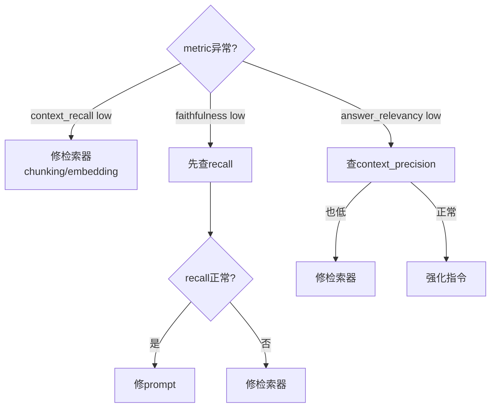
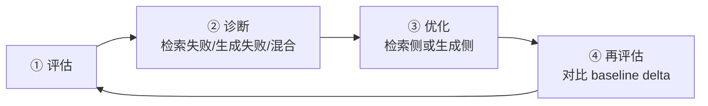

# 第8章 评估体系（Evaluation）

前两章我们学会了如何优化检索质量和生成质量。但"优化"的前提是**可测量**——如果无法定量评估 RAG 系统的质量，优化就失去了方向。本章建立完整的 RAG 评估体系，覆盖检索评估、生成评估、工具框架选型、人工评估集构建和 CI/CD 自动化集成五个层面。RAG 系统可以形象地理解为两个核心角色：**检索器像极快但不怎么动脑子的图书管理员，生成器是绝顶聪明但记忆不准的学霸**。（来源: [RAG评估终极指南](reference/08-评估体系/01-RAG评估终极指南与RAGAS框架.md)）

***

## 8.1 检索评估指标

检索评估的核心问题是：**检索到的文档片段是否真的相关？相关性有多高？排序是否合理？** 检索质量直接决定了 RAG 系统的上限——再强的生成模型也无法从垃圾上下文中产出优质回答。

### 8.1.1 Recall\@K（召回率）

衡量前 K 个结果中包含的相关文档比例：

$$
Recall\@K = \frac{| {前 K 个结果中相关文档} |}{| {所有相关文档总数} |}
$$

```python
def recall_at_k(retrieved_docs: list[str], relevant_docs: list[str], k: int = 5) -> float:
    top_k = retrieved_docs[:k]
    relevant_in_top_k = len(set(top_k) & set(relevant_docs))
    return relevant_in_top_k / len(relevant_docs) if relevant_docs else 0.0
```

阈值：Recall\@5 ≥ **70%** 为良好基线。同时关注 Recall\@3（首屏质量）和 Recall\@10（长尾覆盖）。（来源: [RAG评估终极指南](reference/08-评估体系/01-RAG评估终极指南与RAGAS框架.md)）Recall\@5 < 60% 时排查：chunk size 过大、embedding 领域不匹配、索引元数据过滤缺失。

### 8.1.2 Precision\@K（精确率）

衡量前 K 个结果中相关文档的纯度：

$$Precision\@K = \frac{| {前 K 个结果中相关文档} |}{K}$$

```python
def precision_at_k(retrieved_docs: list[str], relevant_docs: list[str], k: int = 5) -> float:
    top_k = retrieved_docs[:k]
    relevant_in_top_k = len(set(top_k) & set(relevant_docs))
    return relevant_in_top_k / k
```

阈值：Precision\@5 ≥ **60%**。偏低时加 Cross-Encoder Reranker（如 BGE-Reranker），通常可提升 15-30 个百分点，代价是额外 50-200ms 延迟。

### 8.1.3 MRR 与 NDCG

MRR（平均倒数排名）和 NDCG（归一化折损累积增益）衡量**排序位置质量**：

| 指标 | 最优值 | 核心关注点 |
|------|--------|-----------|
| MRR  | 1.0    | 第一个相关文档出现的位置 |
| NDCG | 1.0    | 综合考虑排名和相关度等级 |

$$MRR = \frac{1}{|Q|}\sum_{i=1}^{|Q|}\frac{1}{rank_i}$$

$$NDCG@K = \frac{DCG@K}{IDCG@K}, \; DCG@K = \sum_{k=1}^{K}\frac{2^{rel_k}-1}{\log_2(k+1)}$$

```python
import math

def mrr(retrieved_docs: list[str], relevant_docs: list[str]) -> float:
    for i, doc in enumerate(retrieved_docs):
        if doc in relevant_docs:
            return 1.0 / (i + 1)
    return 0.0

def dcg(relevances: list[float], k: int) -> float:
    return sum(rel / math.log2(i + 2) for i, rel in enumerate(relevances[:k]))

def ndcg(retrieved_relevances: list[float], ideal_relevances: list[float], k: int = 5) -> float:
    dcg_score = dcg(retrieved_relevances, k)
    idcg_score = dcg(sorted(ideal_relevances, reverse=True), k)
    return dcg_score / idcg_score if idcg_score > 0 else 0.0
```

MRR > 0.5 表示首条结果即相关；NDCG\@5 > 0.65 表示排序质量良好。若 MRR 高但 NDCG 低，应减少 Top-K 或加强 reranking。

### 8.1.4 端到端检索评估流水线

以下脚本集成上述指标，使用原生 Python + ChromaDB + SentenceTransformer：

```python
import json
import chromadb
from sentence_transformers import SentenceTransformer

class RetrievalEvalPipeline:
    def __init__(self, collection_name: str = "rag_eval", persist_dir: str = "./chroma_db"):
        self.client = chromadb.PersistentClient(path=persist_dir)
        self.collection = self.client.get_or_create_collection(name=collection_name)
        self.encoder = SentenceTransformer("BAAI/bge-small-zh-v1.5")

    def index_documents(self, chunks: list[dict]):
        ids = [f"doc_{i}" for i in range(len(chunks))]
        texts = [c["text"] for c in chunks]
        embeddings = self.encoder.encode(texts).tolist()
        self.collection.upsert(ids=ids, documents=texts, embeddings=embeddings)

    def retrieve(self, query: str, k: int = 5) -> list[str]:
        query_embedding = self.encoder.encode([query]).tolist()
        results = self.collection.query(query_embeddings=query_embedding, n_results=k)
        return results["documents"][0] if results["documents"] else []

    def run_evaluation(self, eval_set: list[dict], k: int = 5) -> dict:
        scores = {"recall": [], "precision": [], "mrr": []}
        for item in eval_set:
            retrieved = self.retrieve(item["query"], k=k)
            rel = item["relevant_docs"]
            scores["recall"].append(len(set(retrieved[:k]) & set(rel)) / len(rel))
            scores["precision"].append(len(set(retrieved[:k]) & set(rel)) / k)
            scores["mrr"].append(max((1.0 / (i+1) for i, d in enumerate(retrieved) if d in rel), default=0.0))
        return {f"recall@{k}": sum(scores["recall"])/len(scores["recall"]),
                f"precision@{k}": sum(scores["precision"])/len(scores["precision"]),
                "mrr": sum(scores["mrr"])/len(scores["mrr"])}
```

生产建议：纳入回归测试套件，每次修改 chunking/embedding/检索参数后运行对比基线，结果持久化为 JSONL 追踪长期趋势。

***

## 8.2 生成评估指标

检索评估关注"找没找到"，生成评估关注"回答得好不好"。RAG 系统的生成评估核心范式是 **LLM-as-Judge**——用 LLM 自身来评估回答质量。这一范式的优势在于无需人工标注即可实现自动化评估，代价是每次评估需要额外的 LLM API 调用成本。

### 8.2.1 Faithfulness（忠实度）

衡量回答是否基于检索上下文——RAG **最重要的生成指标**。（来源: [RAG评估终极指南](reference/08-评估体系/01-RAG评估终极指南与RAGAS框架.md)）

**机制**：(1) LLM 从回答中提取所有独立的事实性声明（claims）；(2) 逐条检查每个声明能否在检索上下文中找到支持证据；(3) 分数 = 有支撑的声明数 / 总声明数。LLM 调用 1 次即可完成全部声明提取和验证，输出 JSON 格式包含每条声明的支撑判断。（来源: [Ragas完整评估流水线指南](reference/08-评估体系/02-Ragas完整评估流水线指南.md)）

```python
import httpx

FAITHFULNESS_PROMPT = """你是一个严格的事实核查助手。
从以下【回答】中逐条提取事实性声明，判断每条是否能在【上下文】中找到支撑。

上下文：{context}
回答：{answer}

以JSON格式输出：
{{"claims": [{{"statement": "...", "supported": true/false, "evidence": "..."}}],
  "faithfulness_score": 有支撑声明数 / 总声明数}}"""

async def evaluate_faithfulness(answer: str, context: list[str]) -> float:
    prompt = FAITHFULNESS_PROMPT.format(context="\n---\n".join(context), answer=answer)
    async with httpx.AsyncClient() as client:
        resp = await client.post("http://localhost:11434/v1/chat/completions", json={
            "model": "qwen2.5:7b", "messages": [{"role": "user", "content": prompt}], "temperature": 0.0
        }, timeout=60.0)
    import re
    match = re.search(r'"faithfulness_score"\s*:\s*([\d.]+)', resp.json()["choices"][0]["message"]["content"])
    return float(match.group(1)) if match else 0.0
```

### 8.2.2 Answer Relevance（回答相关性）

衡量回答与问题的相关程度。采用逆向验证：(1) LLM 从回答生成 N 个候选问题；(2) 计算候选问题与原始问题的 embedding 余弦相似度；(3) 取最高值。

```python
from sentence_transformers import SentenceTransformer

encoder = SentenceTransformer("BAAI/bge-small-zh-v1.5")

RELEVANCY_PROMPT = """根据以下【回答】，生成{N}个可能对应这个回答的原问题。
回答：{answer}
以JSON数组格式输出。"""

async def evaluate_answer_relevance(question: str, answer: str, n_questions: int = 3) -> float:
    async with httpx.AsyncClient() as client:
        resp = await client.post("http://localhost:11434/v1/chat/completions", json={
            "model": "qwen2.5:7b", "messages": [{"role": "user", "content": RELEVANCY_PROMPT.format(N=n_questions, answer=answer)}], "temperature": 0.7
        }, timeout=60.0)
    content = resp.json()["choices"][0]["message"]["content"]
    import json, re
    questions = json.loads(content) if content.startswith("[") else re.findall(r'"([^"]+)"', content)
    if not questions: return 0.0
    q_emb = encoder.encode([question])
    return float(max((gen_embs * q_emb.T).sum(axis=1) for gen_embs in [encoder.encode(questions)]))
```

### 8.2.3 Context Precision 与 Context Recall

| 指标 | 衡量维度 | 推荐阈值 | 低分首选修复 |
|------|---------|---------|-------------|
| Faithfulness | 回答 vs 上下文 | ≥ 0.85 | 提升 context recall + prompt 约束 |
| Answer Relevance | 回答 vs 问题 | ≥ 0.80 | 先查 context precision，再强化指令 |
| Context Precision | 上下文 vs 问题 | ≥ 0.75 | 加 cross-encoder reranker 或 metadata filter |
| Context Recall | 标准答案 vs 上下文 | ≥ 0.80 | 调 chunk / 换 embedding / 加 hybrid search |

$$ContextPrecision@K = \frac{1}{K}\sum_{k=1}^{K} v_k \cdot \frac{|relevant@k|}{k}$$ 其中 $v_k \in \{0,1\}$ 表示第 k 个文档是否相关，排名靠前的相关文档获得更高权重。Context Recall 衡量 ground truth 各论点是否能在检索上下文中找到支撑，低于 ≥0.80 表示严重漏检。（来源: [Ragas完整评估流水线指南](reference/08-评估体系/02-Ragas完整评估流水线指南.md)）

### 8.2.4 LLM-as-Judge 机制深入解析

LLM-as-Judge 是评估主流范式，各指标调用方式和成本不同：

| 指标 | Judge方式 | LLM调用次数 | 成本级别 |
|------|----------|------------|---------|
| Faithfulness | 分解声明→逐条验证 | O(claims)×1 | 中高 |
| Answer Relevancy | 生成候选Q→embedding相似度 | 1次 + embedding | 中 |
| Context Precision | 二元相关判断 per doc | K次 | 中 |
| Context Recall | claim-level coverage | O(claims)×1 | 中高 |

**成本优化**：(1) 抽样评估（300 样本即可达 ±5% 置信区间）；(2) Embedding 全量监控 + LLM 抽样校准；(3) 分层频率——核心指标每日抽检，回归测试全量，次要指标每周汇总。

**经验阈值**：任何指标较基线下降超过 **0.05** 即触发告警并阻止部署。（来源: [Ragas完整评估流水线指南](reference/08-评估体系/02-Ragas完整评估流水线指南.md)）

***

## 8.3 评估工具与框架

手动编写上述评估脚本虽然可行，但在生产环境中我们需要更系统化的解决方案。本节深入分析三大主流框架的实测表现、选型决策和集成方法。

### 8.3.1 Ragas 完整评估流水线

Ragas 提供从数据集构建到错误诊断的六步闭环：`Set up RAG → Create eval dataset → Set metrics → Run experiment → Analyze errors → Improve → Re-run`。（来源: [Ragas完整评估流水线指南](reference/08-评估体系/02-Ragas完整评估流水线指南.md)）

#### 合成数据集与评估代码

```python
from ragas import evaluate
from ragas.metrics import faithfulness, answer_relevancy, context_precision, context_recall
from datasets import Dataset as HFDataset

dataset = HFDataset.from_dict({
    "question": ["What is the refund policy?", "How do I reset my password?"],
    "answer": ["30-day full refund for unopened items.", "Visit login page and click Forgot Password."],
    "contexts": [["Refund within 30 days."], ["Go to Settings > Account."]],
    "ground_truth": ["Full refund within 30 days.", "Password reset via login page."],
})
results = evaluate(dataset, metrics=[faithfulness, answer_relevancy, context_precision, context_recall])
print(results)
```

**质量要点**：合成问题与真实用户查询存在 gap，建议生产后补充 50-100 条真实 queries 人工标注。

#### 错误诊断决策树



**具体操作清单**：（来源: [Ragas完整评估流水线指南](reference/08-评估体系/02-Ragas完整评估流水线指南.md)）

| 场景 | 首选方案 | 备选方案 |
|------|---------|---------|
| context\_recall < 0.80 | 多种 chunk size 对比实验 | 换 domain-tuned embedding |
| context\_precision < 0.75 | 加 cross-encoder reranker | 加 metadata 过滤 |
| faithfulness < 0.85 | 提升 context recall + 强化 prompt | 加 self-check 步骤 |
| answer\_relevancy < 0.80 | 先查 context precision | 强化 system prompt 指令 |

### 8.3.2 评估框架对比实测（2026 Benchmark）

AI Multiple 2026 年 3 月基准测试（1,460 题、14,600+ 评分上下文，Judge 模型 GPT-4o）：（来源: [RAG评估框架对比实测2026](reference/08-评估体系/03-RAG评估框架对比实测2026.md)）

| 工具 | Top-1 Accuracy | 单条成本(GPT-4o) | 最佳特质 |
|-----|---------------|------------------|---------|
| **WandB Weave** | **94.5%** | ~$2-4/千条 | 二元评分，单次 LLM 调用，高吞吐 |
| **TruLens** | **91.2%** | ~$5-8/千条 | 排名质量领先（NDCG 0.932），最佳排序能力 |
| **Ragas** | **88.8%** | ~$6-10/千条 | 四大指标专为 RAG 设计，生态成熟（13.3K Stars） |
| **DeepEval** | 78.1% | ~$8-14/千条 | pytest 原生集成，50+ 指标，CI/CD 成熟 |

<div style="margin:1.5em 0;padding:1em;border:1px solid var(--md-default-fg-color--lightest);border-radius:8px;background:var(--md-default-bg-color--light);">
  <strong style="color:var(--md-primary-fg-color);">📊 交互式对比图表</strong>
  <p style="margin:0.3em 0 0;font-size:0.9em;color:var(--md-typeset-color--light);">点击下方按钮切换查看各维度的数据对比</p>
</div>
<canvas id="benchmark-chart"></canvas>

**关键发现**：前三名 Top-1 Accuracy 统计无显著差异。**TruLens** 在排名质量（NDCG 0.932, Spearman 0.750）和 Discrimination Ratio（4.2:1）全面领先。

**通用盲区**：所有工具均无法区分事实错误 vs 事实正确的上下文——Hard Negatives（实体替换陷阱）排名高于 Partial Contexts。**衡量的是主题契合度，不是事实准确性**。

**选型决策**：RAG 质量评估选 Ragas；Tracing+Eval 选 TruLens；CI/CD 集成选 DeepEval；高吞吐安全检查选 WandB。（来源: [RAG评估框架对比实测2026](reference/08-评估体系/03-RAG评估框架对比实测2026.md)）

### 8.3.3 TruLens 与 DeepEval

**TruLens**：评估 + 追踪一体化，通过 OpenTelemetry span 记录完整 RAG 调用链路。`@observe` 装饰器自动创建 span，可接入 Jaeger/Tempo/Grafana。（来源: [RAG评估终极指南](reference/08-评估体系/01-RAG评估终极指南与RAGAS框架.md)）

**DeepEval**：**"评估即测试"**——完全融入 pytest 生态系统。`deepeval test run` 可嵌入 CI/CD 流水线，失败时自动输出 per-test-case 诊断信息。适合已有 pytest 工作流的团队。（来源: [RAG评估终极指南](reference/08-评估体系/01-RAG评估终极指南与RAGAS框架.md)）

***

## 8.4 人工评估集与持续评估

自动化评估不能完全替代人工评估——LLM-as-Judge 存在系统性偏差，某些维度难以量化，且人工评估集是自动化评估的校准基准。

### 8.4.1 人工评估集构建 SOP

三个核心概念的区分（来源: [人工评估集构建SOP](reference/08-评估体系/05-人工评估集构建SOP.md)）：

| 维度 | Guidelines（标注指南） | Rubric（评分规则） | Golden Set（金标准） |
|------|----------------------|-------------------|---------------------|
| 定位 | 告诉人**怎么做** | 告诉评审者**怎么打分** | 验证流程**是否有效** |
| 核心问题 | "这个该标什么？" | "这个质量如何？" | "我们的流程靠谱吗？" |

**标注指南设计原则**：清晰标签（每类1-2句定义）、显式负例描述、正反例各有≥2个、覆盖边缘案例。禁止模糊修饰语。

**推荐标注模式**：Thumbs Up/Down + Bad 必填原因（分类：Hallucination / Irrelevant / Incomplete / Tone inappropriate），效率 < 30 秒/条，成本低且信号充分。

**Golden Set 规模建议**：MVP 20-50 条，Standard 100-200 条，Production 300-500 条（60% common / 25% edge / 15% adversarial）。Golden Set 的信任来源：专家审核 → 多人 adjudication → 反复验证无争议。**质量 > 数量**。

**质量控制**：Cohen's κ > 0.80 为优秀，< 0.60 需重写 guidelines；每批次 golden set 抽检 10-20%，准确率 > 90%。（来源: [人工评估集构建SOP](reference/08-评估体系/05-人工评估集构建SOP.md)）

### 8.4.2 CI/CD 自动化评估集成

**质量门禁阈值**：（来源: [CICD自动化评估集成](reference/08-评估体系/04-CICD自动化评估集成.md)）

| 指标 | 阈值 | 失败后果 |
|------|------|---------|
| Faithfulness | > 0.85 | ❌ Fail build |
| Context Precision | > 0.75 | ❌ Fail build |
| Context Recall | > 0.80 | ❌ Fail build |
| Answer Relevancy | > 0.80 | ⚠️ Warning |
| Critical errors | = 0 | ❌ Fail build |

**回归防护三大策略**：

- **Prompt 变更触发的全量 Test Suite**：每次 system prompt 修改跑全量 eval set，指标下降 > 0.05 阻止合并
- **文档库更新即时重评**：corpus 更新立即触发 full re-index + eval，不等 nightly batch
- **嵌入模型 Shadow Mode**：新索引 shadow mode 对比新旧评分，验证通过才切流量

（来源: [CICD自动化评估集成](reference/08-评估体系/04-CICD自动化评估集成.md)）

### 8.4.3 评估驱动的优化闭环



**常见失败模式**：

| 失败模式 | 典型症状 | 优化动作 |
|---------|---------|---------|
| 检索漏检 | Context Recall < 0.70 | 缩小 chunk → 换 domain embedding → 加 hybrid |
| 检索噪声 | Context Precision < 0.65 | 加 reranker → 降 top-k → metadata filter |
| 幻觉频发 | Faithfulness < 0.80 但 Recall 正常 | 强化 prompt → self-check → 降 temperature |
| 答非所问 | Answer Relevancy < 0.70 但 Faithfulness 高 | 加强 query → HyDE → 优化 answering instruction |

建立评估 dashboard（Gradio/Streamlit），设置指标阈值告警和异常下降通知。

***

## 本章小结

| 评估层面 | 核心指标 | 推荐阈值 | 首选工具 |
|---------|---------|---------|---------|
| 检索评估 | Recall\@5 / Precision\@5 / MRR / NDCG\@5 | >70% / >60% / >0.5 / >0.65 | 原生 Python |
| 生成评估 | Faithfulness / Answer Relevance / Context Precision / Context Recall | ≥0.85 / ≥0.80 / ≥0.75 / ≥0.80 | Ragas |
| 框架选型 | 依场景选择 | — | Ragas/TruLens/DeepEval/WandB |
| 人工校验 | Inter-Annotator Agreement | κ > 0.80 | Guidelines + Golden Set |
| CI/CD 门禁 | Critical Errors | = 0 | GitHub Actions |

核心原则：**先测量，再优化**。自动化评估为主（Ragas/TruLens/DeepEval），人工评估定期校准（Golden Set + κ），CI/CD 门禁做最后防线。进阶篇（Ch6-Ch8）至此完成，下一章进入生产篇——架构设计、监控运维和安全合规。
