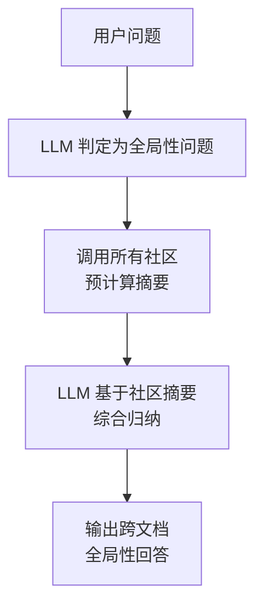
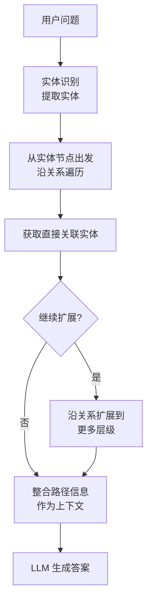
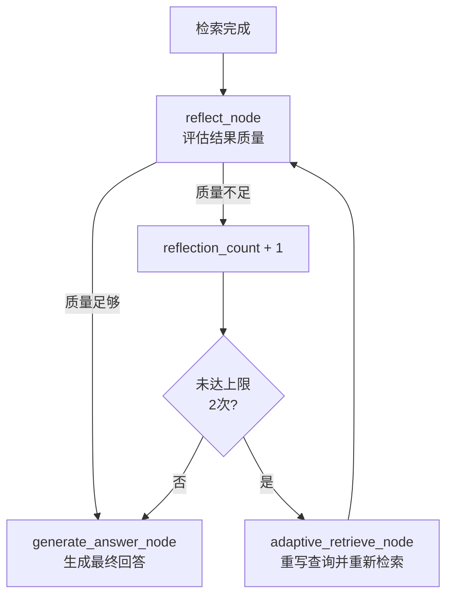

# 第12章 高级 RAG 范式

> 本章定位：前沿篇，介绍 RAG 领域两大前沿方向——Graph RAG 与 Agentic RAG 的工程实践，以及多模态 RAG 的技术趋势。内容侧重架构原理与可运行代码，帮助读者理解下一代 RAG 系统的设计思路。

---

## 12.1 Graph RAG 深度实践

Graph RAG 是 Microsoft Research 于 2024 年提出的新范式，核心思想是用**知识图谱的结构化关系**弥补纯向量检索在"全局性问题"上的根本缺陷。（来源: [01-GraphRAG实战指南Neo4j-LightRAG-Qdrant.md](reference/11-行业案例与趋势/01-GraphRAG实战指南Neo4j-LightRAG-Qdrant.md)）

### 12.1.1 知识图谱构建流程

#### GraphRAG vs 向量 RAG 核心差异

传统向量 RAG 基于"语义相似度匹配"，擅长回答"产品 X 的功能是什么？"这类**局部性问题**；但当用户问"公司整体风险趋势如何？"时，向量检索只能召回若干相关片段，无法跨文档综合归纳。Graph RAG 通过实体关系遍历解决这一痛点。

| 维度 | 向量 RAG | Graph RAG |
|------|---------|----------|
| 检索原理 | 语义相似度匹配 | 实体关系遍历 + 语义搜索 |
| 回答范围 | 局限于单个/多个文本片段 | 可跨实体关系链综合归纳 |
| 适用问题 | "产品 X 的功能是什么？" | "公司整体风险趋势如何？" |
| 构建成本 | 低（Embedding + 存储） | 高（需 LLM 抽取实体关系） |
| 更新成本 | 低（增量索引） | 高（可能需重建受影响子图） |

（来源: [01-GraphRAG实战指南Neo4j-LightRAG-Qdrant.md](reference/11-行业案例与趋势/01-GraphRAG实战指南Neo4j-LightRAG-Qdrant.md)）

#### Neo4j GraphRAG Pipeline 三步走

Neo4j 官方提供了 `neo4j-graphrag` Python 库，封装了从文档到知识图谱的完整流水线。以下是基于 Neo4j Driver 的 GraphRAG 构建示例：

```python
from neo4j import GraphDatabase
from neo4j_graphrag.retrievers import VectorRetriever
from neo4j_graphrag.llm import OpenAILLM
from neo4j_graphrag.generation import GraphRAG
from neo4j_graphrag.embeddings import OpenAIEmbeddings

driver = GraphDatabase.driver(
    "neo4j://localhost:7687",
    auth=("neo4j", "password")
)

embedder = OpenAIEmbeddings(model="text-embedding-3-large")
retriever = VectorRetriever(driver, "document-index", embedder)
llm = OpenAILLM(model_name="gpt-4o")

graph_rag = GraphRAG(retriever=retriever, llm=llm)
result = graph_rag.search("公司的风险趋势是什么？")
print(result.answer)
print(result.context)
```

（来源: [01-GraphRAG实战指南Neo4j-LightRAG-Qdrant.md](reference/11-行业案例与趋势/01-GraphRAG实战指南Neo4j-LightRAG-Qdrant.md)）

#### 知识图谱构建组件清单

完整的 GraphRAG 管线包含以下关键组件：

| 组件 | 功能 | 必要性 |
|------|------|--------|
| Data Loader | 从文件提取原始文本 | 必须 |
| Text Splitter | 按段落/章节分块处理 | 必须 |
| Chunk Embedder | 计算 chunk 的向量表示 | 推荐 |
| Schema Builder | 定义节点类型（Person/Org/Product）和关系类型 | 推荐 |
| Entity & Relation Extractor | **LLM 从文本中抽取实体和关系** | **必须** |
| Knowledge Graph Writer | 将三元组写入 Neo4j 图数据库 | 必须 |
| Entity Resolver | 合并指代同一实体的不同表述（如"微软"和"Microsoft"） | 推荐 |

（来源: [01-GraphRAG实战指南Neo4j-LightRAG-Qdrant.md](reference/11-行业案例与趋势/01-GraphRAG实战指南Neo4j-LightRAG-Qdrant.md)）

其中 **Entity & Relation Extractor** 是最关键的步骤——它调用 LLM 对每个文本块进行信息抽取，输出形如 `(EntityA, RELATIONSHIP, EntityB)` 的三元组。这是 GraphRAG 构建成本高的主要原因。

#### 使用 LLM 进行实体关系抽取

实体关系抽取是知识图谱构建的核心环节。其本质是**信息抽取（Information Extraction, IE）**任务的一个子方向——从非结构化文本中识别命名实体（Named Entity）并确定它们之间的语义关系。

**核心原理**：利用 LLM 的指令遵循能力，通过精心设计的 Prompt 引导模型从文本中提取结构化的三元组。相比传统的基于规则或序列标注（BIO 标签）的方法，LLM 方案无需标注数据，泛化能力更强，但抽取的一致性和格式稳定性需要额外工程处理。

**解决什么问题**：将散落在文档中的隐式知识（"张三在 2023 年加入 A 公司担任技术总监"）转化为图数据库可直接存储和查询的结构化形式（`(张三, WORKS_AT, A公司)`、`(张三, HAS_ROLE, 技术总监)`、`(张三, JOINED_IN, 2023)`）。

以下是一个使用 LLM 进行实体关系抽取的完整代码示例：

```python
import json
from openai import OpenAI

client = OpenAI()

EXTRACTION_PROMPT = """你是一个专业的知识图谱构建助手。请从以下文本中提取实体和关系。

要求：
1. 实体类型包括：Person（人物）、Organization（组织）、Product（产品）、Technology（技术）、Event（事件）
2. 关系类型包括：WORKS_AT（就职于）、DEVELOPS（开发）、USES（使用）、PARTNERS_WITH（合作）、ACQUIRED（收购）
3. 输出格式为 JSON 数组，每个元素包含 source, relation, target 三个字段

文本：{text}

请以 JSON 数组格式输出抽取结果，不要输出其他内容。"""


def extract_entities_and_relations(text: str) -> list[dict]:
    """
    使用 LLM 从文本中抽取实体关系三元组。

    Args:
        text: 待抽取的原始文本

    Returns:
        三元组列表，每个三元组形如 {"source": "实体A", "relation": "关系", "target": "实体B"}

    注意事项：
    - LLM 抽取可能存在幻觉（Hallucination），生产环境需人工校验或交叉验证
    - 同一实体可能有多种表述（"微软"/"Microsoft"/"微软公司"），需要实体消歧（Entity Resolution）
    - 长文本建议先分块再抽取，避免超出上下文窗口
    """
    response = client.chat.completions.create(
        model="gpt-4o",
        messages=[{"role": "user", "content": EXTRACTION_PROMPT.format(text=text)}],
        temperature=0,  # 低温度保证抽取一致性
        response_format={"type": "json_object"},
    )

    try:
        result = json.loads(response.choices[0].message.content)
        return result.get("relations", result) if isinstance(result, dict) else result
    except json.JSONDecodeError:
        print(f"抽取结果解析失败: {response.choices[0].message.content}")
        return []


# 示例：抽取并写入 Neo4j
def build_knowledge_graph(documents: list[str]) -> None:
    """批量抽取实体关系并写入 Neo4j 知识图谱"""
    from neo4j import GraphDatabase

    driver = GraphDatabase.driver("neo4j://localhost:7687", auth=("neo4j", "password"))

    for doc in documents:
        triples = extract_entities_and_relations(doc)
        for triple in triples:
            # 使用 MERGE 避免重复创建节点
            driver.execute_query(
                """
                MERGE (a:Entity {name: $source})
                MERGE (b:Entity {name: $target})
                MERGE (a)-[r:RELATION {type: $relation}]->(b)
                """,
                source=triple["source"],
                target=triple["target"],
                relation=triple["relation"],
            )
        print(f"文档抽取完成，获得 {len(triples)} 个三元组")

    driver.close()


# 使用示例
if __name__ == "__main__":
    sample_text = """
    微软在 2023 年收购了 Activision Blizzard，加强了其在游戏领域的布局。
    同时，微软与 OpenAI 保持深度合作关系，将 GPT-4 技术集成到 Copilot 产品中。
    """
    triples = extract_entities_and_relations(sample_text)
    for t in triples:
        print(f"({t['source']}, {t['relation']}, {t['target']})")
```

**常见陷阱与注意事项**：

| 陷阱 | 说明 | 应对策略 |
|------|------|---------|
| **实体消歧失败** | "苹果"可能指公司或水果 | 构建实体类型约束，结合上下文消歧 |
| **关系粒度不一致** | 有时抽取"合作"，有时抽取"战略合作伙伴" | 定义标准关系类型枚举，Prompt 中明确约束 |
| **LLM 幻觉** | 编造文本中不存在的关系 | 设置 temperature=0，必要时引入 NLI 模型验证 |
| **嵌套实体遗漏** | "微软亚洲研究院"可能只抽取"微软" | 使用多轮抽取或 specialized NER 模型预处理 |

#### LightRAG 轻量级替代方案

如果不想依赖 Neo4j 商业版，[LightRAG](https://github.com/HKUDS/LightRAG) 提供了轻量级的 GraphRAG 实现，支持 SQLite/TiDB 作为后端存储：

```python
from lightrag import LightRAG
from lightrag.llm.openai import gpt_4o_mini_complete

rag = LightRAG(
    working_dir="./auto_kg",
    llm_model_func=gpt_4o_mini_complete
)
await rag.insert("CompanyA develops ProductX for enterprise customers...")
result = await rag.query("Who developed ProductX?")
# 返回基于图谱的答案，附带关系路径
```

（来源: [01-GraphRAG实战指南Neo4j-LightRAG-Qdrant.md](reference/11-行业案例与趋势/01-GraphRAG实战指南Neo4j-LightRAG-Qdrant.md)）

### 12.1.2 图社区摘要与全局查询

GraphRAG 的核心创新在于**Leiden 社区检测算法**的应用：系统自动将知识图谱划分为多个语义社区（Community），每个社区生成一段自然语言摘要。

**全局查询（Global Query）的工作流程**：


例如，当用户问"这家公司的核心技术布局有哪些方向？"时：
1. 系统识别出这是一个需要**全局视角**的问题
2. 检索各技术领域的社区摘要（而非具体专利片段）
3. LLM 综合各领域摘要，输出结构化的技术布局分析

这种设计的优势在于：**将检索粒度从"文档片段"提升到"主题摘要"级别**，天然适合需要综合归纳的场景。

#### 社区摘要的生成与查询

社区摘要是 GraphRAG 区别于普通图检索的关键创新。其**核心原理**是：利用 Leiden 层次化社区检测算法（基于模块度优化的图聚类方法），将知识图谱中的实体按连接密度自动分组为多个社区，然后对每个社区内的实体和关系生成一段自然语言摘要。

**为什么需要社区摘要？** 直接在图上做多跳遍历虽然精确，但当图谱规模达到数万节点时，遍历路径的组合爆炸会导致检索效率急剧下降。社区摘要将"遍历 N 个节点"简化为"读取 1 段摘要"，大幅降低了检索复杂度。

**生成过程**（通常在离线索引阶段完成）：

```python
from neo4j import GraphDatabase
from openai import OpenAI

driver = GraphDatabase.driver("neo4j://localhost:7687", auth=("neo4j", "password"))
client = OpenAI()


def detect_communities() -> list[dict]:
    """
    使用 Leiden 算法检测图中的社区结构。
    实际项目中可使用 graphdatascience (GDS) 库的 Leiden 算法实现。
    返回社区 ID 及其包含的实体列表。
    """
    result = driver.execute_query("""
        // 使用 GDS 库运行 Leiden 社区检测
        // 需要 Neo4j GDS 插件支持
        CALL gds.leiden.stream('myGraph', {
            maxLevels: 10,
            tolerance: 0.0001
        })
        YIELD nodeId, communityId
        RETURN gds.util.asNode(nodeId).name AS entity_name, communityId
        ORDER BY communityId
    """)
    # 按社区 ID 分组
    communities = {}
    for record in result.records:
        cid = record["communityId"]
        communities.setdefault(cid, []).append(record["entity_name"])
    return [{"id": cid, "entities": ents} for cid, ents in communities.items()]


def generate_community_summary(community: dict) -> str:
    """使用 LLM 为单个社区生成自然语言摘要"""
    entities_str = "、".join(community["entities"])

    # 先查询社区内的关系详情
    entities_list = community["entities"][:20]  # 限制查询规模
    result = driver.execute_query("""
        MATCH (a:Entity)-[r:RELATION]->(b:Entity)
        WHERE a.name IN $entities AND b.name IN $entities
        RETURN a.name, r.type, b.name
        LIMIT 50
    """, entities=entities_list)

    relations = [f"{r['a.name']} -[{r['r.type']}]-> {r['b.name']}" for r in result.records]
    relations_str = "\n".join(relations)

    response = client.chat.completions.create(
        model="gpt-4o",
        messages=[{
            "role": "user",
            "content": f"""请为以下知识图谱社区生成一段简洁的摘要（200字以内），
涵盖该社区的核心实体、主要关系和主题。

社区实体：{entities_str}
社区内关系：
{relations_str}

摘要："""
        }],
        temperature=0,
    )
    return response.choices[0].message.content


def build_community_summaries():
    """完整流程：检测社区 → 生成摘要 → 写回图数据库"""
    communities = detect_communities()
    print(f"检测到 {len(communities)} 个社区")

    for community in communities:
        summary = generate_community_summary(community)
        # 将摘要写回图数据库，关联到社区中的每个实体
        for entity_name in community["entities"]:
            driver.execute_query("""
                MATCH (e:Entity {name: $name})
                SET e.community_id = $cid, e.community_summary = $summary
            """, name=entity_name, cid=community["id"], summary=summary)
        print(f"社区 {community['id']}（{len(community['entities'])} 个实体）摘要已生成")

    driver.close()
```

**查询社区摘要的 Cypher 示例**：

```cypher
// 1. 查询所有社区摘要（用于全局查询场景）
MATCH (e:Entity)
WHERE e.community_summary IS NOT NULL
WITH e.community_id AS cid, e.community_summary AS summary, collect(e.name) AS entities
RETURN cid, summary, entities
ORDER BY size(entities) DESC;

// 2. 根据关键词查找相关社区
MATCH (e:Entity)
WHERE e.community_summary CONTAINS '人工智能'
  OR e.name CONTAINS '人工智能'
WITH e.community_id AS cid, e.community_summary AS summary
RETURN DISTINCT cid, summary;

// 3. 查询特定实体的社区上下文（用于局部查询增强）
MATCH (e:Entity {name: '微软'})
MATCH (other:Entity)
WHERE other.community_id = e.community_id AND other.name <> '微软'
RETURN e.community_summary AS summary, collect(other.name) AS related_entities;

// 4. 跨社区关系查询（发现社区间的桥接实体）
MATCH (a:Entity)-[r:RELATION]->(b:Entity)
WHERE a.community_id <> b.community_id
RETURN a.name, a.community_id, r.type, b.name, b.community_id
LIMIT 20;
```

**社区摘要的优缺点**：

| 维度 | 优点 | 缺点 |
|------|------|------|
| **检索效率** | 摘要预计算，查询时无需遍历大量节点 | 摘要生成成本高（需 LLM 调用） |
| **回答质量** | 天然适合全局性/总结性问题 | 细节信息在摘要化过程中有损 |
| **更新维护** | 局部更新只需重新生成受影响社区的摘要 | 实体跨社区迁移时需重新计算 |
| **可解释性** | 摘要本身是可读的自然语言，便于调试 | 社区划分质量依赖图结构，稀疏图效果差 |

### 12.1.3 局部查询与多跳推理

对于"张三参与了哪些项目？"这类**局部性问题**，GraphRAG 采用不同的策略——从特定实体出发，沿关系边进行**多跳推理（Multi-hop Reasoning）**：


**多跳推理的价值**：当答案分散在不同文档中时（如项目 A 在文档 1、项目 B 在文档 3），向量检索可能因各自相似度不够高而遗漏；而图遍历可以沿着 `人→项目→技术` 的关系链**显式地串联起分散的信息**。

#### Qdrant + Neo4j 混合架构

生产环境中常见的做法是**向量库 + 图数据库混合部署**：Qdrant 负责高效向量检索做候选集初筛，Neo4j 负责关系推理做精确扩展。（来源: [01-GraphRAG实战指南Neo4j-LightRAG-Qdrant.md](reference/11-行业案例与趋势/01-GraphRAG实战指南Neo4j-LightRAG-Qdrant.md)）

| 阶段 | Qdrant 职责 | Neo4j 职责 |
|------|-----------|-----------|
| Ingestion | 存储文档 chunk 向量 | 存储实体关系三元组 |
| Retrieval | 向量相似度 Top-K 候选召回 | 沿关系边扩展上下文 |
| Generation | 提供语义相关的文本片段 | 提供结构化的实体关系路径 |

这种架构兼顾了向量检索的高效性和图推理的表达能力，是当前 GraphRAG 生产部署的主流方案。

---

## 12.2 Agentic RAG 实战（LangGraph 实现）

Agentic RAG 将 RAG 从固定流水线升级为**具有自主决策能力的智能体**：它能判断是否需要检索、选择合适的检索策略、评估结果质量并在必要时自我修正。（来源: [03-LangGraph官方AgenticRAG教程.md](reference/04-工具链与环境/03-LangGraph官方AgenticRAG教程.md)）（来源: [05-AgenticRAG2026生产指南与框架选型.md](reference/04-工具链与环境/05-AgenticRAG2026生产指南与框架选型.md)）

根据 2026 年生产指南，**LangGraph StateGraph 是有状态 Agentic RAG 的默认选择**，相比传统 LangChain LCEL 的线性编排，它原生支持循环路由和状态共享。（来源: [05-AgenticRAG2026生产指南与框架选型.md](reference/04-工具链与环境/05-AgenticRAG2026生产指南与框架选型.md)）

### 12.2.1 自适应检索与多工具调用

自适应检索是 Agentic RAG 的核心特征：**不是每个问题都需要检索**。对于事实性知识（"Python 的 GIL 是什么？"），LLM 可能直接回答；对于私有数据或时效性问题（"我们上周的会议决议是什么？"），才触发检索。

**概念定义**：自适应检索路由（Adaptive Retrieval Routing）是一种让 LLM 充当"调度员"的机制——它在运行时动态判断用户问题是否需要外部知识检索，以及应该使用哪种检索工具。这一机制的本质是**查询意图分类（Query Intent Classification）**与**工具选择（Tool Selection）**的统一。

**解决什么问题**：传统 RAG 的"无脑检索"模式存在两个缺陷：一是对简单常识问题产生不必要的检索延迟和成本；二是单一检索工具无法覆盖所有数据源（向量库擅长语义匹配，搜索引擎擅长实时信息，SQL 擅长结构化查询）。

**起因与发展**：这一思想最早可追溯到 2023 年 Self-RAG 论文（由 CMU 和 Meta 联合提出），该论文引入了"反思令牌（Reflection Tokens）"让模型自主决定是否需要检索。随后 LangChain/LangGraph 将这一思想工程化，通过条件边（conditional_edges）实现路由逻辑。

LangGraph 通过 **条件边（conditional_edges）** 实现这一逻辑——LLM 在路由节点中分析用户意图，决定下一步走向：

```python
from typing import TypedDict, Annotated
from langgraph.graph import StateGraph, START, END
from langgraph.graph.message import add_messages

class AgentState(TypedDict):
    messages: Annotated[list, add_messages]
    retrieved_docs: list[str]
    reflection_count: int
```

**路由逻辑的设计原则**：

| 原则 | 说明 | 反模式 |
|------|------|--------|
| **意图优先** | 先分类问题类型（事实/分析/闲聊），再决定检索策略 | 所有问题都走检索 |
| **成本感知** | 简单问题直接回答，避免不必要的 LLM 调用 | 每个节点都调用 LLM |
| **可观测性** | 路由决策日志记录，便于调试和优化 | 路由逻辑是黑盒 |
| **降级兜底** | 检索失败时能优雅降级为直接回答 | 检索失败就报错 |

Agentic RAG 的另一大优势是**工具可扩展性**——除了向量检索，还可以接入搜索引擎、SQL 数据库、API 等多种数据源。LangGraph 使用 `ToolNode` 统一管理工具调用。

以下是**完整的 LangGraph Agentic RAG 实现**，包含自适应路由、多工具调用和 Self-Reflection 质量闭环三个核心模块：

```python
import json
import httpx
from typing import TypedDict, Annotated, Literal
from langgraph.graph import StateGraph, START, END
from langgraph.graph.message import add_messages
from langgraph.prebuilt import ToolNode

def tool(func):
    func.name = func.__name__
    func.description = func.__doc__ or ""
    return func


class AgentState(TypedDict):
    messages: Annotated[list, add_messages]
    retrieved_docs: list[str]
    reflection_count: int

LLM_API_URL = "http://localhost:11434/v1/chat/completions"
LLM_MODEL = "llama3.3:8b"


async def call_llm_async(messages: list, temperature: float = 0) -> dict:
    """
    异步调用 LLM 的统一封装函数。

    注意：在 LangGraph 的异步节点中，必须使用异步 HTTP 客户端。
    如果在异步上下文中使用同步的 httpx.post()，会阻塞事件循环，
    导致整个 workflow 的并发性能严重下降，甚至引发超时。
    """
    async with httpx.AsyncClient() as client:
        resp = await client.post(LLM_API_URL, json={
            "model": LLM_MODEL,
            "messages": messages,
            "temperature": temperature,
        }, timeout=60)
        resp.raise_for_status()
        return resp.json()


@tool
def vector_retrieve(query: str) -> str:
    """从企业知识库向量索引中检索相关文档片段。
    当问题涉及公司内部政策、产品文档或历史记录时使用此工具。"""
    # 实际项目中替换为你的向量检索逻辑
    # 例如: results = vector_store.similarity_search(query, k=5)
    return f"[向量检索结果] 关于 '{query}' 的相关文档片段..."


@tool
def web_search(query: str) -> str:
    """搜索互联网获取最新信息。
    当问题涉及实时新闻、最新技术动态或外部市场数据时使用此工具。"""
    # 实际项目中替换为 Tavily / SerpAPI / DuckDuckGo 等
    return f"[网络搜索结果] 关于 '{query}' 的最新信息..."


tools = [vector_retrieve, web_search]
tool_node = ToolNode(tools)


async def adaptive_retrieve_node(state: AgentState) -> dict:
    """
    自适应检索路由节点：LLM 决定是否及如何检索。

    关键设计：
    - 使用结构化 Prompt 引导 LLM 输出 JSON 格式的路由决策
    - 返回包含 tool_calls 字段的 dict，使 route_tool_call 能正确检测
    - 使用异步 HTTP 调用，避免阻塞事件循环
    """
    route_prompt = """你是一个检索路由助手。分析用户问题，决定下一步操作。

规则：
1. 如果问题涉及公司内部信息或需要最新数据，返回工具调用：
   {"action": "tool_call", "tool": "vector_retrieve" 或 "web_search", "query": "检索关键词"}
2. 如果你可以直接回答（常识性问题），返回：
   {"action": "direct_answer", "content": "你的回答"}

用户问题：{question}"""

    last_user_msg = ""
    for msg in reversed(state["messages"]):
        content = msg.get("content", "") if isinstance(msg, dict) else getattr(msg, "content", "")
        if content:
            last_user_msg = content
            break

    messages = state["messages"] + [{
        "role": "system",
        "content": route_prompt.format(question=last_user_msg)
    }]

    llm_result = await call_llm_async(messages, temperature=0)
    content = llm_result["choices"][0]["message"]["content"]

    # 尝试解析 LLM 返回的结构化路由决策
    try:
        decision = json.loads(content)
        if decision.get("action") == "tool_call":
            # 返回包含 tool_calls 的 dict，使下游路由函数能正确检测
            return {
                "messages": [{
                    "role": "assistant",
                    "content": content,
                    "tool_calls": [{
                        "id": "call_001",
                        "name": decision["tool"],
                        "args": {"query": decision["query"]},
                    }]
                }]
            }
        else:
            # LLM 决定直接回答
            return {
                "messages": [{"role": "assistant", "content": decision.get("content", content)}]
            }
    except (json.JSONDecodeError, KeyError):
        # 解析失败时，默认返回普通回答
        return {"messages": [{"role": "assistant", "content": content}]}


async def reflect_node(state: AgentState) -> dict:
    """
    Self-Reflection 节点：评估检索结果质量。

    使用异步 HTTP 调用，与 adaptive_retrieve_node 保持一致。
    """
    last_message = state["messages"][-1]
    docs_content = "\n".join(state.get("retrieved_docs", []))

    if not docs_content:
        return {
            "messages": [{"role": "system", "content": "检索结果为空，请重写查询后重新检索。"}],
            "reflection_count": state.get("reflection_count", 0) + 1,
        }

    reflection_prompt = f"""请评估以下检索结果是否足以回答用户的原始问题。
如果不足够，说明缺少什么信息；如果足够，回复"OK"。

检索结果：
{docs_content}

用户原始问题：{state["messages"][0].get("content", "")}"""

    llm_result = await call_llm_async(
        [{"role": "user", "content": reflection_prompt}],
        temperature=0
    )
    reflection_content = llm_result["choices"][0]["message"]["content"]

    is_sufficient = "OK" in reflection_content
    new_count = state.get("reflection_count", 0) + (0 if is_sufficient else 1)

    return {
        "messages": [{"role": "assistant", "content": reflection_content}],
        "reflection_count": new_count,
    }


async def generate_answer_node(state: AgentState) -> dict:
    """基于检索结果生成最终回答（异步版本）"""
    docs_context = "\n".join(state.get("retrieved_docs", []))
    prompt = f"""基于以下检索到的材料回答用户问题。
如果材料不足以回答，请明确说明。

检索材料：
{docs_context}

请用中文回答，并标注信息来源。"""

    messages = state["messages"] + [{"role": "user", "content": prompt}]
    llm_result = await call_llm_async(messages, temperature=0)
    content = llm_result["choices"][0]["message"]["content"]
    return {"messages": [{"role": "assistant", "content": content}]}


def route_tool_call(state: AgentState) -> Literal["tools", "generate"]:
    """
    路由条件：检查 LLM 是否发起了工具调用。

    修复说明：
    adaptive_retrieve_node 返回的是普通 dict，不会有 tool_calls 属性。
    这里统一检查 dict 中的 "tool_calls" 键，兼容两种格式。
    """
    last_message = state["messages"][-1]

    # 兼容 dict 中的 tool_calls 字段
    tool_calls = None
    if isinstance(last_message, dict):
        tool_calls = last_message.get("tool_calls")
    elif hasattr(last_message, "tool_calls"):
        tool_calls = last_message.tool_calls

    if tool_calls:
        return "tools"
    return "generate"


def should_retry_or_generate(state: AgentState) -> Literal["retrieve", "reflect"]:
    """反思后路由：未达上限则重试检索，否则进入反思节点"""
    max_reflections = 2
    if state.get("reflection_count", 0) < max_reflections:
        return "retrieve"
    return "reflect"


def reflect_then_route(state: AgentState) -> Literal["generate", "retrieve"]:
    """反思结果路由：质量足够则生成，不足则重新检索"""
    last_message = state["messages"][-1]
    content = last_message.get("content", "") if isinstance(last_message, dict) else getattr(last_message, "content", "")

    if "OK" in content:
        return "generate"
    return "retrieve"


def collect_docs(state: AgentState) -> dict:
    """收集工具返回的文档到 retrieved_docs"""
    last_message = state["messages"][-1]
    new_docs = list(state.get("retrieved_docs", []))

    content = last_message.get("content", "") if isinstance(last_message, dict) else getattr(last_message, "content", "")
    if content:
        new_docs.append(content)
    return {"retrieved_docs": new_docs}


workflow = StateGraph(AgentState)

workflow.add_node("adaptive_retrieve", adaptive_retrieve_node)
workflow.add_node("tools", tool_node)
workflow.add_node("collect", collect_docs)
workflow.add_node("reflect", reflect_node)
workflow.add_node("generate", generate_answer_node)

workflow.add_edge(START, "adaptive_retrieve")
workflow.add_conditional_edges("adaptive_retrieve", route_tool_call, {
    "tools": "tools",
    "generate": "generate",
})
workflow.add_edge("tools", "collect")
workflow.add_conditional_edges("collect", should_retry_or_generate, {
    "retrieve": "adaptive_retrieve",
    "reflect": "reflect",
})
workflow.add_conditional_edges("reflect", reflect_then_route, {
    "generate": "generate",
    "retrieve": "adaptive_retrieve",
})
workflow.add_edge("generate", END)

graph = workflow.compile()


if __name__ == "__main__":
    result = graph.invoke({
        "messages": [("human", "我们公司的数据安全政策有哪些要点？")],
        "retrieved_docs": [],
        "reflection_count": 0,
    })
    print(result["messages"][-1].content)
```

**Bug 修复说明**：

| Bug | 原始问题 | 修复方案 |
|-----|---------|---------|
| **同步/异步混用** | `adaptive_retrieve_node` 和 `reflect_node` 使用同步 `httpx.post()`，在异步上下文中阻塞事件循环 | 统一使用 `async with httpx.AsyncClient()` + `await client.post()` |
| **死代码 `should_reflect`** | `should_reflect` 函数定义了但从未被使用 | 已删除，其功能被 `reflect_then_route` 替代并正确集成到条件边 |
| **工具调用路径无法触发** | `route_tool_call` 检查 `hasattr(last_message, "tool_calls")`，但节点返回的是普通 dict | `adaptive_retrieve_node` 返回包含 `tool_calls` 字段的 dict；`route_tool_call` 同时兼容 dict 和 Message 对象 |

（来源: [03-LangGraph官方AgenticRAG教程.md](reference/04-工具链与环境/03-LangGraph官方AgenticRAG教程.md)）

### 12.2.2 Self-Reflection 质量闭环

上述代码中的 `reflect_node` 实现了 **Self-RAG** 模式的核心思想：让 LLM 充当"裁判"，评估当前检索结果是否足以支撑高质量回答。（来源: [05-AgenticRAG2026生产指南与框架选型.md](reference/04-工具链与环境/05-AgenticRAG2026生产指南与框架选型.md)）

**质量闭环流程**：


这种设计解决了传统 RAG 的一个致命缺陷：**检索到垃圾就生成垃圾答案**。通过引入反思机制，系统能够主动发现检索质量问题并尝试修正。

#### 成本现实提醒

根据 2026 年生产指南的数据，Agentic RAG 相比 vanilla RAG 有显著的成本增加：（来源: [05-AgenticRAG2026生产指南与框架选型.md](reference/04-工具链与环境/05-AgenticRAG2026生产指南与框架选型.md)）

| 指标 | Vanilla RAG | Agentic RAG | 倍数 |
|------|------------|-------------|------|
| Token 消耗 | 基准 | 基准 × 3-10 | **3-10x** |
| 端到端延迟 | 基准 | 基准 × 2-5 | **2-5x** |
| 构建成本 | $2K-$8K | $8K-$50K | **4-6x** |

因此，Agentic RAG 更适合**准确率优先**的场景（法律、医疗、金融），而非对延迟敏感的高并发场景。生产环境的质量目标建议设定为：faithfulness ≥ 0.9, answer relevancy ≥ 0.85, context precision ≥ 0.8。（来源: [05-AgenticRAG2026生产指南与框架选型.md](reference/04-工具链与环境/05-AgenticRAG2026生产指南与框架选型.md)）

> 📖 本节内容已独立为[第12A章 多模态 RAG 展望](ch12a-多模态RAG展望.md)

## 本章小结

本章介绍了 RAG 领域的两个前沿范式及其工程实践：

| 范式 | 核心价值 | 成熟度 | 推荐入门方式 |
|------|---------|--------|-------------|
| **Graph RAG** | 解决全局性/跨文档问题的根本缺陷 | 生产可用（Neo4j/LightRAG） | LightRAG 30 分钟上手 |
| **Agentic RAG** | 自适应检索 + 工具调用 + 质量自省 | 生产可用（LangGraph） | 本章完整代码直接运行 |
| **多模态 RAG** | 突破纯文本边界，覆盖图片/表格/音频/视频 | 快速演进期 | 关注 SigLIP + ColPali + Whisper |

**关键决策点**：
- 如果你的问答场景大量涉及"总结""归纳""分析"类全局性问题 → **考虑引入 Graph RAG**
- 如果你需要对接多种数据源且对准确率要求极高 → **采用 LangGraph 构建 Agentic RAG**
- 如果知识库中有大量图表和表格 → **开始调研多模态 Embedding 方案**
- 如果知识库中有大量会议录音或培训视频 → **从 Whisper 音频转写入手，逐步引入视频多通道检索**

下一章将探讨 RAG 与 AI Agent 生态的深度融合，包括 MCP 协议的行业应用和真实落地的案例分析。
