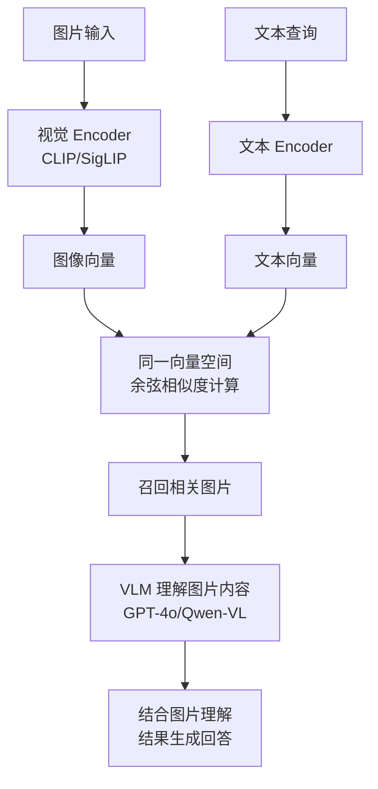
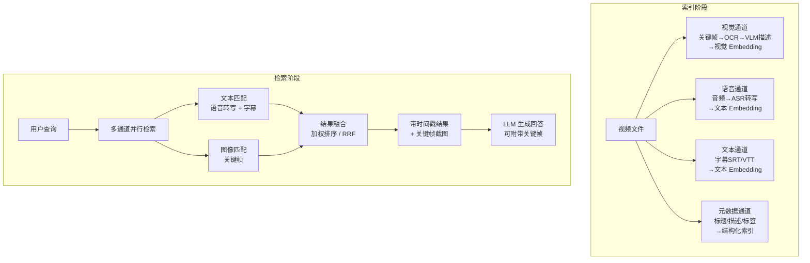

# 第12A章 多模态 RAG 展望

> 本节为前瞻性内容，介绍多模态 RAG 的技术趋势和代表性工作，暂不涉及完整代码实现。

### 12A.1 图文混合检索

传统 RAG 仅处理文本模态，但企业知识库中的大量信息以**图片、图表、截图**形式存在。图文混合检索的核心挑战是如何将视觉信息纳入统一的检索-生成管线。

#### 视觉 Embedding 模型

图文混合检索的关键在于**共享语义空间**的视觉-语言 Embedding 模型：

| 模型 | 发布方 | 特点 | 适用场景 |
|------|--------|------|----------|
| **CLIP** | OpenAI (2021) | 开创性对比学习框架，图像-文本对齐 | 通用图文检索 |
| **SigLIP** | Google (2024) | 改进 CLIP 的 sigmoid loss，训练更稳定 | 生产级图文检索推荐 |
| **EVA-CLIP** | BAAI | 大规模预训练，中文表现优秀 | 中文多模态场景 |
| **CogVLM** | 智源AI | 支持 OCR + 视觉理解一体化 | 文档图片理解 |

**典型工作流**：


#### 技术趋势

2025-2026 年的发展方向包括：
- **原生多模态 Embedding**：如 Jina CLIP、ColPali 等模型将文档页面直接编码为向量，无需先提取文本
- **Late Fusion 策略**：分别检索文本和图片结果，在生成阶段融合
- **VLM 作为统一后端**：GPT-4o、Gemini 1.5 Pro 等原生多模态大模型可直接接收图文混合上下文

### 12A.2 表格理解与结构化检索

表格是企业文档中最常见的结构化数据形式，但传统 RAG 的"分块-嵌入-检索"范式对表格效果很差——表格的语义高度依赖于**行列结构和表头含义**，切分后容易丢失关键信息。

#### Table Transformer 方向

针对表格理解的代表性技术路线：

| 方法 | 核心思路 | 局限性 |
|------|---------|--------|
| **Table Transformer** | 将表格视为特殊结构的图像，用视觉 Transformer 编码 | 需要大量表格数据微调 |
| **STR（Structured Table Recognition）** | 先 OCR 识别表格结构，再转为 HTML/Markdown | 依赖 OCR 质量 |
| **LLM 直接理解** | 将 Markdown 格式表格直接传入 LLM Context | 受 Token 限制，大表格需截断 |
| **Semantic Table Parsing** | 用 LLM 抽取表格为三元组存入图谱 | 信息有损，不适合保留原表格式 |

#### 生产实践建议

当前阶段的多模态 RAG 建议：

1. **表格预处理优先**：使用 `camelot`、`pdfplumber` 等工具提取 PDF 表格为结构化数据（DataFrame / JSON）
2. **分层存储**：表格元数据（表名、列名、行数）存入向量库用于粗筛；完整表格内容按需加载
3. **混合检索**：文本查询走向量检索，结构化查询（"Q3 营收环比增长多少？"）走 SQL/Table 解析
4. **渐进式落地**：先解决 80% 的非结构化文本场景，再逐步引入多模态能力

#### 展望

多模态 RAG 在 2026 年仍处于快速演进期，尚未形成类似文本 RAG 那样成熟的最佳实践。建议关注以下方向的进展：
- **原生多模态向量数据库**（如 Qdrant 的 Multimodal Capabilities）
- **长上下文窗口降低模态转换需求**（Gemini 200K+ 上下文可容纳整份文档）
- **统一 Embedding 模型**（一个模型同时处理文本、图片、表格）

### 12A.3 音频/视频内容检索

音频和视频是企业知识库中尚未被充分挖掘的信息载体。会议录音、产品演示视频、培训课程、客户访谈等非文本内容蕴含大量有价值的信息，但传统文本 RAG 无法直接处理这些模态。音频/视频 RAG 的核心思路是**模态转换**——将非文本内容转化为文本，再复用成熟的文本 RAG 管线。

#### 音频 RAG：语音转文字 + 文本检索

**概念定义**：音频 RAG（Audio RAG）是指对音频内容进行自动语音识别（ASR, Automatic Speech Recognition），将语音转化为文本后，利用文本 Embedding 和向量检索技术实现音频内容的语义检索。

**核心原理**：音频信号本身无法直接与文本查询计算语义相似度，因此需要经过 ASR 模型转换为文本中间表示。转换后的文本可以无缝接入现有的文本 RAG 管线（分块、嵌入、向量检索、LLM 生成），无需为音频单独设计检索架构。

**解决什么问题**：
- 企业内部大量会议录音、电话录音、语音备忘录无法被搜索
- 播客、讲座、培训视频中的语音信息无法被有效利用
- 客服录音中的关键信息难以快速定位

**技术发展历程**：

| 阶段 | 时间 | 代表技术 | 特点 |
|------|------|---------|------|
| 传统 ASR | 2010s | Hidden Markov Model + GMM-HMM | 需要大量标注数据，识别准确率低 |
| 深度学习 ASR | 2017-2022 | DeepSpeech, Wav2Vec, Conformer | 端到端训练，准确率大幅提升 |
| 大规模预训练 ASR | 2023-至今 | **OpenAI Whisper** | 多语言支持、鲁棒性强、零样本能力 |

**推荐工具与模型**：

| 工具/模型 | 类型 | 特点 | 适用场景 |
|-----------|------|------|---------|
| **OpenAI Whisper** | ASR 模型 | 多语言（含中文）、多种尺寸、开源 | 通用语音转文字首选 |
| **faster-whisper** | Whisper 加速版 | 基于 CTranslate2，推理速度提升 4x | 生产环境大规模转写 |
| **FunASR (阿里)** | ASR 工具包 | 中文识别优化、实时流式识别 | 中文场景推荐 |
| **ffmpeg** | 音频处理 | 格式转换、采样率调整、音频切片 | 音频预处理必备 |
| **Deepgram** | ASR API | 超低延迟、说话人分离 | 实时转录场景 |

**最小代码示例 -- 使用 Whisper API 转写音频**：

```python
import json
from openai import OpenAI

client = OpenAI()


def transcribe_audio(audio_path: str, language: str = "zh") -> dict:
    """
    使用 OpenAI Whisper API 转写音频文件。

    Args:
        audio_path: 音频文件路径（支持 mp3, mp4, wav, m4a, webm 等格式）
        language: 音频语言代码，"zh" 为中文

    Returns:
        包含转写文本和时间戳的字典

    注意事项：
    - 文件大小限制 25MB，超过需先用 ffmpeg 切片
    - Whisper API 支持的格式有限，建议先用 ffmpeg 统一转为 mp3
    - 对于长音频（>1小时），建议先切片再并行转写
    """
    with open(audio_path, "rb") as audio_file:
        # 使用较新的 gpt-4o-transcribe 模型获得更好的中文效果
        # 也可使用 "whisper-1" 模型
        transcript = client.audio.transcriptions.create(
            model="gpt-4o-transcribe",
            file=audio_file,
            language=language,
            response_format="verbose_json",  # 获取时间戳信息
            timestamp_granularities=["segment"],
        )

    return {
        "text": transcript.text,
        "segments": [
            {
                "start": seg.start,
                "end": seg.end,
                "text": seg.text,
            }
            for seg in transcript.segments
        ],
    }


def audio_to_rag_pipeline(audio_path: str) -> list[dict]:
    """
    完整的音频 RAG 索引流程：转写 → 分块 → 生成嵌入向量。

    将音频转写为带时间戳的文本片段，每个片段作为独立的检索单元。
    """
    # 第一步：语音转文字
    result = transcribe_audio(audio_path, language="zh")
    print(f"转写完成，共 {len(result['segments'])} 个片段")

    # 第二步：按语义段落分块（相邻片段合并为语义完整的块）
    chunks = []
    current_chunk = {"text": "", "start": 0, "end": 0}

    for segment in result["segments"]:
        if not current_chunk["text"]:
            current_chunk["start"] = segment["start"]
        current_chunk["text"] += segment["text"]
        current_chunk["end"] = segment["end"]

        # 每 30 秒或遇到句号时切分
        if current_chunk["end"] - current_chunk["start"] >= 30 or "。" in segment["text"]:
            chunks.append({
                "text": current_chunk["text"].strip(),
                "timestamp": f"[{format_time(current_chunk['start'])} - {format_time(current_chunk['end'])}]",
                "source": audio_path,
            })
            current_chunk = {"text": "", "start": 0, "end": 0}

    if current_chunk["text"].strip():
        chunks.append({
            "text": current_chunk["text"].strip(),
            "timestamp": f"[{format_time(current_chunk['start'])} - {format_time(current_chunk['end'])}]",
            "source": audio_path,
        })

    # 第三步：生成嵌入向量并存入向量库（伪代码，实际项目替换为你的向量库）
    # for chunk in chunks:
    #     embedding = embed_model.encode(chunk["text"])
    #     vector_store.upsert(id=chunk["timestamp"], vector=embedding, metadata=chunk)

    return chunks


def format_time(seconds: float) -> str:
    """将秒数格式化为 MM:SS"""
    minutes = int(seconds // 60)
    secs = int(seconds % 60)
    return f"{minutes:02d}:{secs:02d}"


if __name__ == "__main__":
    # 使用示例
    chunks = audio_to_rag_pipeline("meeting_recording.mp3")
    for chunk in chunks[:3]:  # 打印前 3 个片段
        print(f"{chunk['timestamp']} {chunk['text'][:100]}...")
```

**使用 ffmpeg 进行音频预处理**：

```bash
# 转换音频格式为 mp3（Whisper API 推荐格式）
ffmpeg -i input.wav -codec:a libmp3lame -qscale:a 2 output.mp3

# 切割长音频为 10 分钟片段（避免超出 API 大小限制）
ffmpeg -i long_meeting.m4a -f segment -segment_time 600 -c copy segment_%03d.mp3

# 提取视频中的音频轨道
ffmpeg -i video.mp4 -vn -acodec mp3 audio_track.mp3

# 降噪处理（提升 ASR 准确率）
ffmpeg -i noisy_audio.wav -af "anlmdn=s=7" denoised_audio.wav
```

**音频 RAG 的常见陷阱**：

| 陷阱 | 说明 | 应对策略 |
|------|------|---------|
| **背景噪声** | 会议录音中的键盘声、空调声影响 ASR 准确率 | 转写前用 ffmpeg 降噪，或使用噪声鲁棒的 ASR 模型 |
| **多人说话重叠** | 会议中多人同时发言导致转写混乱 | 使用说话人分离（Speaker Diarization）技术预处理 |
| **专业术语识别错误** | ASR 对行业术语、人名、产品名的识别准确率低 | 构建自定义术语表，后处理阶段进行术语纠正 |
| **时间戳对齐** | 检索结果需要定位到音频的具体位置 | 保留 segment 级别的时间戳，生成回答时附带时间定位 |

#### 视频 RAG：多模态信息融合

**概念定义**：视频 RAG（Video RAG）是对视频内容进行多维度信息提取（视觉、语音、文本），并将提取的信息融合到统一的检索体系中。视频是信息密度最高的媒体类型，同时包含视觉画面、语音对话、字幕文本和元数据（标题、描述、标签）等多种信息通道。

**核心原理**：视频 RAG 采用**分层提取 + 融合检索**的策略。首先将视频分解为多个信息通道分别处理，然后在检索阶段通过 Late Fusion（延迟融合）或 Early Fusion（早期融合）策略整合多通道的检索结果。

**解决什么问题**：
- 产品演示视频中的操作步骤无法被文本搜索到
- 培训视频中的关键知识点难以快速定位
- 视频内容无法与文本知识库进行联合检索

**技术架构**：


**关键帧提取与处理**：

```python
import cv2
import base64
from openai import OpenAI

client = OpenAI()


def extract_keyframes(video_path: str, interval_seconds: int = 5) -> list[dict]:
    """
    从视频中按固定间隔提取关键帧。

    Args:
        video_path: 视频文件路径
        interval_seconds: 提取间隔（秒）

    Returns:
        关键帧列表，每帧包含时间戳和 base64 编码的图像数据

    注意事项：
    - 固定间隔提取简单但不够智能，生产环境建议使用场景检测（scene detection）
    - OpenCV 的 VideoCapture 不支持所有视频编码格式，必要时用 ffmpeg 预处理
    - 提取的关键帧数量与视频长度成正比，需注意存储成本
    """
    cap = cv2.VideoCapture(video_path)
    fps = cap.get(cv2.CAP_PROP_FPS)
    total_frames = int(cap.get(cv2.CAP_PROP_FRAME_COUNT))
    frame_interval = int(fps * interval_seconds)

    keyframes = []
    frame_count = 0

    while cap.isOpened():
        ret, frame = cap.read()
        if not ret:
            break

        if frame_count % frame_interval == 0:
            timestamp = frame_count / fps
            # 编码为 JPEG 并 base64 编码
            _, buffer = cv2.imencode('.jpg', frame, [cv2.IMWRITE_JPEG_QUALITY, 80])
            b64_image = base64.b64encode(buffer).decode('utf-8')

            keyframes.append({
                "timestamp": format_time(timestamp),
                "frame_number": frame_count,
                "image_base64": b64_image,
            })

        frame_count += 1

    cap.release()
    print(f"从视频中提取了 {len(keyframes)} 个关键帧（共 {total_frames} 帧）")
    return keyframes


def describe_keyframe(image_base64: str) -> str:
    """
    使用多模态 LLM 生成关键帧的视觉描述。

    这是视频 RAG 中视觉通道的核心步骤：
    将图像转化为可被文本检索系统处理的自然语言描述。
    """
    response = client.chat.completions.create(
        model="gpt-4o",
        messages=[{
            "role": "user",
            "content": [
                {
                    "type": "text",
                    "text": "请用中文简洁描述这张图片中的内容，包括场景、人物动作、文字信息等。50字以内。"
                },
                {
                    "type": "image_url",
                    "image_url": {
                        "url": f"data:image/jpeg;base64,{image_base64}",
                        "detail": "low"  # 使用低分辨率降低成本
                    }
                }
            ]
        }],
        max_tokens=100,
    )
    return response.choices[0].message.content


def build_video_index(video_path: str) -> list[dict]:
    """
    完整的视频索引流程：关键帧提取 → 视觉描述 → 音频转写 → 融合索引。

    最终每个索引单元包含视觉描述和音频转写的融合文本，
    附带时间戳用于结果定位。
    """
    # 提取关键帧
    keyframes = extract_keyframes(video_path, interval_seconds=10)

    # 为每个关键帧生成视觉描述
    for kf in keyframes:
        kf["visual_description"] = describe_keyframe(kf["image_base64"])
        print(f"  [{kf['timestamp']}] {kf['visual_description']}")

    # 提取音频并转写（复用前面的 transcribe_audio 函数）
    # audio_path = extract_audio_from_video(video_path)
    # transcript = transcribe_audio(audio_path)

    # 按时间戳对齐视觉描述和音频转写，生成融合索引
    # for kf in keyframes:
    #     aligned_text = get_transcript_segment(transcript, kf["timestamp"])
    #     fused_text = f"[视觉] {kf['visual_description']}\n[语音] {aligned_text}"
    #     embedding = embed_model.encode(fused_text)
    #     vector_store.upsert(...)

    return keyframes


def format_time(seconds: float) -> str:
    """将秒数格式化为 HH:MM:SS"""
    hours = int(seconds // 3600)
    minutes = int((seconds % 3600) // 60)
    secs = int(seconds % 60)
    return f"{hours:02d}:{minutes:02d}:{secs:02d}"
```

**视频 RAG 的优缺点与发展趋势**：

| 维度 | 分析 |
|------|------|
| **优势** | 多通道信息融合提供更全面的语义理解；关键帧截图可作为回答的视觉证据 |
| **挑战** | 处理成本高（关键帧描述 + ASR + Embedding 三重 LLM 调用）；存储成本大（关键帧图像） |
| **当前趋势** | 原生视频理解模型（如 Gemini 1.5 Pro 的视频输入能力）可能绕过关键帧提取步骤；视频 Embedding 模型（VideoCLIP、InternVideo）正在快速发展 |
| **生产建议** | 先从"音频转写 + 字幕提取"入手（成本最低），再逐步引入视觉通道；对关键帧使用场景检测（scene cut detection）替代固定间隔提取，减少冗余帧 |

**推荐工具链**：

| 工具 | 用途 | 说明 |
|------|------|------|
| **ffmpeg** | 视频预处理 | 音频提取、格式转换、关键帧提取 |
| **OpenCV** | 关键帧提取 | Python 生态最成熟的视频处理库 |
| **OpenAI Whisper** | 语音转文字 | 视频中语音轨道的转写 |
| **CLIP / SigLIP** | 视觉 Embedding | 关键帧的向量编码 |
| **GPT-4o / Qwen-VL** | 视觉描述生成 | 为关键帧生成可检索的自然语言描述 |
| **PySceneDetect** | 智能场景检测 | 基于内容变化自动检测场景切换点，比固定间隔更智能 |

### 12A.4 多模态 RAG 生产最佳实践

多模态 RAG 在生产环境的失败率高达 **73%**，主要原因在于单模态检索模式无法有效处理跨模态协调需求。以下总结来自生产实践的 12 项最佳实践中的核心要点：（来源: [多模态RAG生产最佳实践](reference/10-高级RAG范式/03-多模态RAG生产最佳实践.md)）

#### 核心挑战

| 挑战 | 说明 | 影响 |
|------|------|------|
| 分块策略不统一 | 文本按 Token 切分，视频需要时间分割，图像需要 ROI 检测 | 无法统一索引流程 |
| Embedding 空间隔离 | CLIP 图像向量与 Whisper 文本向量不在同一空间 | 跨模态检索有损 |
| Context Window 硬限制 | VLM 无法接收原始视频/高分辨率图像 | 需要多级信息提取 |
| 延迟预算分化 | 合规扫描可容忍数小时，客户搜索要求 < 500ms | 架构无法"一刀切" |

#### 渐进式落地策略

对于大多数团队，推荐的渐进式落地路径：

```
阶段 1: 文本 RAG 成熟 → 阶段 2: 图文混合检索 → 阶段 3: 表格结构化理解 → 阶段 4: 音频/视频 RAG
```

- **阶段 1**（MVP）：先解决 80% 的非结构化文本场景，建立完整的分块-嵌入-检索-生成管线
- **阶段 2**（图文）：引入 CLIP/SigLIP 多模态 Embedding 或 VLM 描述生成，实现图文混合检索
- **阶段 3**（表格）：使用 camelot/pdfplumber 提取表格，按"元数据粗筛 + 内容按需加载"策略存储
- **阶段 4**（音视频）：从音频转写入手（成本最低），再逐步引入关键帧视觉通道

#### 2026 年技术趋势

- **原生多模态向量数据库**：Qdrant 和 Weaviate 已支持多模态向量统一存储和跨模态检索
- **长上下文降低模态转换需求**：Gemini 200K+、Claude 200K 的上下文窗口可容纳整份文档的图文内容，减少模态转换的信息损失
- **统一 Embedding 模型**：Jina CLIP、ColPali 等模型将文档页面直接编码为向量，无需先提取文本再分别嵌入
- **Late Fusion 策略**：分别检索文本和图片结果，在生成阶段融合，避免检索阶段的模态损失

---


