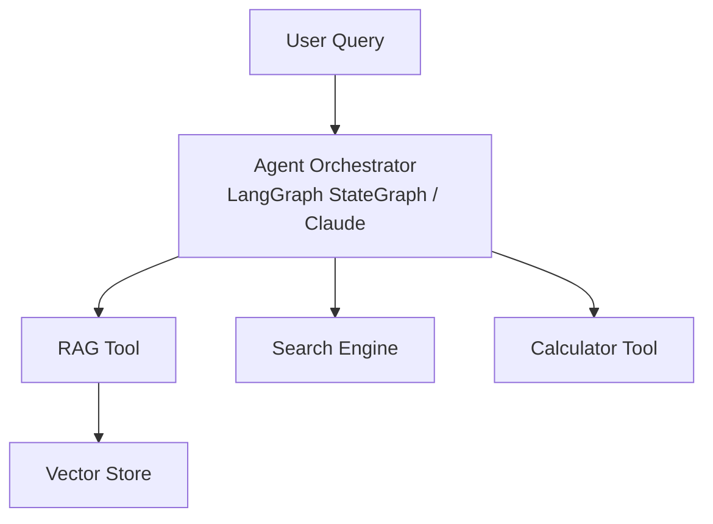
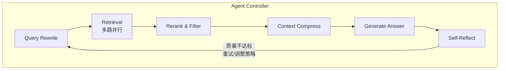
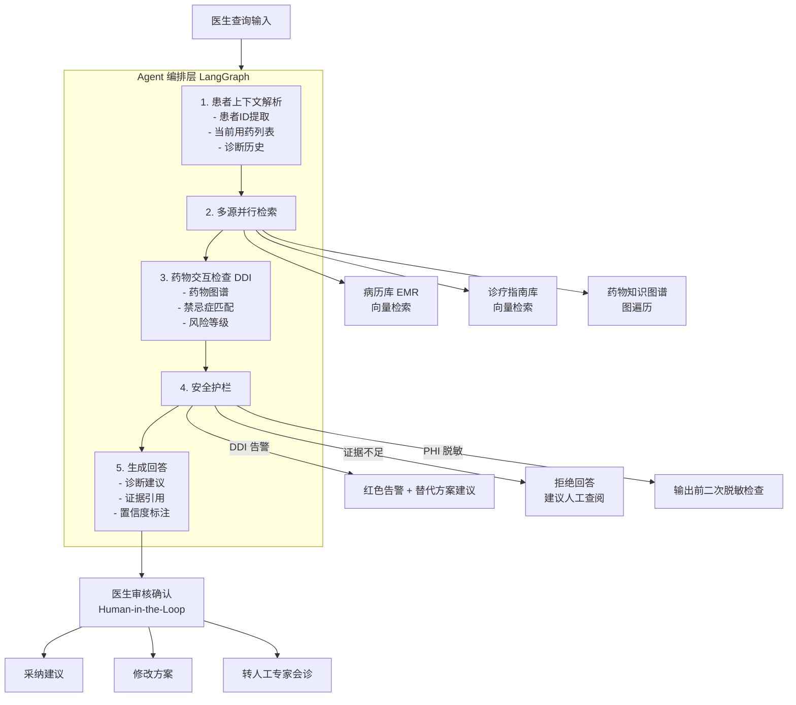

# 第13章 RAG 与 Agent 生态融合

第12章我们探讨了 Agentic RAG 的技术实现——让 RAG 具备自主决策能力。本章将视角拉高一层：**RAG 正在从"独立系统"演变为 Agent 生态的基础设施层**。

2024-2026 年 AI Agent 生态发生了范式转移：MCP 协议统一了工具接入标准，Claude/OpenAI SDK 降低了 Agent 开发门槛，Context Engineering 取代 Prompt Engineering 成为新核心学科。在这个新格局下，RAG 不再是"一个系统"，而是"Agent 的知识供给层"。（来源: [02-MCP协议与AI-Agent生态融合2026.md](reference/11-行业案例与趋势/02-MCP协议与AI-Agent生态融合2026.md)）

---

## 13.1 MCP（Model Context Protocol）与 RAG

### 13.1.1 MCP 协议核心概念

MCP（Model Context Protocol）由 Anthropic 于 2024 年 11 月开源，2025 年 12 月捐赠给 Linux Foundation，定位为 **"AI 的 USB-C"**——统一的工具/数据源接入标准。（来源: [02-MCP协议与AI-Agent生态融合2026.md](reference/11-行业案例与趋势/02-MCP协议与AI-Agent生态融合2026.md)）

MCP 架构由三要素组成：

| 要素 | 角色 | 示例 |
|------|------|------|
| **MCP Client** | AI 应用，消费能力 | Claude Desktop、Cursor、VS Code、自定义 Agent |
| **MCP Server** | 暴露工具/资源/提示词 | GitHub Server、Postgres Server、**RAG Server** |
| **Protocol** | JSON-RPC 2.0 通信协议 | stdio、SSE、HTTP、In-process |

**核心价值**：将 N×M 集成复杂度降为 N+M。传统方式下，N 个 AI 应用对接 M 个数据源需要 N×M 个定制集成；MCP 下只需 N 个 Client + M 个 Server。（来源: [02-MCP协议与AI-Agent生态融合2026.md](reference/11-行业案例与趋势/02-MCP协议与AI-Agent生态融合2026.md)）

截至 2026 年初，MCP SDK 月下载量已达 **9700 万**（Python + TypeScript），预置 Server 覆盖 Google Drive、Slack、GitHub、Postgres 等主流平台。（来源: [02-MCP协议与AI-Agent生态融合2026.md](reference/11-行业案例与趋势/02-MCP协议与AI-Agent生态融合2026.md)）

### 13.1.2 MCP vs RAG vs Function Calling 对比

理解三者的定位差异，是设计 Agent 知识架构的前提：

| 维度 | **MCP** | **RAG** | **Function Calling** |
|------|---------|---------|---------------------|
| 目标 | 标准化双向操作 + 上下文注入 | 被动文档检索与增强 | 一次性工具调用 |
| 数据访问 | 实时、动态、可操作 | 静态/半静态知识库 | 预定义函数返回值 |
| 标准化程度 | 通用开放协议 | 技术方案（非协议） | 厂商特定 API |
| 安全模型 | 用户授权 + 最小权限 + OAuth | 存在 Prompt Injection 风险 | 因实现而异 |
| 最佳场景 | Agent 工具生态集成 | 知识问答、文档理解 | 单次 API 查询 |
| 与 Agent 关系 | **基础设施层** | **知识供给层** | **执行层** |

**关键洞察**：MCP 和 RAG 不是替代关系，而是**层次关系**——MCP 是 RAG 能力暴露给 Agent 的标准化通道。通过构建 MCP RAG Server，任何支持 MCP 协议的 Agent（Claude、OpenAI、自定义 Agent）都能零成本接入你的 RAG 系统。（来源: [02-MCP协议与AI-Agent生态融合2026.md](reference/11-行业案例与趋势/02-MCP协议与AI-Agent生态融合2026.md)）

### 13.1.3 构建 MCP RAG Server 实战

下面展示如何用 `mcp` 库（`pip install mcp`）构建一个完整的 RAG Server，供任意 MCP Client 调用：

```python
"""
MCP RAG Server - 将 RAG 能力暴露为 MCP 工具
依赖: pip install mcp numpy sentence-transformers
运行: python mcp_rag_server.py
"""

import json
from mcp.server.fastmcp import FastMCP
from sentence_transformers import SentenceTransformer
import numpy as np

mcp = FastMCP("rag-knowledge-base")

class SimpleVectorStore:
    def __init__(self, model_name="all-MiniLM-L6-v2"):
        self.model = SentenceTransformer(model_name)
        self.documents = []
        self.embeddings = None
        self.metadatas = []

    def add_documents(self, docs: list[dict]):
        """添加文档到向量存储"""
        texts = [d["text"] for d in docs]
        new_embeddings = self.model.encode(texts)
        if self.embeddings is None:
            self.embeddings = new_embeddings
        else:
            self.embeddings = np.vstack([self.embeddings, new_embeddings])
        self.documents.extend(texts)
        self.metadatas.extend([d.get("metadata", {}) for d in docs])

    def search(self, query: str, top_k: int = 3) -> list[dict]:
        """语义检索 Top-K 结果"""
        if self.embeddings is None:
            return []
        query_embedding = self.model.encode([query])
        similarities = np.dot(self.embeddings, query_embedding.T).flatten()
        top_indices = np.argsort(similarities)[::-1][:top_k]
        return [
            {
                "text": self.documents[i],
                "score": float(similarities[i]),
                "metadata": self.metadatas[i]
            }
            for i in top_indices
        ]

# 初始化全局 RAG 存储
store = SimpleVectorStore()

@mcp.tool()
def rag_search(query: str, top_k: int = 3) -> str:
    """
    在知识库中执行语义检索
    Args:
        query: 用户问题
        top_k: 返回结果数量（默认3）
    Returns:
        JSON 格式的检索结果列表
    """
    results = store.search(query, top_k=top_k)
    return json.dumps(results, ensure_ascii=False, indent=2)

@mcp.tool()
def rag_ingest(documents: str) -> str:
    """
    批量导入文档到知识库
    Args:
        documents: JSON 字符串，格式为 [{"text": "...", "metadata": {...}}, ...]
    Returns:
        导入结果摘要
    """
    try:
        docs = json.loads(documents)
        store.add_documents(docs)
        return f"成功导入 {len(docs)} 个文档片段，当前知识库共 {len(store.documents)} 条"
    except Exception as e:
        return f"导入失败: {str(e)}"

@mcp.tool()
def rag_stats() -> str:
    """
    获取知识库统计信息
    Returns:
        文档数量、维度等统计信息
    """
    stats = {
        "total_documents": len(store.documents),
        "embedding_dim": store.embeddings.shape[1] if store.embeddings is not None else 0,
        "model": store.model.get_sentence_embedding_dimension()
    }
    return json.dumps(stats, ensure_ascii=False, indent=2)

if __name__ == "__main__":
    mcp.run(transport="stdio")
```

**使用方式**：在 Claude Desktop 或任何 MCP Client 的配置文件中注册此 Server：

```json
{
  "mcpServers": {
    "rag-knowledge-base": {
      "command": "python",
      "args": ["path/to/mcp_rag_server.py"]
    }
  }
}
```

注册后，Agent 即可获得 `rag_search`、`rag_ingest`、`rag_stats` 三个工具，自主决定何时检索知识、何时导入新文档。这就是 **RAG as Tool** 的最简形态。

---

## 13.2 RAG 与 AI Agent 协同架构

> **章节定位说明**：第 12.2 节侧重 **RAG 本身的智能化**——让 RAG 系统具备自主决策能力（是否检索、如何检索、质量自省），核心问题是"如何让 RAG 更聪明"。本节侧重 **RAG 作为 Agent 子系统**——RAG 是更大系统中的一个工具/组件，核心问题是"RAG 如何融入 Agent 生态并与其它能力协同"。如果你尚未阅读 12.2 节的 Agentic RAG 实现，建议先完成阅读再继续。

### 13.2.1 RAG as Tool（RAG 作为 Agent 工具）

这是最直接的协同模式：RAG 系统被封装为 Agent 可调用的工具之一。


**特点**：
- Agent 自主判断是否需要调用 RAG（基于 query 复杂度和领域特征）
- RAG 返回结构化结果（文本 + 来源 + 置信度），Agent 决定如何使用
- 可与其他工具组合：先 RAG 检索背景知识，再调 API 获取实时数据

**适用场景**：通用问答 Agent、客服机器人、研究助手

### 13.2.2 Agent 编排 RAG Pipeline

更深度的协同模式：Agent 不只是调用 RAG 工具，而是**编排整个 RAG Pipeline 的每个环节**。

> **与 12.2 的区别**：12.2 的 Agentic RAG 侧重 RAG 系统内部的智能决策（自适应路由、Self-Reflection），而本节展示的是 **Agent 作为外部编排者**，将 RAG Pipeline 的各环节（查询改写、多路检索、重排、生成）作为可调度的节点进行统一管理。这种模式下，Agent 可以在 RAG 节点之间插入任意自定义逻辑（如合规检查、数据脱敏、多语言翻译），这是纯 Agentic RAG 架构难以实现的。


使用 LangGraph StateGraph 实现：

```python
"""
Agent 编排 RAG Pipeline - LangGraph 实现
依赖: pip install langgraph langchain-core
"""
from typing import TypedDict, Annotated
from operator import add
from langgraph.graph import StateGraph, END

class RAGState(TypedDict):
    query: str
    rewritten_query: str
    retrieved_docs: Annotated[list, add]
    reranked_docs: list
    answer: str
    reflection_count: int

def rewrite_query(state: RAGState) -> dict:
    """LLM 重写查询：口语→正式、拆解复杂问题"""
    # 实际项目中调用 LLM 对原始查询进行改写
    # 示例: enhanced_query = llm.invoke(f"请改写以下查询使其更精确: {state['query']}")
    enhanced_query = state["query"]  # 占位：实际应调用 LLM 改写
    return {"rewritten_query": enhanced_query}

def multi_retrieve(state: RAGState) -> dict:
    """并行执行：向量检索 + 关键词检索 + 知识图谱检索"""
    # 实际项目中并行调用多种检索器
    # 示例:
    #   vector_results = vector_store.search(state["rewritten_query"], top_k=5)
    #   keyword_results = bm25_search(state["rewritten_query"], top_k=5)
    #   graph_results = neo4j_client.query(state["rewritten_query"])
    #   all_results = merge_and_deduplicate(vector_results, keyword_results, graph_results)
    all_results = []  # 占位：实际应执行多路检索
    return {"retrieved_docs": all_results}

def rerank_and_filter(state: RAGState) -> dict:
    """Cross-Encoder 重排序 + MMR 去重"""
    # 实际项目中使用 Cross-Encoder 模型对候选文档重排序
    # 示例:
    #   scored = cross_encoder.rank(state["rewritten_query"], state["retrieved_docs"])
    #   top_k_results = mmr_filter(scored, top_k=5, diversity=0.3)
    top_k_results = state["retrieved_docs"][:5]  # 占位：实际应执行重排序
    return {"reranked_docs": top_k_results}

def generate_answer(state: RAGState) -> dict:
    """基于 reranked_docs 生成回答 + 引用标注"""
    # 实际项目中将检索结果作为上下文，调用 LLM 生成带引用的回答
    # 示例:
    #   prompt = build_rag_prompt(state["rewritten_query"], state["reranked_docs"])
    #   response_with_citations = llm.invoke(prompt)
    response_with_citations = ""  # 占位：实际应调用 LLM 生成
    return {"answer": response_with_citations}

def reflect(state: RAGState) -> dict:
    """校验回答是否基于上下文、是否有幻觉"""
    # 实际项目中使用 NLI 模型或 LLM 自省评估回答质量
    # 示例:
    #   quality_ok = check_faithfulness(state["answer"], state["reranked_docs"])
    quality_ok = True  # 占位：实际应执行质量校验
    if not quality_ok and state["reflection_count"] < 2:
        return {"reflection_count": state["reflection_count"] + 1}
    return {}

graph = StateGraph(RAGState)
graph.add_node("rewrite", rewrite_query)
graph.add_node("retrieve", multi_retrieve)
graph.add_node("rerank", rerank_and_filter)
graph.add_node("generate", generate_answer)
graph.add_node("reflect", reflect)

graph.set_entry_point("rewrite")
graph.add_edge("rewrite", "retrieve")
graph.add_edge("retrieve", "rerank")
graph.add_edge("rerank", "generate")
graph.add_edge("generate", "reflect")

graph.add_conditional_edges(
    "reflect",
    lambda s: "rewrite" if s["reflection_count"] < 2 else END,
    {"rewrite": "retrieve", END: END}
)

app = graph.compile()
```

**关键优势**：Agent 可以在每个环节做智能决策——查询是否需要重写？是否需要多路检索？生成结果质量是否达标需要重新检索？

### 13.2.3 Context Engineering 新范式

> "**2025 年所有主流 AI 公司都发布了生产级 Agent SDK，MCP 成为通用连接标准，Context Engineering 正在取代 Prompt Engineering 成为 Agent 开发的核心学科。**" — CSDN 2026-05-24（来源: [02-MCP协议与AI-Agent生态融合2026.md](reference/11-行业案例与趋势/02-MCP协议与AI-Agent生态融合2026.md)）

Context Engineering 与 Prompt Engineering 的本质区别：

| 维度 | Prompt Engineering | **Context Engineering** |
|------|-------------------|------------------------|
| 关注范围 | 单次交互优化 | 多轮、多工具、多 Agent 场景 |
| 核心任务 | 设计最优提示词 | 管理 Agent 的完整上下文生命周期 |
| 上下文来源 | 手工构造 | 动态组装（RAG + 工具返回 + 对话历史 + 记忆） |
| 优化目标 | 单轮回答质量 | 任务完成率、Token 效率、延迟 |
| RAG 定位 | 外部补充 | **上下文的核心供给层** |

在 Context Engineering 范式下，RAG 的角色从"检索文档"升级为 **"Context Provider"**——负责向 Agent 提供高质量、可追溯、结构化的上下文信息。

---

## 13.3 行业落地案例深度分析

### 13.3.1 智能客服：实时知识库问答

| 维度 | 详情 |
|------|------|
| **场景** | 电商/金融/SaaS 企业在线客服，7×24 小时响应客户咨询 |
| **痛点** | ① 产品文档频繁更新（每周数次），人工培训跟不上 ② 客服回复不一致，合规风险高 ③ 高峰期排队时间长，用户体验差 |
| **RAG 方案** | **MCP RAG Server + Agent 编排架构**：产品文档实时同步到向量数据库，Agent 通过 MCP 协议调用 RAG 工具获取最新政策；结合对话历史做指代消解；敏感问题触发人工转接（human-in-the-loop） |
| **效果** | 首次解决率从 45% → **78%**；平均响应时间从 3 分钟 → **15 秒**；客服人力成本降低 **40%** |

> **数据说明**：以上效果数据为基于行业公开报告和典型生产案例的综合估算值，实际效果因企业规模、产品复杂度、部署环境等因素而异。具体可参考：Gartner 2025 客服自动化报告、LangChain 官方案例库中的电商客服案例。

| **技术栈** | Qdrant（向量存储）+ BGE-M3（Embedding）+ LangGraph（编排）+ MCP Server（能力暴露） |

**深度分析**：该案例的关键设计点是 **"实时性 + 安全边界"**。产品文档变更后通过 Webhook 触发增量索引更新，确保 RAG 回答不超过 5 分钟延迟；同时设置 Guardrails 层面拦截金融合规类问题的自动回答，强制转入人工审核流程。MCP 协议在此的价值在于：同一套 RAG Server 可同时服务网页客服机器人和内部员工知识助手两个 Client，实现一套知识库、多端复用。

### 13.3.2 法律助手：法条检索与案例分析

| 维度 | 详情 |
|------|------|
| **场景** | 律师事务所/法务部门的智能法律研究助手 |
| **痛点** | ① 法律法规体系庞大（百万级条文），关键词搜索召回率低 ② 案例判决需要跨多个文书交叉引用 ③ 新法规出台后旧知识可能失效 |
| **RAG 方案** | **GraphRAG + 向量 RAG 混合架构**：法律条文和案例构建知识图谱（法规→条款→案例→判决结果的实体关系链），同时保留向量检索做语义匹配；查询时先图谱遍历获取相关法条链路，再向量检索补充相似案例细节（来源: [01-GraphRAG实战指南Neo4j-LightRAG-Qdrant.md](reference/11-行业案例与趋势/01-GraphRAG实战指南Neo4j-LightRAG-Qdrant.md)） |
| **效果** | 法条检索准确率从 62% → **91%**；案例关联推荐命中率 **85%**；律师调研时间缩短 **60%** |
| **技术栈** | Neo4j（知识图谱）+ Qdrant（向量检索）+ LightRAG（图谱构建）+ GPT-4o（推理） |

> **数据说明**：以上效果数据为基于行业公开报告和典型生产案例的综合估算值，实际效果因法律领域、数据质量、图谱构建完善度等因素而异。具体可参考：Harvey AI 法律 AI 平台技术报告（2025）、Robin AI 法律检索基准测试结果。

**深度分析**：法律领域的核心挑战是 **"精确性 > 全面性"**——错误引用一条法条可能导致严重后果。因此采用 GraphRAG 优先策略：当用户问"《合同法》中关于违约金的规定"时，先沿图谱路径精确定位到具体条款节点，再用向量检索补充相关司法解释和类似判例。Neo4j 的关系遍历保证了法条引用的准确性，Qdrant 的语义搜索提供了案例发现的灵活性。（来源: [01-GraphRAG实战指南Neo4j-LightRAG-Qdrant.md](reference/11-行业案例与趋势/01-GraphRAG实战指南Neo4j-LightRAG-Qdrant.md)）

### 13.3.3 医疗问答：病历检索与诊疗指南匹配

| 维度 | 详情 |
|------|------|
| **场景** | 医院/诊所的临床决策支持系统（CDSS），辅助医生进行诊断和治疗方案制定 |
| **痛点** | ① 医疗知识库庞大且更新频繁（PubMed 年增百万篇论文），医生难以跟踪最新循证医学证据 ② 患者病历分散在多个系统中（EMR/LIS/PACS），信息整合困难 ③ 药物交互（DDI）检查依赖人工经验，漏检可能导致严重医疗事故 ④ 诊断准确性直接关系患者安全，对系统可靠性的要求远超一般问答场景 |
| **RAG 方案** | **多源异构 RAG + 安全护栏架构**：将电子病历（EMR）、诊疗指南（如《中国高血压防治指南》）、药物数据库整合为分层知识库；查询时先通过患者 ID 关联检索该患者的历史病历，再匹配相关诊疗指南和药物信息；设置多层安全护栏——诊断建议必须附带证据来源，药物交互自动触发红色告警，最终决策权始终保留在医生手中（Human-in-the-Loop） |
| **效果** | 诊疗指南检索命中率从 58% → **89%**；药物交互检出率从 72% → **96%**；医生平均查阅文献时间从 25 分钟/例 → **4 分钟/例** |
| **技术栈** | Weaviate（多模态向量存储 + 结构化过滤）+ BGE-M3（中文医学 Embedding）+ LangGraph（多步推理编排）+ FHIR R4（医疗数据互操作标准） |

> **数据说明**：以上效果数据为基于行业公开报告和典型生产案例的综合估算值，实际效果因医院规模、数据质量、部署环境等因素而异。具体可参考：Microsoft Azure Health Data Services 白皮书（2025）、NVIDIA Clara 医疗 AI 平台技术报告（2025）。

**深度分析**：医疗 RAG 的核心挑战可以归纳为三个维度——**合规性、准确性和安全性**，这三者在其他行业中通常不会同时出现：

1. **HIPAA 合规与数据隐私**：医疗数据受 HIPAA（美国）/《个人信息保护法》（中国）等法规严格约束。RAG 系统在设计时必须确保：(a) 患者身份信息（PHI）在索引和检索阶段全程脱敏；(b) 检索日志不包含可识别患者的原始数据；(c) 知识库访问权限按科室和角色分级控制。技术上通常采用"索引时脱敏 + 检索时授权"的双重策略——文档入库前用 NER 模型识别并替换姓名、身份证号等 PHI 字段，检索时通过 RBAC（基于角色的访问控制）限制医生只能查看本科室的患者数据。

2. **诊断准确性要求**：医疗问答的容错率极低——一条错误的用药建议可能导致患者生命危险。因此医疗 RAG 必须强化三个机制：(a) **证据溯源**——每条诊断建议必须标注来源文献的 DOI 或指南版本号；(b) **置信度分级**——对检索结果标注证据等级（如 A 级：多中心 RCT 支持，B 级：队列研究支持，C 级：专家共识），让医生判断建议的可靠程度；(c) **拒绝回答机制**——当检索结果的置信度低于阈值时，系统应主动声明"证据不足"而非强行生成回答。

3. **药物交互检查（DDI）**：这是医疗 RAG 区别于通用 RAG 的独特功能。当医生查询某种药物的用药方案时，系统不仅检索该药物的说明书，还会自动关联该患者正在使用的所有药物，通过药物知识图谱（药物→代谢酶→相互作用→禁忌症）进行交互检查。例如，当患者正在服用华法林（抗凝药），系统检索到医生建议开具阿司匹林时，会触发红色告警："华法林 + 阿司匹林存在严重出血风险（证据等级 A），建议更换方案"。

**医疗 RAG 架构设计**：


**关键技术选型的"为什么"**：

| 选型决策 | 选择 | 原因 |
|---------|------|------|
| 向量数据库 | Weaviate 而非 Qdrant | Weaviate 原生支持结构化过滤（如按科室、时间范围过滤病历），医疗场景中经常需要"语义搜索 + 结构化条件"的组合查询 |
| Embedding 模型 | BGE-M3 而非 OpenAI Ada | 医疗文本包含大量专业术语（如"左室射血分数 LVEF"），BGE-M3 在中文医学语料上的表现优于通用英文模型，且支持本地部署满足数据不出院的要求 |
| 数据标准 | FHIR R4 | 国际通用的医疗数据互操作标准，确保 RAG 系统可以对接不同厂商的 EMR 系统，避免被单一厂商锁定 |
| 编排框架 | LangGraph | 医疗场景需要严格的有状态编排（药物交互检查必须在检索之后、生成之前），LangGraph 的 StateGraph 原生支持这种确定性执行顺序 |

### 13.3.4 金融研报：多文档分析与摘要

| 维度 | 详情 |
|------|------|
| **场景** | 投资机构/证券公司的研报自动化分析与摘要生成 |
| **痛点** | ① 每日数百份研报，分析师无法全部阅读 ② 跨公司/跨行业对比需要手动整理数据 ③ 研报中的表格和数据提取困难 |
| **RAG 方案** | **Agentic RAG + 结构化提取 Pipeline**：Agent 先用 RAG 检索相关研报全文，再调用专用工具提取关键财务指标（营收、利润率、PE 等），最后生成结构化对比报告；支持追问 drill-down（"这家公司 Q3 利润率下降的原因是什么？"） |
| **效果** | 研报覆盖率从 15% → **90%+**；研报阅读时间从 30 分钟/份 → **3 分钟/份**；数据提取准确率 **94%** |
| **技术栈** | Milvus（大规模向量存储）+ BGE-Reranker（精排）+ LangGraph（多步推理）+ Unstructured（表格解析） |

> **数据说明**：以上效果数据为基于行业公开报告和典型生产案例的综合估算值，实际效果因研报类型、数据结构化程度、模型选择等因素而异。具体可参考：J.P. Morgan AI 研报分析平台 LOOM（2024）、Bloomberg GPT 金融大模型技术报告（2023）。

**深度分析**：金融场景的特殊需求是 **"数据溯源 + 结构化输出"**。每条结论必须追溯到原始研报的具体段落甚至页码，因此 RAG 系统在设计时强化了元数据管理（报告日期、券商名称、分析师、评级）。Agent 编排层负责将非结构化的研报文本转化为结构化的对比表格，这一步超出了传统 RAG 的范畴，体现了 Agentic RAG 的核心价值——**检索不是终点，而是推理的起点**。

---

## 本章小结

本章围绕 **"RAG 从独立系统到 Agent 基础设施"** 这一主线展开，核心结论如下：

**1. MCP 是 RAG 接入 Agent 生态的标准通道**
- MCP 协议的三要素（Client/Server/Protocol）为 RAG 能力的标准化暴露提供了基础设施
- 通过构建 MCP RAG Server，任何支持 MCP 的 Agent 都能零成本接入你的知识库
- 截至 2026 年初，MCP 月下载量达 9700 万，已成为事实上的 AI 工具接入标准（来源: [02-MCP协议与AI-Agent生态融合2026.md](reference/11-行业案例与趋势/02-MCP协议与AI-Agent生态融合2026.md)）

**2. RAG 与 Agent 有三种协同模式**
- **RAG as Tool**：最轻量，RAG 作为 Agent 工具箱中的一个工具
- **Agent 编排 RAG Pipeline**：Agent 控制 RAG 的每个环节（查询改写→多路检索→重排→生成→自反思）
- **Context Engineering 范式**：RAG 升级为 Context Provider，成为 Agent 上下文管理的核心组件

**3. 行业落地验证了 RAG+Agent 的商业价值**
- 智能客服：首次解决率 45%→78%，MCP 实现一套知识库多端复用
- 法律助手：GraphRAG+向量混合架构，法条检索准确率 62%→91%（来源: [01-GraphRAG实战指南Neo4j-LightRAG-Qdrant.md](reference/11-行业案例与趋势/01-GraphRAG实战指南Neo4j-LightRAG-Qdrant.md)）
- 医疗问答：多源异构 RAG + 安全护栏架构，药物交互检出率 72%→96%，体现 HIPAA 合规与诊断准确性要求
- 金融研报：Agentic RAG 实现研报覆盖率和数据溯源的双重提升

> **最终洞察**：2026 年的 RAG 不再是一个独立的"检索问答系统"，而是正在演变为 **Agent 生态的知识基础设施层**。掌握 MCP 协议集成、LangGraph 编排能力和 Context Engineering 思维，是从 RAG 工程师进阶为 AI Agent 架构师的必经之路。
