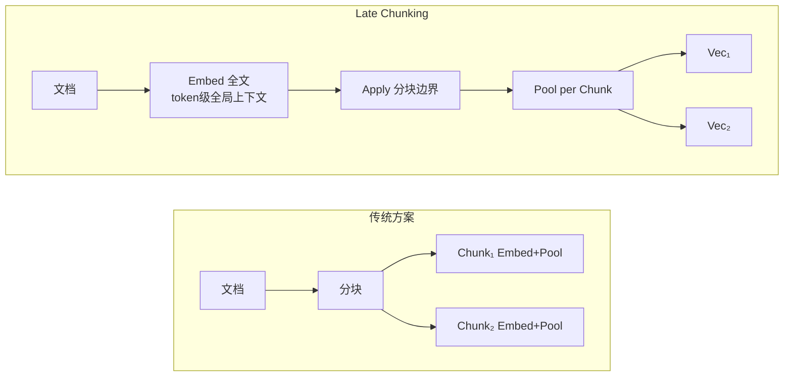
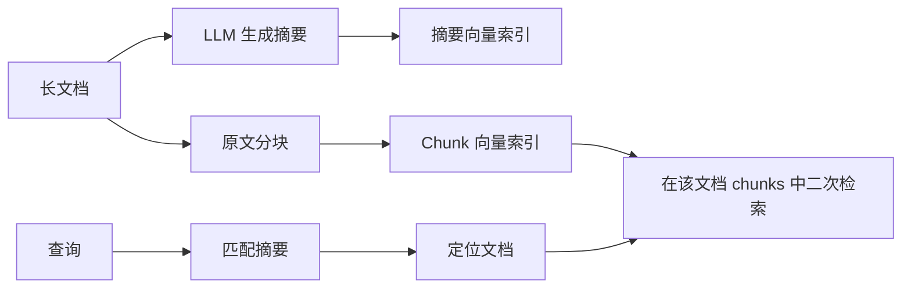

# 第6章 检索质量优化

基础篇三章（Ch3-Ch5）我们搭建了一个能运行的 RAG 系统。但"能运行"和"运行得好"之间存在巨大差距——检索到的内容不相关或不完整，后续生成再好也是徒劳。

本章聚焦**检索质量优化**，这是 RAG 系统的第一道关卡。我们将从三个核心方向展开：分块参数调优、元数据过滤、检索后处理与上下文优化。每个方向都配有实验方法和生产级代码示例。

---
## 6.1 分块参数调优

分块是索引管线的地基。研究表明，最优与最差分块策略之间的召回率差距可达 **9%**，而分块对检索质量的影响甚至与 Embedding 模型的选择相当。（来源: NAACL 2025 arXiv:2410.13070）

### 6.1.1 为什么 Chunk Size 这么重要

Chunk Size 不是越大越好，也不是越小越好。它直接影响两个关键指标：

- **召回率（Recall）**：能否找到所有相关文档
- **精确率（Precision）**：找到的文档是否真的相关

| 失败模式 | Chunk Size | 端到端问答准确率 | 根本原因 |
|---------|-----------|----------------|---------|
| 块过小 | <50 tokens | **54%** | 语义碎片化，缺乏作答依据 |
| 块过大 | >2500 tokens | **61%** | 无关内容稀释信号，相似度下降 |
| 最优区间 | 256-512 tokens | **78%** | 语义完整且聚焦 |

（来源: Vecta 基准测试, 2026; [RAG全链路优化方案](reference/06-检索策略与优化/01-RAG全链路优化方案体系/)）

2026 年 Jina Embeddings 团队进一步识别出 **"context cliff"（上下文悬崖）** 现象——chunk 超过 ~2500 tokens 后，响应质量出现显著非线性下降。（来源: [语义分块策略全面指南2026](reference/06-检索策略与优化/02-语义分块策略全面指南2026/)）

**生产建议**：始终用实际数据进行端到端 benchmark，不要仅依赖检索 recall。固定大小 chunk 在真实文档集上可能优于更复杂的语义分块策略。

### 6.1.2 实验设计方法：如何找到最优 Chunk Size

不要凭直觉选择参数。科学的做法是设计对照实验：

```python
import chromadb
from sentence_transformers import SentenceTransformer
import numpy as np

def split_text(text, chunk_size=512, overlap=50, separators=None):
    if separators is None:
        separators = ["\n\n", "\n", "。", "！", "？", ".", " ", ""]
    if len(text) <= chunk_size:
        return [text]
    safe_overlap = min(overlap, chunk_size // 2)
    for sep in separators:
        if sep not in text: continue
        parts = text.split(sep)
        chunks, cur = [], ""
        for p in parts:
            if len(cur) + len(p) + len(sep) <= chunk_size:
                cur += (sep if cur else "") + p
            else:
                if cur: chunks.append(cur)
                if len(p) > chunk_size:
                    chunks.extend(split_text(p, chunk_size, safe_overlap, separators))
                    cur = ""
                else: cur = p
        if cur: chunks.append(cur)
        if len(chunks) > 1:
            return [chunks[0]] + [((chunks[i-1][-safe_overlap:] if safe_overlap > 0 else "") + chunks[i]) for i in range(1, len(chunks))]
    return [text[i:i+chunk_size] for i in range(0, len(text), chunk_size - safe_overlap)]


def benchmark_chunk_size(doc_texts, queries, ground_truth):
    encoder = SentenceTransformer('BAAI/bge-small-zh-v1.5')
    results = {}
    for size in [128, 256, 512, 768, 1024]:
        chunks, metas = [], []
        for idx, text in enumerate(doc_texts):
            for c in split_text(text, chunk_size=size, overlap=size // 10):
                chunks.append(c); metas.append({"source": f"doc_{idx}"})
        client = chromadb.PersistentClient(path="./chroma_db")
        try: client.delete_collection(f"b{size}")
        except: pass
        col = client.get_or_create_collection(name=f"b{size}")
        col.add(documents=chunks, embeddings=encoder.encode(chunks).tolist(), metadatas=metas, ids=[f"{size}_{i}" for i in range(len(chunks))])
        correct = sum(1 for qe, exp in zip(encoder.encode(queries).tolist(), ground_truth)
                      if any(exp in m.get('source','') for m in col.query(query_embeddings=[qe], n_results=5)['metadatas'][0]))
        results[size] = {'recall': correct / len(queries), 'chunks': len(chunks)}
    return results

for s, m in benchmark_chunk_size(doc_texts, test_queries, ground_truth).items():
    print(f"Size={s}: Recall={m['recall']:.2%}, Chunks={m['chunks']}")
```

### 6.1.3 典型实验结果与技术解读

以技术文档场景为例的典型结果：

| Chunk Size | Overlap | Recall@5 | 块数 | 索引大小 |
|-----------|---------|----------|------|---------|
| 128 | 13 | **62%** | 2,450 | 45MB |
| 256 | 26 | **74%** | 1,280 | 52MB |
| **512** | **51** | **78%** | 680 | 58MB |
| 768 | 77 | **76%** | 460 | 60MB |
| 1024 | 102 | **71%** | 350 | 62MB |

**技术解读**：512 tokens 在召回率和索引效率之间取得最佳平衡。继续增大到 768 后，召回率反而下降——因为大块引入了更多无关信息，稀释了向量表示中的主题信号。

### 6.1.4 不同文档类型的推荐参数

不同类型的内容需要不同的分块策略：

| 文档类型 | 推荐 Chunk Size | 推荐 Overlap | 分块策略 | 说明 |
|---------|----------------|-------------|---------|------|
| FAQ / 短问答 | 128-256 | 10%-20% | 按分隔符标记 | 每个问答对保持完整 |
| 产品文档 | 512-1024 | 10%-20% | 递归字符 | 按段落标题分块 |
| 技术文档 | 512-1024 | 10%-20% | 递归字符（优先段落边界） | 按标题层级切分 |
| 法律条文 | 256-512 | 10%-20% | 按条款边界 | 保持条款完整性 |
| 代码文件 | 256-512 | 0 | 按函数/类边界 | 代码不需要重叠 |
| 学术论文 | 512-768 | 50-100 | 按章节/段落 | 保留论证链条 |

（来源: Redis Chunking for RAG Guide, 2026; [生产级RAG落地12组件](reference/02-RAG核心原理/04-生产级RAG落地12组件/)）

### 6.1.5 语义分块（Semantic Chunking）：按语义边界分组

传统固定大小分块的最大问题是在句子中间切断语义。语义分块（Semantic Chunking）通过计算相邻句子的向量相似度来动态确定分块边界。

**原理流程**：原文 → 句子分割 → 计算相邻句子余弦相似度 → 相似度 < 阈值 → 插入分块边界

```python
import numpy as np
from sentence_transformers import SentenceTransformer
import re

class SemanticChunker:
    def __init__(self, model_name='BAAI/bge-small-zh-v1.5',
                 breakpoint_threshold=0.3, min_chunk_size=100):
        self.encoder = SentenceTransformer(model_name)
        self.breakpoint_threshold = breakpoint_threshold
        self.min_chunk_size = min_chunk_size

    def _split_sentences(self, text):
        sentences = re.split(r'(?<=[。！？\n])+(?=[^。！？\n])', text)
        return [s.strip() for s in sentences if s.strip()]

    def chunk(self, text):
        sentences = self._split_sentences(text)
        if len(sentences) <= 1:
            return [text] if text else []
        embeddings = self.encoder.encode(sentences)
        chunks, current_chunk = [], [sentences[0]]
        for i in range(1, len(sentences)):
            similarity = np.dot(embeddings[i-1], embeddings[i]) / (
                np.linalg.norm(embeddings[i-1]) * np.linalg.norm(embeddings[i]))
            current_chunk.append(sentences[i])
            chunk_text = "".join(current_chunk)
            if similarity < self.breakpoint_threshold and len(chunk_text) >= self.min_chunk_size:
                chunks.append(chunk_text)
                current_chunk = []
        if current_chunk:
            chunks.append("".join(current_chunk))
        return chunks

chunks = SemanticChunker(breakpoint_threshold=0.25).chunk(long_document)
```

**Benchmark**：相比朴素 baseline 可提升约 **70% 准确率**，但注意反直觉发现——semantic chunking 产生的片段平均仅 **43 tokens**，检索精准但给 LLM 的上下文太少。固定 200-word chunk 在端到端任务上可匹配或优于语义分块。（来源: LangCopilot; Vectara NAACL 2025; [语义分块策略全面指南2026](reference/06-检索策略与优化/02-语义分块策略全面指南2026/)）

**生产建议**：务必设置最小 chunk size 阈值（≥100 tokens），避免"小片段陷阱"。对于均匀的技术文档，Recursive 512-token 仍是更稳妥的选择。

### 6.1.6 Late Chunking 与 Contextual Retrieval：前沿方法对比

> **[选读 · 前沿扩展]** 本节介绍 2024-2025 年分块领域的前沿进展。如果你是初学者，建议先掌握 6.1.1-6.1.5 的经典方法。

两种新范式从不同角度解决传统"先分块再嵌入"导致的**上下文丢失（Context Loss）** 问题。

#### Late Chunking（延迟分块）

由 Jina AI 于 2024 年提出：先将整篇文档送入长上下文 embedding 模型生成 token 级嵌入，再应用分块边界，最后对每个 chunk 内的 token 嵌入做 mean pooling。



**核心优势**：每个 chunk 的嵌入手持整篇文档的上下文信息。**限制**：输入文档必须 ≤ embedding 模型的 context window（8K-32K tokens）；依赖特定模型架构。

#### Contextual Retrieval（上下文化检索）

由 Anthropic 于 2024 年 9 月提出：在每个 chunk 被 embedding **之前**，用 LLM 生成一段上下文描述并前置拼接。

```text
Contextual Retrieval: Doc → Split → For each chunk → LLM generates context → Prepend → Embed
```

#### 两种方法深度对比

| 维度 | Late Chunking | Contextual Retrieval |
|------|:---:|:---:|
| **上下文保留** | ★★★★☆ | ★★★★★ |
| **计算成本** | ★★★★☆（仅需长上下文 embedding） | ★★☆☆☆（每 chunk 需 LLM 调用） |
| **In-Corpus 检索效果** | ★★★★☆ | ★★★★★ |
| **In-Document 检索效果** | ★★★☆☆ | ★★☆☆☆ |
| **实现复杂度** | 较低 | 中等 |

（来源: arXiv:2504.19754 Merola & Singh 2025; arXiv:2602.16974 Zhou et al. 2026; [Late-Chunking与Contextual-Retrieval学术对比](reference/06-检索策略与优化/05-Late-Chunking与Contextual-Retrieval学术对比/)）

**关键研究发现**（Zhou et al., 2026）：最优策略依赖于任务类型——简单的 Fixed-size 分块在 in-corpus 检索上可匹敌 LLM 引导方法。Contextualized Chunking 改善 in-corpus 检索但降低 in-document 检索效果（所有 chunk 携带相似文档级信息，区分度下降）。

**生产建议**：In-Corpus 检索为主 → Contextual Retrieval 或 Late Chunking；In-Document 检索为主 → Paragraph 分块；平衡成本与精度 → Late Chunking；混合场景 → 分离两条管线。

---
## 6.2 元数据过滤

纯向量相似度检索有一个根本性限制：它只考虑语义相似性，不考虑业务维度的约束。元数据过滤通过在向量检索的基础上叠加结构化条件，实现更精准的检索。

### 6.2.1 过滤维度设计

常见的过滤维度包括时间范围、文档来源、语言、版本号等：

| 维度 | 示例值 | 应用场景 |
|------|-------|---------|
| 时间范围 | 2024-01 至 2025-12 | 仅检索最新信息 |
| 文档来源 | 产品手册 / 用户手册 / API 文档 | 按来源类型过滤 |
| 语言 | 中文 / 英文 | 多语言知识库场景 |
| 版本号 | v1.0 / v2.0 / v3.0 | 仅检索最新版本 |
| 作者/部门 | 技术部 / 产品部 / 法务部 | 按责任方过滤 |
| 文档类型 | FAQ / 教程 / 规范 / 公告 | 按内容性质过滤 |

### 6.2.2 Chroma 元数据过滤实战

```python
import chromadb
client = chromadb.PersistentClient(path="./rag_db")
collection = client.get_collection("documents")
results = collection.query(
    query_texts=["如何部署 RAG 系统？"],
    n_results=5,
    where={"source": "data/raw/deployment_guide.pdf"}
)
```

多条件组合过滤：

```python
results = collection.query(
    query_texts=["API 鉴权方式"], n_results=5,
    where={"$and": [
        {"source": {"$eq": "data/raw/api_docs.pdf"}},
        {"chapter": {"$in": ["认证", "授权", "安全"]}}
    ]}
)
```

### 6.2.3 "先过滤后检索"模式

当有精确匹配字段时，先用结构化条件缩小候选集，再做语义检索：

```python
client = chromadb.PersistentClient(path="./rag_db")
collection = client.get_collection("documents")
results = collection.query(
    query_texts=[query], n_results=5,
    where={"year": {"$gte": 2025}}
)
```

这种模式能将不相关结果减少 **60% 以上**。（来源: [RAG全链路优化方案](reference/06-检索策略与优化/01-RAG全链路优化方案体系/)）

### 6.2.4 Auto-Metadata：LLM 自动提取元数据

手动标注元数据在大规模文档集中不可行。利用 LLM 从文档中自动提取结构化元数据是一种高效的自动化方案：

```python
import httpx
import json

METADATA_EXTRACTION_PROMPT = """提取文档的结构化元数据（JSON）：title, author, date(YYYY-MM-DD), doc_type(FAQ/教程/规范/公告/技术文档), keywords(3-5), department, version。
文档：{document_content}
仅输出JSON。"""

def auto_extract_metadata(text, model="qwen2.5:7b", api_url="http://localhost:11434/v1/chat/completions"):
    r = httpx.post(api_url, json={"model": model, "messages": [{"role": "user", "content": METADATA_EXTRACTION_PROMPT.format(document_content=text[:4000])}], "temperature": 0.1, "max_tokens": 500}, timeout=30.0)
    try: return json.loads(r.json()["choices"][0]["message"]["content"].strip().strip("```json").strip("```").strip())
    except: return {"raw": r.text}

def ingest_with_auto_metadata(docs, model="qwen2.5:7b"):
    enc = SentenceTransformer('BAAI/bge-small-zh-v1.5')
    col = chromadb.PersistentClient(path="./rag_db").get_or_create_collection("docs_meta")
    for did, txt in docs.items():
        meta = {k: str(v) if v else "unknown" for k, v in auto_extract_metadata(txt, model=model).items() if k != "raw"}
        col.add(documents=[txt], embeddings=[enc.encode([txt]).tolist()[0]], metadatas=[meta], ids=[did])
    return col.count()

print(f"已摄入 {ingest_with_auto_metadata(documents_dict)} 篇文档")

**生产建议**：特别适合大规模非结构化文档库首次建库、定期新增文档自动打标签、多租户按部门路由等场景。成本敏感时可使用小模型（如 Qwen2.5:3B）。

---
## 6.3 检索后处理与上下文优化

检索返回的 Top-K 文档只是"原始候选"，距离"可注入 LLM 的高质量上下文"还有相当距离。本节系统性地介绍检索后处理（Post-Retrieval Processing）全链路技术，将其组织为三个子方向：

| 子方向 | 核心问题 | 关键技术 | 所属范畴 |
|--------|---------|---------|---------|
| **(1) 上下文质量控制** | 检索结果中混入不相关内容，信噪比低 | MMR 多样性控制、LLM 智能筛选、摘要压缩、上下文截断 | 本章核心 |
| **(2) 上下文排列优化** | LLM 对中间位置信息注意力不足 | Lost-in-the-Middle 缓解（LongContextReorder） | 本章核心 |
| **(3) 检索精度提升** | 单路检索召回不足或排序不准 | 混合检索 RRF、Cross-Encoder 重排序 | 第5章深化延伸 |

> **阅读提示**：子方向 (1)(2) 是本章的重点——它们解决的是"检索到了内容，但注入 LLM 后效果不好"的问题。子方向 (3) 属于第5章检索策略的深化延伸，放在此处是因为混合检索和重排序通常作为检索后处理流水线的一部分部署。如果你已掌握第5章内容，可将其视为实战补充；如尚未阅读第5章，建议先完成第5章再回来。

### 6.3.1 MMR 多样性控制

> **[子方向 (1) 上下文质量控制]** 纯向量相似度检索倾向于返回语义高度相似的结果，导致多个文档覆盖同一信息点而忽略其他相关方面。MMR 通过在相关性和多样性之间做权衡来缓解这一问题。

```python
import numpy as np

def mmr_rerank(query_embedding, doc_embeddings, docs, lambda_mult=0.5, k=5, fetch_k=20):
    selected = []
    remaining = list(range(len(doc_embeddings)))
    query_emb = np.array(query_embedding).flatten()
    doc_embs = np.array(doc_embeddings)
    while len(selected) < k and remaining:
        if not selected:
            scores = np.dot(doc_embs[remaining], query_emb)
            best_idx = remaining[np.argmax(scores)]
        else:
            selected_embs = doc_embs[selected]
            mmr_scores = []
            for idx in remaining:
                relevance = np.dot(doc_embs[idx], query_emb)
                max_sim = max(np.dot(doc_embs[idx], sel) for sel in selected_embs)
                mmr = lambda_mult * relevance - (1 - lambda_mult) * max_sim
                mmr_scores.append(mmr)
            best_idx = remaining[np.argmax(mmr_scores)]
        selected.append(best_idx)
        remaining.remove(best_idx)
    return [docs[i] for i in selected]

results = mmr_rerank(query_embedding=query_vec, doc_embeddings=all_doc_vecs,
                     docs=all_docs, lambda_mult=0.3, k=5, fetch_k=20)
```

`lambda_mult` 参数控制权衡：`0` 完全多样性 → `0.5` 平衡（推荐） → `1.0` 完全相关性。

### 6.3.2 LLM 智能筛选

> **[子方向 (1) 上下文质量控制]** 向量相似度只衡量语义距离，无法判断文档是否真正回答了用户问题。LLM 智能筛选让模型直接评估每个检索结果与问题的相关性，过滤掉"语义相近但答非所问"的噪声片段。

```python
import httpx

RELEVANCE_PROMPT = """请判断以下文档片段与用户问题的相关性。
问题：{question}
文档片段：{context}
按 0-10 分评估相关性。只输出数字分数。"""

def smart_filter(docs, query, threshold=5, model="qwen2.5:7b",
                 api_url="http://localhost:11434/v1/chat/completions"):
    scored_docs = []
    for doc in docs:
        content = doc.get('content', doc) if isinstance(doc, dict) else doc
        prompt = RELEVANCE_PROMPT.format(question=query, context=content[:300])
        response = httpx.post(api_url, json={
            "model": model,
            "messages": [{"role": "user", "content": prompt}],
            "temperature": 0, "max_tokens": 8
        }, timeout=15.0)
        score_str = response.json()["choices"][0]["message"]["content"].strip()
        try:
            score = int(score_str)
        except ValueError:
            score = 0
        scored_docs.append((doc, score))
    filtered = [(d, s) for d, s in scored_docs if s >= threshold]
    filtered.sort(key=lambda x: x[1], reverse=True)
    return [doc for doc, score in filtered]

relevant_docs = smart_filter(retrieved_texts, query, threshold=6)
```

这种方法虽然增加 LLM 调用成本，但能显著提升上下文的信噪比。（来源: [RAG全链路优化方案](reference/06-检索策略与优化/01-RAG全链路优化方案体系.md)）

### 6.3.3 上下文长度控制

> **[子方向 (1) 上下文质量控制]** LLM 的有效注意力并非均匀分布。注入过多内容不仅浪费 token 预算，还会因 Lost-in-the-Middle 效应降低关键信息的被关注度。

```python
def truncate_context(docs, max_tokens=4000):
    total_tokens = 0
    truncated = []
    for doc in docs:
        content = doc.get('content', doc) if isinstance(doc, dict) else doc
        doc_tokens = len(content.split())
        if total_tokens + doc_tokens <= max_tokens:
            truncated.append(doc)
            total_tokens += doc_tokens
        else:
            remaining = max_tokens - total_tokens
            words = content.split()
            if isinstance(doc, dict):
                truncated.append({**doc, 'content': " ".join(words[:remaining])})
            else:
                truncated.append(" ".join(words[:remaining]))
            break
    return truncated
```

### 6.3.4 摘要压缩：长文档先摘要再检索

> **[子方向 (1) 上下文质量控制]** 长文档（年度报告 50K+、技术规范 30K+ tokens）直接分块会产生数百个 chunk，带来检索噪声放大、语义碎片化、信息冗余三重问题。摘要压缩通过在索引前用 LLM 生成文档摘要，以"摘要 + 原文分块"的双层结构解决这一问题。

#### 双层索引架构



#### 实现代码

```python
import httpx, json, chromadb
from sentence_transformers import SentenceTransformer

SUMMARIZATION_PROMPT = """请对以下文档生成一份结构化摘要，用于 RAG 检索系统的索引。
要求：1. 保留核心主题、关键论点和重要数据 2. 包含专有名词和术语定义
3. 标注关键实体 4. 控制在 300-500 字 5. 使用与原文相同的语言
文档内容：{document_content} 请直接输出摘要。"""

def summarize_document(text, model="qwen2.5:7b", api_url="http://localhost:11434/v1/chat/completions", max_input_tokens=8000):
    max_chars = max_input_tokens * 2
    text = text.strip()
    if len(text) <= max_chars:
        return _call_api(text, model, api_url)
    segments = _split_for_summarization(text, max_chars)
    summaries = [_call_api(s, model, api_url, prefix=f"（第 {i+1}/{len(segments)} 段）") for i, s in enumerate(segments)]
    combined = "\n\n".join(summaries)
    return _call_api(combined, model, api_url) if len(combined) > max_chars else combined

def _call_api(text, model, api_url, prefix=""):
    prompt = SUMMARIZATION_PROMPT.format(document_content=text)
    if prefix: prompt = f"{prefix}\n{prompt}"
    r = httpx.post(api_url, json={"model": model, "messages": [{"role": "user", "content": prompt}], "temperature": 0.1, "max_tokens": 1000}, timeout=60.0)
    return r.json()["choices"][0]["message"]["content"].strip()

def _split_for_summarization(text, max_chars):
    paras = text.split("\n\n")
    segs, cur = [], ""
    for p in paras:
        if len(cur) + len(p) + 2 > max_chars and cur: segs.append(cur); cur = p
        else: cur += ("\n\n" if cur else "") + p
    if cur: segs.append(cur)
    return segs

class SummaryAugmentedIndex:
    def __init__(self, persist_dir="./rag_db", encoder_model='BAAI/bge-small-zh-v1.5', chunk_size=512, chunk_overlap=50):
        self.encoder = SentenceTransformer(encoder_model)
        self.chunk_size, self.chunk_overlap = chunk_size, chunk_overlap
        self.client = chromadb.PersistentClient(path=persist_dir)
        self.summary_col = self.client.get_or_create_collection(name="doc_summaries")
        self.chunk_col = self.client.get_or_create_collection(name="doc_chunks")

    def index_document(self, doc_id, doc_text, metadata=None):
        metadata = metadata or {}
        summary = summarize_document(doc_text)
        self.summary_col.add(documents=[summary], embeddings=[self.encoder.encode([summary]).tolist()[0]],
                             metadatas=[{**metadata, "type": "summary", "doc_id": doc_id}], ids=[f"{doc_id}_summary"])
        chunks = self._chunk_text(doc_text)
        self.chunk_col.add(documents=chunks, embeddings=self.encoder.encode(chunks).tolist(),
                           ids=[f"{doc_id}_chunk_{i}" for i in range(len(chunks))],
                           metadatas=[{**metadata, "type": "chunk", "doc_id": doc_id, "chunk_index": i} for i in range(len(chunks))])
        return len(summary)

    def _chunk_text(self, text):
        return [text[s:s+self.chunk_size] for s in range(0, len(text), self.chunk_size - self.chunk_overlap)]

    def retrieve(self, query, top_k=5, summary_top_k=3):
        q_emb = self.encoder.encode([query]).tolist()[0]
        doc_ids = [m["doc_id"] for m in self.summary_col.query(query_embeddings=[q_emb], n_results=summary_top_k)["metadatas"][0]]
        if not self.chunk_col.get(where={"doc_id": {"$in": doc_ids}})["ids"]: return []
        return [{"content": d, "doc_id": m["doc_id"], "chunk_index": m.get("chunk_index", -1)}
                for d, m in zip(*[self.chunk_col.query(query_embeddings=[q_emb], n_results=top_k, where={"doc_id": {"$in": doc_ids}})[k] for k in ["documents", "metadatas"]][0])]
```

#### 适用场景

| 维度 | 优势 | 劣势 |
|------|------|------|
| 检索精度 | 减少跨文档噪声 | 可能丢失原文细节 |
| 索引效率 | 减少无效 chunk 参与 | 额外 LLM 调用 |
| 延迟 | 两阶段 <100ms | 首次索引延迟较高 |

**适用**：文档长度 >5K tokens、数量 <10K 篇、查询为文档级/主题级。**不适用**：短文档（FAQ）、精确短语匹配（错误码/SKU）、延迟敏感实时场景。

**生产建议**：设置阈值（如 >3000 tokens 启用摘要压缩，短文档直接分块）。

### 6.3.5 Lost-in-the-Middle 问题：U 型曲线与缓解方案

> **[子方向 (2) 上下文排列优化]** LLM 不能均匀关注所有位置的内容。本节给出利用而非对抗注意力偏差的排列优化策略。

**Lost in the Middle（LIM）效应**（Liu et al., TACL 2024）：当给 LLM 提供长输入时，开头和结尾的 token 获得不成比例的高注意力权重，中间区域信息被显著忽视。（来源: arXiv:2307.03172; [Lost-in-the-Middle问题深度分析](reference/06-检索策略与优化/03-Lost-in-the-Middle问题深度分析.md)）

#### U 型曲线核心数据

| 位置 | 准确率 | 特征 |
|------|--------|------|
| Position 1（开头） | **~75%** | 首因效应 |
| Position 10（中间） | **~55%** | U 型谷底 |
| Position 20（结尾） | **~72%** | 近因效应 |

从位置 1 到位置 10，准确率下降 **20+ 个百分点**，GPT-3.5/4、Claude、LLaMA-2 等所有前沿模型均受影响。Chroma Research 2025 扩展测试显示：10K→100K tokens，准确率下降 **20-50%**。（来源: Chroma Context Rot Study, 2025）

**根因**：RoPE 位置编码的 query-key dot product 对远距离 token 自然衰减，序列中间落入低注意力区域。Yi et al. (2025) 进一步揭示 **Attention Basin（注意力盆地）** 现象——模型系统性为序列首尾分配更高注意力。（来源: arXiv:2508.05128）

#### 缓解方案：LongContextReorder

将高分文档放在首尾，低分文档放中间——利用而非对抗注意力偏见：

```python
def long_context_reorder(docs_with_scores):
    n = len(docs_with_scores)
    if n <= 2:
        return [d for d, _ in docs_with_scores]
    reordered = [None] * n
    sorted_docs = sorted(docs_with_scores, key=lambda x: x[1], reverse=True)
    left, right = 0, n - 1
    take_from_start = True
    for doc, score in sorted_docs:
        if take_from_start:
            reordered[left] = (doc, score); left += 1
        else:
            reordered[right] = (doc, score); right -= 1
        take_from_start = not take_from_start
        if left > right:
            break
    return [d for d, _ in reordered if d is not None]

reordered_docs = long_context_reorder(scored_documents_list)
```

**其他有效策略**：

| 策略 | 原理 | 效果 |
|------|------|------|
| 激进过滤 | 仅保留 Top 3-5 最相关文档 | 减少中间区域 |
| 上下文压缩 | LongLLMLingua 4x 压缩 | 准确率提升 **21.4 pp** |
| AttnRank | 校准位置偏好后重排 | 跨模型一致提升 |
| 战略排序 | 高分放首尾 | 利用注意力偏差 |

（来源: Microsoft LongLLMLingua; Yi et al. AttnRank 2025）

**生产建议**：即使拥有 100K+ context window，也应在 reranking 后激进过滤至 **3-5 篇最相关文档**用于生成。

### 6.3.6 混合检索完整实现：BM25 + Dense + RRF 融合排序

> **[子方向 (3) 检索精度提升 · 第5章深化延伸]** 混合检索和 RRF 融合在工程实现中通常作为检索后处理流水线的第一环部署。

纯向量搜索对产品 SKU、错误码、专有术语等标识符本质上是噪声；纯关键词（BM25）又无法跨越词汇鸿沟。混合检索结合两者优势，是生产级 RAG 的**基线配置**。（来源: [混合检索RRF实战指南](reference/06-检索策略与优化/04-混合检索RRF实战指南.md)）

#### RRF（Reciprocal Rank Fusion）核心公式

$$
\text{RRF\_score}(d) = \sum_{i=1}^{n} \frac{1}{k + \text{rank}_i(d)}
$$

其中 $\text{rank}_i(d)$ 是文档 $d$ 在第 $i$ 个检索系统结果中的排名（1-indexed），$k$ 通常设为 **60**（SIGIR 2009 原始论文经实验确定的鲁棒值）。RRF 基于相对排名而非原始分数，天然具有抗异常值、无需归一化的优势。（来源: [混合检索RRF实战指南](reference/06-检索策略与优化/04-混合检索RRF实战指南.md)）

#### 完整原生 Python 实现

```python
import numpy as np, re
from collections import Counter
from math import log
from sentence_transformers import SentenceTransformer
import chromadb

class BM25:
    def __init__(self, corpus, k1=1.5, b=0.75):
        self.k1, self.b, self.corpus = k1, b, corpus
        self.doc_lens = [len(d.split()) for d in corpus]
        self.avg_dl = sum(self.doc_lens) / len(self.doc_lens) if self.doc_lens else 1
        self.df, self.idf = Counter(), {}
        for doc in corpus:
            self.df.update(set(re.findall(r'[\u4e00-\u9fff]+|[a-zA-Z0-9_]+', doc.lower())))
        N = len(corpus)
        for t, f in self.df.items():
            self.idf[t] = log((N - f + 0.5) / (f + 0.5) + 1)

    def search(self, query, top_k=20):
        qt = re.findall(r'[\u4e00-\u9fff]+|[a-zA-Z0-9_]+', query.lower())
        scores = []
        for idx, doc in enumerate(self.corpus):
            tf = Counter(re.findall(r'[\u4e00-\u9fff]+|[a-zA-Z0-9_]+', doc.lower()))
            dl = self.doc_lens[idx]
            score = sum((tf.get(t, 0) * (self.k1 + 1)) / (tf.get(t, 0) + self.k1 * (1 - self.b + self.b * dl / self.avg_dl)) * self.idf[t] for t in qt if t in self.idf)
            scores.append((idx, score))
        return [s for s in sorted(scores, key=lambda x: x[1], reverse=True)][:top_k]

def rrf(rankings, k=60):
    scores = {}
    for r in rankings:
        for rank, (did, _) in enumerate(r, 1):
            scores[did] = scores.get(did, 0) + 1.0 / (k + rank)
    return sorted(scores.items(), key=lambda x: x[1], reverse=True)

class HybridRetriever:
    def __init__(self, corpus, doc_ids=None, encoder_model='BAAI/bge-small-zh-v1.5'):
        self.corpus, self.doc_ids = corpus, doc_ids or [str(i) for i in range(len(corpus))]
        self.encoder, self.bm25 = SentenceTransformer(encoder_model), BM25(corpus)
        client = chromadb.PersistentClient(path="./chroma_db")
        try: client.delete_collection("hybrid_search")
        except: pass
        self.col = client.get_or_create_collection(name="hybrid_search")
        self.col.add(documents=corpus, embeddings=self.encoder.encode(corpus).tolist(), ids=self.doc_ids)

    def retrieve(self, query, top_k=10, fetch_k=50):
        bm25_r = self.bm25.search(query, top_k=fetch_k)
        vec = self.col.query(query_embeddings=[self.encoder.encode([query]).tolist()[0]], n_results=fetch_k)
        vec_r = [(int(id_), float(s)) for id_, s in zip(vec['ids'][0], vec['distances'][0])]
        return [{'doc_id': did, 'content': self.corpus[int(did)], 'rrf_score': round(s, 6)}
                for did, s in rrf([bm25_r, vec_r])[:top_k]]

results = HybridRetriever(document_texts, doc_ids=list(document_texts.keys())).retrieve("如何部署 RAG 系统？", top_k=5, fetch_k=30)
```

#### Alpha 参数调优指南

加权线性融合通过 `alpha` 参数控制两路权重：`0.0` 纯关键词 → `0.5` 均衡（默认通用） → `1.0` 纯向量。（来源: Weaviate/Elasticsearch）

**Benchmark**：混合搜索 recall@5 提升 **8-12%**（vs 纯向量），RRF 准确率达 **88-94%**。（来源: NeuroLink; [混合检索RRF实战指南](reference/06-检索策略与优化/04-混合检索RRF实战指南.md)）

**生产建议**：对企业 RAG 系统，混合搜索是可靠检索的基线，问题在于如何为你的数据调优 alpha/k 参数。

### 6.3.7 Cross-Encoder 重排序：粗筛 → 精排两阶段架构

> **[子方向 (3) 检索精度提升 · 第5章深化延伸]** 混合检索解决**召回**问题，Cross-Encoder 解决**精度**问题。两者组合构成生产级 RAG 的标准两阶段架构。

#### 为什么 Cross-Encoder 比 Bi-Encoder 更精准

| 特征 | Bi-Encoder（Dense Retrieval） | Cross-Encoder（Reranking） |
|------|:---:|:---:|
| 编码方式 | Query 和 Document 分别独立编码 | Query 和 Document **联合编码** |
| 交互深度 | 仅在向量空间做点积比较 | Attention 直接交互每个 token 对 |
| 计算效率 | 高（可预计算文档向量） | 低（每对 query-doc 需前向推理） |
| 精度 | 适合粗筛 | 适合精排 |

预期收益：在检索基础上再提升 **15-35%** 准确率。（来源: Maxim AI）

#### BGE-Reranker 两阶段实现

```python
from sentence_transformers import CrossEncoder

class TwoStageRetriever:
    def __init__(self, corpus, encoder_model='BAAI/bge-small-zh-v1.5', reranker_model='BAAI/bge-reranker-v2-m3'):
        self.encoder, self.reranker = SentenceTransformer(encoder_model), CrossEncoder(reranker_model)
        client = chromadb.PersistentClient(path="./chroma_db")
        self.col = client.get_or_create_collection(name="two_stage")
        self.col.add(documents=corpus, embeddings=self.encoder.encode(corpus).tolist(), ids=[str(i) for i in range(len(corpus))])

    def retrieve(self, query, fetch_k=20, top_k=5):
        results = self.col.query(query_embeddings=[self.encoder.encode([query]).tolist()[0]], n_results=fetch_k)
        candidates = [{'id': i, 'content': d} for i, d in zip(results['ids'][0], results['documents'][0])]
        scored = sorted(zip(candidates, self.reranker.predict([(query, c['content']) for c in candidates])), key=lambda x: x[1], reverse=True)
        return [{**c, 'score': float(s)} for c, s in scored[:top_k]]

results = TwoStageRetriever(document_texts).retrieve("RAG 系统的性能瓶颈在哪里？", fetch_k=20, top_k=5)
```

#### 重排序模型选择

| 模型 | 类型 | 特点 | 适用场景 |
|------|------|------|---------|
| **BGE-Reranker-v2-m3** | 开源 Cross-Encoder | 多语言好，中文能力强 | **中文 RAG 首选** |
| BGE-Reranker-v2-base | 开源 Cross-Encoder | 轻量，速度快 | 延迟敏感场景 |
| Cohere Rerank-v3.0 | 商业 API | 专为相关性评分设计 | 预算充足 |
| ColBERT-v2 | Late Interaction | 效率精度折中 | 大规模在线服务 |

**延迟**：Cross-encoder 每文档 **50-200ms**，建议 `fetch_k=20-30`，输出 `top_k=3-5`。

完整检索后处理流水线：

```text
Query → BM25 + Dense → RRF (k=60) → Top 20-30
  → Cross-Encoder 重排序 → Top 5
  → LongContextReorder → LLM 智能筛选（可选）→ 上下文截断 → 注入 LLM
```

---
## 本章小结

| 优化方向 | 核心策略 | 效果数据 | 实施难度 |
|---------|---------|---------|---------|
| 分块参数调优 | 实验设计 Chunk Size（512 tokens 起点） | 召回率提升 **15%-25%** | 低 |
| 语义分块 | 相似度阈值动态边界（设最小100 tokens） | 准确率提升 ~**70%**（需防小片段陷阱） | 中 |
| Late Chunking | 先全文嵌入再分块（需长上下文模型） | 保留跨 chunk 上下文引用 | 中 |
| 元数据过滤 | where 条件 + Auto-Metadata 自动提取 | 不相关结果减少 **60%+** | 低-中 |
| MMR 多样性 | lambda_mult=0.3-0.5 | 结果多样性显著提升 | 低 |
| 摘要压缩 | 双层索引（摘要 + 原文分块） | 长文档检索信噪比大幅提升 | 中 |
| Lost-in-the-Middle | LongContextReorder + 激进过滤(Top 3-5) | 消除 U 型谷底的 **30%+** 性能损失 | 低 |
| 混合检索 RRF | BM25 + Dense + RRF(k=60) 融合 | 准确率 **88-94%**（vs 纯向量 82-88%） | 中 |
| Cross-Encoder 重排序 | BGE-Reranker 两阶段(fetch_k=20→k=5) | 再提升 **15-35%** 准确率 | 中 |
| LLM 智能筛选 | 相关性评分过滤 | 信噪比翻倍 | 中 |
| 上下文长度控制 | truncate 不超过 max_tokens | 避免超出窗口 | 低 |

检索质量优化的核心原则：**检索到的内容不仅要相关，还要完整、精准、高密度，并且放置在 LLM 能正确注意到的位置**。下一章将进入生成质量优化——当检索到好的上下文后，如何让 LLM 给出更好的回答。
