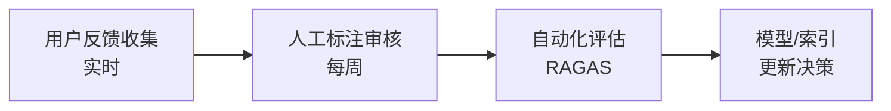

# 第10章 监控与运维

第9章我们完成了生产架构的设计与部署。但**上线只是开始**——RAG 系统在生产环境中会持续面临检索质量漂移、延迟波动、用户反馈变化等挑战。本章聚焦两大运维支柱：**全链路可观测性**和**数据飞轮闭环**。

> **核心认知**：传统 APM 监控只能回答"服务是否健康"，而 RAG 可观测性必须回答"**回答质量是否在下降**"。（来源: [04-RAG可观测性与全链路监控.md](reference/09-生产部署与运维/04-RAG可观测性与全链路监控/)）

---

## 10.1 全链路日志与可观测性

### 10.1.1 RAG 四大核心 Trace 类型

RAG 系统的可观测性与传统 Web 应用有本质区别。通用 LLM Monitoring 只关注调用延迟和 Token 成本，**无法衡量检索质量或重排是否降级了正确的 chunk**。因此，2026 年生产级 RAG 必须记录以下四类 Trace：（来源: [04-RAG可观测性与全链路监控.md](reference/09-生产部署与运维/04-RAG可观测性与全链路监控/)）

| Trace 类型 | 记录内容 | 典型失败模式 | 关键属性 |
|-----------|---------|-------------|---------|
| **Retrieval traces** | 检索到的 chunks、scores、排序顺序 | 召回语义相近但主题错误的内容 | `query`, `top_k`, `retrieved_count`, `scores` |
| **Reranker traces** | 排名变化（初始→最终） | 重排器移除了唯一正确的 chunk | `initial_rank`, `final_rank`, `score_delta` |
| **Context-assembly traces** | chunks 如何拼接为 final prompt | 拼接逻辑丢失关键上下文 | `context_length`, `chunk_ids`, `truncation` |
| **Generation traces** | LLM 调用输入/输出/延迟/成本 | LLM 基于缺失上下文产生幻觉 | `input_tokens`, `output_tokens`, `duration`, `faithfulness_score` |

这四类 Trace 构成了 RAG 的**因果链**：Retrieval → Reranking → Context Assembly → Generation。当最终回答质量下降时，通过 Trace 链可以快速定位是哪个环节出了问题。

### 10.1.2 OpenTelemetry + LangGraph 集成方案

OpenTelemetry (OTel) 是 2026 年可观测性的**事实标准**，LangGraph 原生支持 OTel Span 注入。下面展示一个完整的集成示例，使用 LangGraph StateGraph + OpenTelemetry Python SDK 实现节点级追踪。

```python
import logging
from typing import TypedDict, Annotated
from opentelemetry import trace
from opentelemetry.sdk.trace import TracerProvider
from opentelemetry.sdk.trace.export import BatchSpanProcessor
from opentelemetry.exporter.otlp.proto.http.trace_exporter import OTLPSpanExporter
from langgraph.graph import StateGraph, END
import chromadb

logging.basicConfig(level=logging.INFO)
logger = logging.getLogger("rag.pipeline")

provider = TracerProvider()
processor = BatchSpanProcessor(
    OTLPSpanExporter(endpoint="http://otel-collector:4318/v1/traces")
)
provider.add_span_processor(processor)
trace.set_tracer_provider(provider)
tracer = trace.get_tracer("rag-app")

class RAGState(TypedDict):
    question: str
    context: list[str]
    answer: str
    metadata: dict

def retrieve_node(state: RAGState) -> dict:
    with tracer.start_as_current_span("rag.retrieve") as span:
        span.set_attribute("query", state["question"])
        span.set_attribute("top_k", 5)

        collection = chromadb.Client().get_or_create_collection("docs")
        results = collection.query(
            query_texts=[state["question"]],
            n_results=5
        )

        docs = results["documents"][0] if results["documents"] else []
        span.set_attribute("retrieved_count", len(docs))
        span.set_attribute("retrieved_ids", results["ids"][0] if results["ids"] else [])

        logger.info(f"Retrieved {len(docs)} chunks for query: {state['question']}")
        return {"context": docs}

def reranker_node(state: RAGState) -> dict:
    """Reranker 节点：对检索结果进行重排序，记录排名变化"""
    with tracer.start_as_current_span("rag.reranker") as span:
        docs = state["context"]
        span.set_attribute("input_count", len(docs))

        # 记录初始排名（用于对比重排效果）
        initial_rank = list(range(len(docs)))
        span.set_attribute("initial_rank", initial_rank)

        # 伪代码：实际项目中替换为 Cross-Encoder 重排序
        # reranked = cross_encoder.rank(state["question"], docs, top_k=5)
        # 这里用逆序模拟重排效果
        reranked_docs = list(reversed(docs)) if len(docs) > 1 else docs

        span.set_attribute("final_rank", list(range(len(reranked_docs))))
        span.set_attribute("output_count", len(reranked_docs))

        logger.info(f"Reranked {len(docs)} chunks, top result changed: {docs[0] != reranked_docs[0] if docs else False}")
        return {"context": reranked_docs}

def call_llm(prompt: str, model: str = "qwen2.5-7b-instruct",
             temperature: float = 0.0) -> str:
    """占位函数：展示真实 LLM 调用的接口模式。

    实际项目中可替换为以下任意后端：
    - OpenAI API: openai.ChatCompletion.create(model=model, messages=[...])
    - Ollama: httpx.post("http://localhost:11434/v1/chat/completions", ...)
    - vLLM:  openai.OpenAI(base_url="http://vllm:8000/v1", ...)
    - Azure OpenAI: azure_openai.ChatCompletion.create(deployment_id=model, ...)
    """
    import httpx
    async with httpx.AsyncClient() as client:
        resp = await client.post(
            "http://localhost:11434/v1/chat/completions",
            json={
                "model": model,
                "messages": [{"role": "user", "content": prompt}],
                "temperature": temperature,
            },
            timeout=60.0,
        )
    return resp.json()["choices"][0]["message"]["content"]

def generate_node(state: RAGState) -> dict:
    with tracer.start_as_current_span("rag.generate") as span:
        context_text = "\n".join(state["context"])
        prompt = f"基于以下资料回答问题：\n{context_text}\n\n问题：{state['question']}"

        span.set_attribute("context_length", len(context_text))
        span.set_attribute("llm.model", "qwen2.5-7b-instruct")

        logger.info(f"Generating answer with context length: {len(context_text)}")
        # 实际项目中使用: answer = call_llm(prompt, model="qwen2.5-7b-instruct")
        answer = f"基于提供的资料，关于'{state['question']}'的回答如下..."

        span.set_attribute("output_length", len(answer))
        return {"answer": answer}

workflow = StateGraph(RAGState)
workflow.add_node("retrieve", retrieve_node)
workflow.add_node("reranker", reranker_node)
workflow.add_node("generate", generate_node)
workflow.set_entry_point("retrieve")
workflow.add_edge("retrieve", "reranker")
workflow.add_edge("reranker", "generate")
workflow.add_edge("generate", END)

app = workflow.compile()

result = app.invoke({"question": "什么是RAG？"})
print(result["answer"])
```

这段代码的核心设计要点：

1. **Node 级别 Span 注入**：每个 LangGraph 节点函数都用 `tracer.start_as_current_span()` 包装，自动创建父子层级关系
2. **结构化属性记录**：通过 `span.set_attribute()` 记录查询参数、结果数量、Token 用量等关键指标
3. **标准 logging 集成**：同时使用 logging 模块输出结构化日志，便于本地调试和日志聚合系统收集
4. **零 LangChain 依赖**：完全基于 LangGraph StateGraph 和原生 Python 实现

### 10.1.3 关键指标与告警策略

有了 Trace 数据后，需要定义**关键性能指标（KPIs）**并设置告警阈值。以下是生产环境推荐的监控指标体系：

| 指标类别 | 指标名称 | P50 目标 | P95 目标 | P99 目标 | 告警阈值 |
|---------|---------|---------|---------|---------|---------|
| **端到端延迟** | 总响应时间 | < 800ms | < 2s | < 5s | P95 > 3s 触发告警 |
| **检索延迟** | 向量查询耗时 | < 100ms | < 300ms | < 800ms | P95 > 500ms 触发告警 |
| **生成延迟** | LLM 推理耗时 | < 500ms | < 1.5s | < 4s | P95 > 2s 触发告警 |
| **Token 吞吐** | 输入+输出 Token/s | > 100 | > 80 | > 50 | P50 < 60 触发告警 |
| **检索质量** | 召回率 Recall@5 | > 0.85 | > 0.75 | > 0.6 | 日均 < 0.7 触发告警 |
| **生成质量** | Faithfulness 得分 | > 0.9 | > 0.8 | > 0.65 | 日均 < 0.75 触发告警 |
| **错误率** | `llm_error_rate` | < 0.1% | < 0.5% | < 1% | P95 > 1% 触发告警 |
| **错误率** | `retrieval_error_rate` | < 0.05% | < 0.2% | < 0.5% | P95 > 0.5% 触发告警 |
| **错误率** | `reranker_error_rate` | < 0.1% | < 0.3% | < 1% | P95 > 1% 触发告警 |
| **可用性** | 端到端成功率 | > 99.9% | > 99.5% | > 99% | P95 < 99% 触发告警 |

**告警分级策略**：

```python
import time
import logging
from dataclasses import dataclass
from enum import Enum

logger = logging.getLogger("rag.alerts")

class AlertSeverity(Enum):
    INFO = "info"
    WARNING = "warning"
    CRITICAL = "critical"

@dataclass
class MetricThreshold:
    name: str
    p95_threshold: float
    p99_threshold: float
    severity: AlertSeverity

THRESHOLDS = [
    MetricThreshold("total_latency_ms", 3000, 5000, AlertSeverity.CRITICAL),
    MetricThreshold("retrieval_latency_ms", 500, 800, AlertSeverity.WARNING),
    MetricThreshold("generation_latency_ms", 2000, 4000, AlertSeverity.CRITICAL),
    MetricThreshold("recall_at_5", 0.70, 0.60, AlertSeverity.WARNING),
    MetricThreshold("faithfulness_score", 0.75, 0.65, AlertSeverity.CRITICAL),
]

def check_alerts(metrics: dict[str, float]) -> list[dict]:
    alerts = []
    for threshold in THRESHOLDS:
        value = metrics.get(threshold.name)
        if value is None:
            continue

        is_latency = "latency" in threshold.name
        triggered = (value > threshold.p99_threshold) if is_latency else (value < threshold.p99_threshold)

        if triggered:
            alerts.append({
                "metric": threshold.name,
                "value": value,
                "threshold": threshold.p99_threshold,
                "severity": threshold.severity.value,
                "timestamp": time.time()
            })
            logger.warning(
                f"ALERT [{threshold.severity.value.upper()}] "
                f"{threshold.name}={value:.2f} (threshold: {threshold.p99_threshold})"
            )
    return alerts

metrics_sample = {
    "total_latency_ms": 4200,
    "retrieval_latency_ms": 280,
    "generation_latency_ms": 3800,
    "recall_at_5": 0.72,
    "faithfulness_score": 0.68,
}
alerts = check_alerts(metrics_sample)
print(f"触发告警数: {len(alerts)}")
```

这套监控体系的**关键洞察**：延迟类指标（latency）是"越大越差"，质量类指标（recall、faithfulness）是"越小越差"，告警逻辑需要区分方向。

---

## 10.2 数据飞轮：从反馈到迭代

### 10.2.1 用户反馈收集机制

监控告诉我们"系统是否正常"，但要持续改进则需要**用户反馈数据**。数据飞轮的起点是建立一个轻量级、低摩擦的反馈收集机制：

```python
import json
import uuid
from datetime import datetime
from pathlib import Path
from dataclasses import dataclass, asdict
from enum import Enum

class FeedbackType(Enum):
    THUMBS_UP = "thumbs_up"
    THUMBS_DOWN = "thumbs_down"
    REPORT_HALLUCINATION = "hallucination"
    MISSING_INFO = "missing_info"

@dataclass
class FeedbackRecord:
    id: str
    session_id: str
    question: str
    answer: str
    context_sources: list[str]
    feedback_type: FeedbackType
    comment: str
    timestamp: str
    latency_ms: int
    retrieved_chunks: int

class FeedbackCollector:
    def __init__(self, storage_path: str = "data/feedback"):
        self.storage_path = Path(storage_path)
        self.storage_path.mkdir(parents=True, exist_ok=True)

    def collect(self, session_id: str, question: str, answer: str,
                context_sources: list[str], feedback_type: str,
                comment: str = "", latency_ms: int = 0,
                retrieved_chunks: int = 0) -> FeedbackRecord:

        record = FeedbackRecord(
            id=str(uuid.uuid4())[:8],
            session_id=session_id,
            question=question,
            answer=answer,
            context_sources=context_sources,
            feedback_type=FeedbackType(feedback_type),
            comment=comment,
            timestamp=datetime.now().isoformat(),
            latency_ms=latency_ms,
            retrieved_chunks=retrieved_chunks,
        )

        file_path = self.storage_path / f"{record.timestamp[:10]}.jsonl"
        with open(file_path, "a", encoding="utf-8") as f:
            f.write(json.dumps(asdict(record), ensure_ascii=False) + "\n")

        logger.info(f"Collected feedback: {record.id} type={feedback_type}")
        return record

    def get_negative_feedback(self, days: int = 7) -> list[FeedbackRecord]:
        from datetime import timedelta
        cutoff = (datetime.now() - timedelta(days=days)).isoformat()[:10]
        records = []
        for file in sorted(self.storage_path.glob("*.jsonl")):
            if file.stem < cutoff:
                continue
            with open(file, "r", encoding="utf-8") as f:
                for line in f:
                    data = json.loads(line)
                    if data["feedback_type"] in ("thumbs_down", "hallucination", "missing_info"):
                        records.append(FeedbackRecord(**data))
        return records

collector = FeedbackCollector()
feedback = collector.collect(
    session_id="sess_001",
    question="RAG如何解决幻觉问题？",
    answer="RAG通过检索外部知识来减少幻觉...",
    context_sources=["doc_01.pdf", "doc_03.pdf"],
    feedback_type="thumbs_up",
    comment="回答准确，引用清晰",
    latency_ms=1200,
    retrieved_chunks=5,
)

negative_samples = collector.get_negative_feedback(days=30)
print(f"近30天负面反馈数: {len(negative_samples)}")
```

这个反馈收集器的设计特点：

1. **按日期分片存储**：每天一个 JSONL 文件，便于按时间范围查询和归档
2. **结构化字段**：记录完整的问答上下文（question、answer、sources），而非仅记录评分
3. **负面样本筛选**：`get_negative_feedback()` 快速提取用于人工标注和模型改进的高价值样本
4. **零外部依赖**：纯 Python 实现，文件存储即可满足中小规模需求

### 10.2.2 定期评估与模型更新

收集到足够反馈后，需要建立**定期评估流程**来量化系统表现并驱动迭代：


评估频率建议：
- **每日自动化**：运行 RAGAS 评估套件，检查 Faithfulness、Answer Relevance 等指标的日环比变化
- **每周人工抽检**：随机抽取 50-100 条负面反馈进行人工复核，验证自动化评估的准确性
- **每月全面评审**：结合业务指标（用户留存、查询量趋势）决定是否需要模型升级或索引重建

### 10.2.3 增量索引更新策略

生产环境中，知识库文档会持续增长或变更。**全量重建索引**成本高昂（Embedding 计算时间长、服务中断），因此需要增量更新策略：

| 更新场景 | 触发条件 | 更新策略 | 实现复杂度 |
|---------|---------|---------|-----------|
| 新增文档 | 文档入库事件 | 仅对新文档执行 Embedding 并插入向量库 | 低 |
| 文档修改 | 文档版本变更 | 删除旧向量 → 插入新向量（需维护 doc_id 映射） | 中 |
| 文档删除 | 文档归档/下线 | 按 doc_id 删除对应向量 | 低 |
| Embedding 模型升级 | 模型版本变更 | 全量重新 Embedding（需灰度切换） | 高 |
| 分块策略调整 | 参数优化后 | 全量重建索引 | 高 |

**增量更新的核心实现思路**：

```python
import hashlib
from pathlib import Path

class IncrementalIndexer:
    def __init__(self, collection, embedding_model):
        self.collection = collection
        self.embedding_model = embedding_model
        self.state_file = Path("data/index_state.json")

    def _compute_doc_hash(self, content: str) -> str:
        return hashlib.sha256(content.encode()).hexdigest()[:16]

    def _load_state(self) -> dict:
        if self.state_file.exists():
            return json.loads(self.state_file.read_text(encoding="utf-8"))
        return {"indexed_docs": {}}

    def _save_state(self, state: dict):
        self.state_file.parent.mkdir(parents=True, exist_ok=True)
        self.state_file.write_text(json.dumps(state, ensure_ascii=False), encoding="utf-8")

    def upsert_document(self, doc_id: str, content: str, metadata: dict = None):
        state = self._load_state()
        current_hash = self._compute_doc_hash(content)

        if doc_id in state["indexed_docs"]:
            if state["indexed_docs"][doc_id]["hash"] == current_hash:
                logger.info(f"Document {doc_id} unchanged, skipping")
                return False

            self.collection.delete(ids=[doc_id])
            logger.info(f"Deleted stale vectors for {doc_id}")

        embedding = self.embedding_model.encode(content).tolist()
        self.collection.upsert(
            ids=[doc_id],
            embeddings=[embedding],
            documents=[content],
            metadatas=[metadata or {}]
        )

        state["indexed_docs"][doc_id] = {
            "hash": current_hash,
            "updated_at": datetime.now().isoformat()
        }
        self._save_state(state)
        logger.info(f"Upserted document {doc_id}")
        return True

# 以下为伪代码演示，collection 和 embedding_model 使用 mock 对象
# 实际使用时需传入真实的向量库连接和 Embedding 模型实例
mock_collection = type("MockCollection", (), {
    "delete": lambda self, ids: None,
    "upsert": lambda self, **kwargs: None,
})()
mock_embedding = type("MockEmbedding", (), {
    "encode": lambda self, text: type("Result", (), {"tolist": lambda: [0.0] * 1024})(),
})()

indexer = IncrementalIndexer(collection=mock_collection, embedding_model=mock_embedding)
changed = indexer.upsert_document(
    doc_id="doc_v2_001",
    content="RAG系统的核心组件包括检索器和生成器...",
    metadata={"source": "handbook.pdf", "version": "2.1"}
)
print(f"索引已更新: {changed}")
```

这个增量索引器的关键设计：

1. **内容哈希检测**：通过 SHA256 哈希判断文档是否真正变更，避免无意义的重复 Embedding 计算
2. **幂等操作**：同一文档多次调用 `upsert_document()` 只会产生一次实际写入
3. **状态持久化**：将已索引文档的哈希值保存到本地文件，重启后仍能正确判断增量
4. **先删后插**：对于已存在的修改文档，先删除旧向量再插入新向量，保证数据一致性

---

## 本章小结

本章覆盖了 RAG 生产运维的两个核心维度：

| 维度 | 核心工具 | 关键产出 |
|------|---------|---------|
| **可观测性** | OpenTelemetry + LangGraph | 四类 Trace（Retrieval/Reranking/Context/Generation）、五维监控指标、分级告警 |
| **数据飞轮** | 反馈收集 + 定期评估 + 增量索引 | 结构化反馈数据集、RAGAS 自动化评估流水线、幂等增量更新机制 |

**生产运维的本质**是将 RAG 系统从"一次性项目"转变为"持续演进的产品"。可观测性让你知道**哪里出了问题**，数据飞轮让你知道**如何改进它**。
